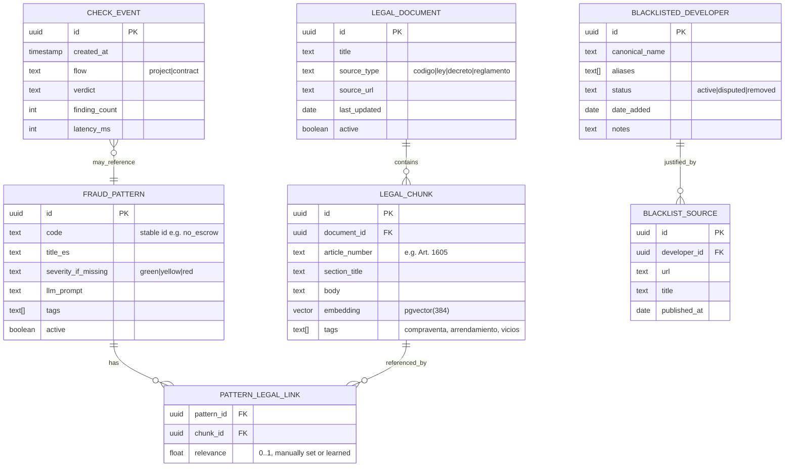

# Casa Segura — Backend Services (v2)

> Updated to include explicit OCR pipeline, RAG over Salvadoran legal corpus, and the data model (ER) needed to support both. Replaces v1.

## 0. What changed from v1

- **New: persistent data layer.** Postgres + pgvector. Used **only** for curated content (legal corpus, fraud patterns, blacklist) and aggregate metrics. *Never* for user-uploaded photos, PDFs, or contract text.
- **New: explicit OCR service.** Routes by document type. Vision LLM for billboards and scanned PDFs; pypdf for text PDFs; Tesseract as a free fallback if OpenRouter is throttled.
- **New: RAG service.** Each finding can cite a Salvadoran legal article. Retrieval lives in pgvector. Citations are surfaced in the web report and linked from SMS/email delivery.
- **Updated: `Finding` schema** now carries an optional `legal_reference`.
- **Updated: verdict synthesis** consumes retrieved legal context and is required to cite, not paraphrase.

---

## 1. Stack additions

| Layer | Choice | Why |
|---|---|---|
| Relational DB | Postgres 15+ | Single DB for ER and vectors |
| Vector store | pgvector extension | Avoids second service |
| ORM / migrations | **Django ORM** + **Django migrations** | Native to Django 5.2 LTS; matches project ADR-0001 |
| Embeddings | `paraphrase-multilingual-MiniLM-L12-v2` (sentence-transformers) | Free, multilingual, 80 MB, runs in-process |
| OCR fallback | Tesseract + `pdf2image` | Free, offline, used only if vision LLM fails |
| Hosting DB | Supabase or Railway Postgres | Free tier, pgvector available |

Everything else (**Django REST Framework** for the HTTP API, Celery + **Redis**, OpenRouter, SMS/email delivery providers) follows the stack in `docs/ARCHITECTURE.md` and [ADR-0001](../adr/ADR-0001-django-backend-stack.md).

---

## 2. Data model (ER)

### 2.1 Diagram



### 2.2 Entities

**`legal_document`** — A source of Salvadoran law. One row per distinct legal text.
- Examples: *Código Civil de El Salvador*, *Ley de Protección al Consumidor*, *Ley Especial de Lotificaciones y Parcelaciones para Uso Habitacional*.

**`legal_chunk`** — One article (or article fragment) from a `legal_document`. This is the unit of retrieval.
- Embedding column uses pgvector dimension matching the embedding model (384 for MiniLM).
- `tags` array enables fast filtering before vector search (e.g. only chunks tagged `compraventa`).

**`fraud_pattern`** — One thing we look for in a contract. Replaces v1's `patterns.yaml` (we keep YAML as the *seed* but persist in DB so curators can edit without redeploy).
- `code` is stable across edits; UI references this.
- `llm_prompt` is the question we ask the LLM during pattern detection.

**`pattern_legal_link`** — Many-to-many between patterns and legal chunks. When a pattern is detected, we surface the linked legal chunks as the citation. `relevance` lets us order or prune; for MVP we set it manually during seeding.

**`blacklisted_developer`** — Curated list. `aliases` handles spelling/branding variations. `status` supports the public dispute mechanism.

**`blacklist_source`** — Each blacklisted developer must have at least one cited public source (news article, court record). No source, no entry.

**`check_event`** — Aggregate metrics only. **No content. No PII.** Used for "how many people did we help this week" and nothing else. The `flow` and `verdict` columns are enums; the rest is counts and timing.

### 2.3 What is NOT in the database

- Uploaded photos
- Uploaded PDFs
- Extracted contract text
- Detected developer names from user uploads
- Phone numbers (only hashed phone → session_id mapping in Redis, TTL 24h)
- Web search results (cached in Redis, TTL 24h, key = developer name)

This separation is the privacy contract. Curated data persists. User data does not.

### 2.4 Migrations

**Django migrations** from project bootstrap. Initial migration(s) enable the pgvector extension and create ORM-backed tables (via `RunSQL` / `CREATE EXTENSION` where the backend does not auto-create extensions):

```sql
CREATE EXTENSION IF NOT EXISTS vector;
-- then Django migration–generated tables (VectorField, etc.)
```

See `docs/analysis/_shared/GLOBAL_ASSUMPTIONS.md` for per-module `migrations/` layout.

---

## 3. OCR service

### 3.1 Why explicit OCR

In v1 we relied on the vision LLM for both billboards and any image input. With contracts now accepting scanned PDFs (photos of contract pages), we need a real routing layer.

### 3.2 Service shape

`services/ocr.py`:

```python
from enum import Enum

class DocumentKind(Enum):
    BILLBOARD_IMAGE = "billboard_image"
    TEXT_PDF = "text_pdf"
    SCANNED_PDF = "scanned_pdf"
    UNSUPPORTED = "unsupported"

async def detect_kind(file_bytes: bytes, content_type: str) -> DocumentKind:
    """Routes by mime type, magic bytes, and PDF text-layer probe."""

async def extract_billboard(image_bytes: bytes) -> ExtractedBillboard:
    """Vision LLM with structured extraction prompt."""

async def extract_contract_text(file_bytes: bytes, kind: DocumentKind) -> str:
    """
    text_pdf  -> pypdf
    scanned_pdf -> pdf2image -> page-by-page vision LLM (preferred)
                              -> Tesseract (fallback if vision quota hit)
    """
```

### 3.3 Routing logic

| Input | Path | Notes |
|---|---|---|
| JPEG/PNG of billboard | Vision LLM with extraction prompt | Returns structured fields, not raw text |
| PDF with text layer | `pypdf` | Fast, free, accurate. Detect by attempting extraction; if total chars > 200, treat as text PDF |
| PDF without text layer | `pdf2image` → vision LLM per page | Vision LLM gives better accuracy than Tesseract on noisy scans |
| PDF without text layer + vision quota hit | `pdf2image` → Tesseract per page | Free fallback, lower accuracy |
| Anything else | Reject with friendly message | |

### 3.4 Probe to detect text PDFs

```python
def has_text_layer(pdf_bytes: bytes, threshold: int = 200) -> bool:
    """Quick check: extract first 3 pages, count characters."""
```

Cheap, correct most of the time. If it lies (rare), the contract analyzer will return empty findings — we surface that as "no pudimos leer el contrato" rather than silent failure.

### 3.5 OCR-related env vars

```
OCR_FALLBACK_ENABLED=true        # set false to force vision-only
TESSERACT_LANG=spa               # Spanish language pack required
PDF_MAX_PAGES=30                 # reject huge PDFs
```

---

## 4. RAG service

### 4.1 Goal

When the system reports a finding, it should cite the relevant article of Salvadoran law where applicable. This raises the verdict's authority and gives the user something concrete to bring to a lawyer.

### 4.2 Corpus for MVP

Pick **two sources to ingest well**, not five poorly:

1. **Código Civil de El Salvador** — articles on compraventa (1597-1718) and arrendamiento (1703 onward). The legal backbone.
2. **Ley de Protección al Consumidor** — relevant sections on abusive clauses and adhesion contracts.

If time permits at hour 30:
- *Ley Especial de Lotificaciones y Parcelaciones para Uso Habitacional*

Sources are downloaded from official portals (Asamblea Legislativa, Defensoría del Consumidor) once, committed to `corpus/raw/` in the repo, and re-ingestable by anyone who clones.

### 4.3 Ingestion (one-time, off-line)

`scripts/ingest_corpus.py`:

```python
def ingest(document_path: Path, document_meta: dict):
    text = read_pdf_or_html(document_path)
    chunks = split_by_article(text)         # heuristic: "Art. \d+" + first sentence
    for chunk in chunks:
        embedding = embed(chunk.body)        # sentence-transformers
        save(LegalChunk(
            document_id=...,
            article_number=chunk.article,
            body=chunk.body,
            embedding=embedding,
            tags=infer_tags(chunk.body),     # rule-based: compraventa, plazo, fideicomiso, etc.
        ))
```

Chunking strategy: **one article = one chunk** unless the article is over ~1500 characters, then split at numbered subsections. This keeps citations clean ("Art. 1605") rather than synthetic chunk IDs.

### 4.4 Retrieval (at query time)

`services/rag.py`:

```python
async def retrieve_for_finding(
    finding_text: str,
    pattern_code: str | None = None,
    top_k: int = 3,
) -> list[LegalReference]:
    """
    1. If pattern_code given, prefer pre-linked chunks via PATTERN_LEGAL_LINK.
    2. Otherwise, embed the finding text and do vector similarity search.
    3. Return top_k chunks above similarity threshold (default 0.65).
    4. Empty list if nothing meets threshold — DO NOT cite weakly.
    """
```

**Key rule:** RAG returns nothing rather than citing a weakly-relevant article. False citations are worse than no citations because they look authoritative.

### 4.5 Where RAG plugs in

In the verdict synthesis step (`services/verdict.py`), each finding produced by pattern detection or rule-based checks gets enriched:

```
finding (raw)
   → rag.retrieve_for_finding(finding.title + finding.explanation)
   → finding.legal_reference = top hit (or None)
```

The synthesis LLM then **does not** generate legal references — it only includes the retrieved ones verbatim. This separation is non-negotiable: generated citations hallucinate.

### 4.6 Embedding choices

For MVP: `paraphrase-multilingual-MiniLM-L12-v2` via sentence-transformers.
- 384-dim vectors
- Multilingual (Spanish handles well)
- ~80 MB model, runs CPU-only
- No API cost

Alternative (post-MVP): OpenAI `text-embedding-3-small` via OpenRouter. Better quality, costs money, requires an API call per embed.

### 4.7 RAG-related env vars

```
EMBEDDING_MODEL=paraphrase-multilingual-MiniLM-L12-v2
EMBEDDING_DIM=384
RAG_TOP_K=3
RAG_SIMILARITY_THRESHOLD=0.65
```

---

## 5. Updated schemas (Pydantic v2 domain DTOs)

API request/response serialization may use DRF serializers; **domain** shapes and LLM outputs stay as Pydantic `BaseModel` (v2) for a framework-free core.

```python
class LegalReference(BaseModel):
    document_title: str        # "Código Civil de El Salvador"
    article_number: str        # "Art. 1605"
    excerpt: str               # short verbatim quote (max 280 chars)
    source_url: str | None
    similarity: float          # 0..1, for debugging

class Finding(BaseModel):
    severity: Severity
    title: str
    explanation: str
    evidence: str | None       # quoted contract text or external URL
    legal_reference: LegalReference | None   # NEW
```

SMS links to the full report instead of fitting citations inline. The web report shows the citation when present:
```
Fecha de entrega vaga
El contrato dice "aproximadamente 18 meses" sin fecha cierta.
Código Civil, Art. 1605
```

Web rendering: the legal reference is a collapsible card under each finding.

---

## 6. Updated repo layout (Django)

Concrete layout matches `GLOBAL_ASSUMPTIONS.md` (per-feature packages, `infrastructure/django/` per module). Sketch:

```
casa_segura/
├── manage.py
├── config/
│   ├── settings/{base,dev,prod}.py
│   ├── urls.py
│   └── celery.py
├── scripts/
│   └── ingest_corpus.py
├── corpus/                   # F3: LegalDocument, LegalChunk, RAG
│   ├── raw/                  # source PDFs/HTML (gitignored if too big)
│   ├── README.md             # how to add a new legal source
│   ├── domain/               # Pydantic v2 entities / DTOs
│   ├── application/
│   └── infrastructure/
│       ├── django/
│       │   ├── models.py
│       │   ├── migrations/
│       │   ├── serializers.py
│       │   └── views.py
│       └── celery/
├── ingestion/                # F1: OCR, uploads
│   └── ...
└── tests/
```

Shared **Pydantic** DTOs live under each module's `domain/`; **Django ORM** models under `infrastructure/django/models.py` with `migrations/` alongside—**no** Alembic/SQLAlchemy tree.

---

## 7. Updated pipelines

### Flow 1 (project check)

1. `ocr.detect_kind` → `BILLBOARD_IMAGE`
2. `ocr.extract_billboard` → `ExtractedBillboard`
3. Parallel: `reputation.search`, blacklist match, permit format check
4. Build raw findings
5. **For each raw finding: `rag.retrieve_for_finding` → attach `legal_reference` if above threshold**
6. `verdict.synthesize_project` (synthesis prompt forbids new citations)
7. Persist `check_event` row (aggregate)
8. Create Redis session
9. Return

### Flow 2 (contract check)

1. Gate via `session.gate_check`
2. `ocr.detect_kind` → `TEXT_PDF` or `SCANNED_PDF`
3. `ocr.extract_contract_text` → string
4. For each pattern in `fraud_pattern`: `patterns.check_pattern` → Finding | None
5. Cross-checks (developer match, address match)
6. **For each Finding: `rag.retrieve_for_finding` (preferring `pattern_legal_link` shortcut)**
7. `verdict.synthesize_contract`
8. Persist `check_event`
9. Return

---

## 8. Updated risk log

In addition to v1 risks:

| ID | Risk | Trigger | Panic button |
|---|---|---|---|
| R8 | Legal corpus ingestion blows the schedule | Hour 6, less than 1 source ingested | Ship without RAG; findings lose citations but still work. RAG becomes v2 banner feature. |
| R9 | RAG retrieves irrelevant articles | QA shows weak matches surfacing as citations | Raise similarity threshold to 0.75; if still bad, disable auto-cite and use only `pattern_legal_link` shortcuts |
| R10 | pgvector deploy harder than expected on Railway free tier | Hour 8, can't get extension installed | Switch to Supabase (pgvector enabled by default) |
| R11 | Tesseract Spanish accuracy too low | OCR fallback returns gibberish | Drop Tesseract; on vision quota hit, return "intenta de nuevo en unos minutos" |

---

## 9. New environment variables (full list)

```
# Existing
OPENROUTER_API_KEY=
OPENROUTER_VISION_MODEL=
OPENROUTER_TEXT_MODEL=
SMS_API_KEY=
SMS_WEBHOOK_SECRET=
REDIS_URL=
SEARCH_PROVIDER=serpapi
SERPAPI_KEY=
ENV=development
LOG_LEVEL=INFO

# New
DATABASE_URL=postgresql+psycopg://...
EMBEDDING_MODEL=paraphrase-multilingual-MiniLM-L12-v2
EMBEDDING_DIM=384
RAG_TOP_K=3
RAG_SIMILARITY_THRESHOLD=0.65
OCR_FALLBACK_ENABLED=true
TESSERACT_LANG=spa
PDF_MAX_PAGES=30
```

---

## 10. ML / TensorFlow note (revised)

The team member with ML experience now has clear high-leverage work:

1. **Owns ingestion pipeline** — chunking heuristics, tag inference, embedding strategy. Quality of RAG depends on this.
2. **Owns retrieval tuning** — threshold calibration, evaluation set of (finding, expected article) pairs.
3. **Owns hallucination guardrails** — verifying that synthesis prompt never produces ungrounded citations. This is testable: feed synthesis fake retrieval results and check the output.

Still no TensorFlow in MVP. The path to a custom classifier (replacing some of the LLM pattern checks) opens once we have labeled data from real usage. That's a v2 conversation grounded in real signals.
