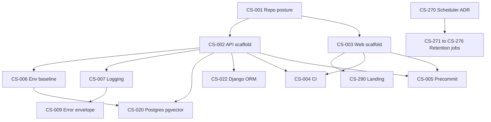

# Parallel Work Plan

This document turns the roadmap into pickable chunks for a three-engineer team working in parallel on the same repository. The source of truth remains `docs/Roadmap/README.md`, the epic files, and the individual tickets in `docs/Roadmap/tickets/`.

Use this plan to decide who owns which folder, which tickets are safe to start, and which work should wait for a dependency to land.

## Current Ready Picks

- **`CS-270`** — retention scheduler ADR ([`CS-270.md`](tickets/CS-270.md)) — `ready`.
- **`CS-298`** — Vercel frontend deploy ([`CS-298.md`](tickets/CS-298.md)) — `ready`; connect repo → set `CASASEGURA_API_BASE_URL` on Preview + Production ([`frontend/README.md`](../../frontend/README.md)); README runbook landed.
- **`CS-299`** — physical Android QA at 360px ([`CS-299.md`](tickets/CS-299.md)) — `ready` **after** a preview/production URL exists; checklist [`frontend/docs/CS-299-mobile-qa-checklist.md`](../../frontend/docs/CS-299-mobile-qa-checklist.md).
- **EPIC-12 (FE)** — Optional project verification shells: [`CS-356`](tickets/CS-356.md) / [`CS-351`](tickets/CS-351.md) / [`CS-355`](tickets/CS-355.md) are **`in_progress`**; enable locally with `PROJECT_VERIFICATION_ENABLED=true` ([`frontend/README.md`](../../frontend/README.md)).

**EPIC-03 (Legal Corpus & RAG) cerrado 2026-05-16.** CS-080..CS-090 → `done`. Stack productivo: `intfloat/multilingual-e5-large` (1024-dim, prefijos `passage:`/`query:`) + `BAAI/bge-reranker-v2-m3` sobre top-10 pgvector. AC revisado: Top-1 ≥ 0.60 ∧ Top-3 ≥ 0.85 ∧ Top-5 ≥ 0.95 (lo cumple en 0.633 / 0.900 / 0.967). Trace en [`CS-087`](tickets/CS-087.md) — "Live calibration runs #1–#4". **EPIC-02 (Contract Ingestion & OCR) sigue `in_progress` — único bloqueador de Phase 1 closure.**

**`CS-001`** (repo posture and README skeleton) is **`in_progress`**, not `ready`. Completing **`CS-001`** unblocks both scaffolds. Backend/FE foundation work flows through **`CS-002`** and **`CS-003`**.

Keep this list synchronized with `docs/Roadmap/phases/README.md`.

- `CS-002` establishes the **`backend/`** tree, which unlocks backend, config, logging, database, and CI work.
- `CS-003` establishes the **`frontend/`** tree, which unlocks frontend implementation and web CI.

**Path note:** Canonical layout is **`backend/`** and **`frontend/`** (see `AGENTS.md` and this repository). Ticket scope text on **CS-002** / **CS-003** still uses legacy **`apps/api`** / **`apps/web`** wording until those ticket files are updated.

## Engineer Lanes

These are ownership lanes for a three-person team. The phase docs use the same lane names: `FE WORK`, `BE WORK`, `INFRA WORK`, and `API / AI CONNECTIONS`.

### Engineer 1 - BE WORK: Backend Foundation

Primary folders:

- `backend/`
- `docs/adr/` when the ADR is backend-facing
- shared backend config files introduced by `CS-002`

Start here:

- `CS-002` - Django 5.2 LTS + DRF API scaffold with `pyproject`, ruff, mypy, pytest (see [ADR-0001](../adr/ADR-0001-django-backend-stack.md)).

Next picks after `CS-002`:

- `CS-007` - Structured logging with correlation IDs and version fields.
- `CS-008` - Health and readiness endpoints.
- `CS-009` - Standard error envelope schema.
- `CS-022` - Django ORM / database layer wired for DRF and workers.

Skill hints:

- Python design patterns for service layering and dependency injection.
- Python error handling for validation, exception mapping, and public error envelopes.
- Python type safety for strict public signatures, **Pydantic v2** domain DTOs and payloads, and Django ORM boundaries.

### Engineer 2 - FE WORK: Frontend Foundation

Primary folders:

- `frontend/`
- frontend-facing design/token files
- page and component folders introduced by `CS-003`

Start here:

- `CS-003` - Next.js scaffold with Tailwind, shadcn/ui, ESLint, Prettier.

Next picks after `CS-003`:

- `CS-290` - Mobile-first landing page — **done** (`frontend/` `/`).
- `CS-291` - Upload page with disclaimer gate — **done**.
- `CS-292` - Delivery channel selector — **done**.
- `CS-293` - Loading state with rotating Spanish reassurance copy — **done** (`frontend/` upload flow).
- `CS-294` - Result page (HTML report embed) — **done** (`frontend/` `/r/[publicShortId]`).
- `CS-295` - Expired-link UX (`/enlace-expirado`, PRD US-05) — **done**.
- `CS-297` - Single-source disclaimer module — **done** (`frontend/src/legal`).
- **`CS-298`** - Vercel deploy (`frontend/README.md`, headers/`robots`, env gate) — **ready** for operator verification (ticket AC¹–²).
- **`CS-299`** - Physical Android QA (360px / 4G) — **ready**; checklist `frontend/docs/CS-299-mobile-qa-checklist.md` (**after** Preview/Prod URL).
- **EPIC-12 (optional)** - Project verification shells — **`CS-356` / `CS-351` / `CS-355`** are **`in_progress`** (`frontend/src/app/verificacion-proyecto/`; `PROJECT_VERIFICATION_ENABLED` — `frontend/README.md`). Backend OCR/verdict tickets still open.

Constraints:

- Landing (`CS-290`) shipped in canonical `frontend/`; keep landing copy focused on contract analysis. Do not make billboard/project verification a prerequisite.
- Maintain Spanish `tú` register and include `Esto no es asesoría legal` where required.

Skill hints:

- Next.js best practices for App Router, server actions, and client/server boundaries.
- TypeScript expert for strict frontend contracts and test setup.
- UI/UX Pro Max and Web Interface Guidelines for mobile-first layout, accessibility, and contrast.

### Engineer 3 - INFRA WORK: Infra, Config, and Coordination

Primary folders:

- `.github/`
- `.cursor/rules/`
- root config files
- `docs/adr/`
- `docker-compose.yml`
- environment examples and deployment notes

Start here:

- `CS-270` - Retention job scheduler ADR. This is independent and already ready.

Next picks:

- `CS-006` - Secrets baseline and `.env.example`.
- `CS-004` - CI pipeline for API and web.
- `CS-005` - Pre-commit hooks for both apps.
- `CS-020` - Postgres 15+ with pgvector, local and remote notes.

Constraints:

- `CS-004` and `CS-005` should wait until both `CS-002` and `CS-003` define actual tool commands.
- `CS-020` should wait for `CS-002` and `CS-006`, because it needs API env conventions and database URL policy.
- `CS-270` can proceed now because it is an ADR and does not depend on current app folders.

Skill hints:

- Python design patterns for job interface shape if the ADR sketches callable contracts.
- Python error handling for job exit codes and failure semantics.
- Supabase or Neon Postgres skills if the remote pgvector host is selected.

### Shared - API / AI CONNECTIONS

Primary folders and contracts:

- `backend/` service boundaries that call OCR, RAG, delivery, or external providers
- prompt, retrieval, eval, and integration fixtures
- webhook, SMS, SMTP, model, and vector-search contracts

Start this lane when its backing BE or Infra foundation exists. Early API / AI work is concentrated in Phase 1 input pipelines, Phase 2 extraction, Phase 4 synthesis/citation wiring, Phase 5 delivery integrations, and optional project verification.

## Today Plan

### Round 1 - Unblock Folders

- One engineer completes or confirms `CS-001`.
- Backend engineer starts `CS-002` and lands the **`backend/`** scaffold.
- Frontend engineer prepares `CS-003` and then lands the **`frontend/`** scaffold.
- Infra engineer starts `CS-270` in `docs/adr` with no app dependency.

### Round 2 - Stabilize Shared Contracts

- Backend continues with `CS-007`, `CS-008`, and `CS-009`.
- Frontend continues EPIC-10 closure (operator **CS-298** deploy wiring, then **CS-299** device QA checklist) in `frontend/`.
- Infra starts `CS-006` after `CS-002` chooses env loading and app boot conventions.

### Round 3 - Make CI and Data Work Real

- Infra implements `CS-004` and `CS-005` after API and web scripts exist.
- Infra or data-oriented backend starts `CS-020`.
- Backend starts `CS-022` after database conventions are clear.

## Phase Clusters

### Phase 0 - Foundation and Schema

Own this before feature work:

- Foundation: `CS-001` through `CS-010`.
- Persistence: `CS-020` through `CS-035`.

Recommended split:

- `BE WORK`: `CS-002`, `CS-007`, `CS-008`, `CS-009`, `CS-021`, `CS-022`, and schema tickets.
- `FE WORK`: `CS-003`, then `CS-290` from the cross-cutting frontend epic.
- `INFRA WORK`: `CS-004`, `CS-005`, `CS-006`, `CS-020`, `CS-030`, `CS-032`, `CS-035`.
- `API / AI CONNECTIONS`: seed `RubricVersion` and `CorpusVersion` contracts that later rubric and RAG work consume.

### Phase 1 - Parallel Input Pipelines

These can split after schema basics are in place:

- OCR and ingestion: `CS-050` through `CS-060`.
- Legal corpus and RAG: `CS-080` through `CS-090`.

Recommended split:

- `BE WORK`: upload, file validation, extraction routing, pypdf, vision, Tesseract, not-analyzable envelopes.
- `FE WORK`: disclaimer acceptance coordination with upload UI.
- `INFRA WORK`: model/env variables, pgvector checks, latency instrumentation, CI fixture support.
- `API / AI CONNECTIONS`: corpus loader, chunking, tagging, embeddings, retrieval, evals, citation tracing.

### Phase 2 - Contract Intelligence

Main tickets:

- Classification and field extraction: `CS-110` through `CS-116`.

Recommended split:

- `BE WORK`: project name normalization handoff, confidence schemas, unverifiable bookkeeping.
- `FE WORK`: no primary phase-owned tickets; consume stable API outputs later.
- `INFRA WORK`: classification eval set and fixture hygiene.
- `API / AI CONNECTIONS`: prompts, few-shot anchors, leasing reclassification detector, economic extraction prompt.

### Phase 3 - Economic Analysis

Main tickets:

- Economic benchmarks and computations: `CS-130` through `CS-137`.

Recommended split:

- `BE WORK`: rate computations, total cost, overcost, summary model, and unverifiable renormalization.
- `FE WORK`: no primary phase-owned tickets; consume outputs later in reports.
- `INFRA WORK`: benchmark schema, versioned benchmark data, and boundary fixtures.
- `API / AI CONNECTIONS`: review the `EconomicSummary` contract before rubric work consumes it.

### Phase 4 - Evaluation Engine

Main tickets:

- Rubric framework, evaluators, synthesis, and BVA tests: `CS-150` through `CS-171`.

Recommended split:

- `BE WORK`: schemas, aggregation, applicability, overrides, band assignment, evaluator framework, and deterministic category evaluators.
- `FE WORK`: no primary phase-owned tickets; consume verdicts and findings later.
- `INFRA WORK`: BVA tests for bands, interest, down payment, overrides, and asymmetric penalty.
- `API / AI CONNECTIONS`: RAG citation wiring, verdict synthesis, and output validation.

### Phase 5 - User Output

Main tickets:

- Report generation: `CS-200` through `CS-210`.
- Multi-channel delivery: `CS-230` through `CS-248`.

Recommended split:

- `BE WORK`: Jinja shell, report sections, PDF rendering, delivery schemas, dispatcher, email, public link route, resend, and regeneration.
- `FE WORK`: result page, upload/delivery surface, mobile report behavior, and expired-link UX.
- `INFRA WORK`: queue, retry policy, dead-letter handling, and SMS secrets.
- `API / AI CONNECTIONS`: SMS, SMTP normalization, webhook contracts, and external delivery behavior.

### Phase 6 - Privacy Closure

Main tickets:

- Retention and privacy jobs: `CS-270` through `CS-276`.

Recommended split:

- `BE WORK`: cleanup SQL, anonymization, link expiration, recompute project metrics, and audit rows.
- `FE WORK`: expired-link behavior coordination.
- `INFRA WORK`: scheduler ADR and operational contract.
- `API / AI CONNECTIONS`: no primary tickets; privacy review still covers prompts, OCR text, delivery targets, reports, and logs.

### Cross-Cutting

`FE WORK`:

- `CS-290` through `CS-299`.

`INFRA WORK`:

- `CS-330` through `CS-337`.

`API / AI CONNECTIONS`:

- `CS-350` through `CS-356`.

Project verification is separate from contract analysis. Do not block upload or analysis flows on billboard OCR or project verification.

## Dependency Map

## Pick-Up Rules

- Pick one ticket at a time and claim it before opening a PR.
- Keep one ticket to one PR unless the ticket explicitly requires a split.
- Read the ticket frontmatter before coding, especially `depends_on`, `domain`, and `secondary_domains`.
- Do not start a blocked ticket unless the blocker is stubbed behind an agreed interface and the PR calls out the assumption.
- Stay inside your lane's primary folders unless the ticket explicitly spans domains.
- If a ticket changes an API contract, update or create the corresponding schema/version note before `FE WORK` depends on it.
- If a ticket touches privacy, logging, OCR text, delivery targets, or report content, assume PII leakage is the main failure mode.
- If a ticket touches UI, verify 360px mobile behavior and avoid horizontal scroll.
- If a ticket touches numeric thresholds, add or preserve BVA coverage from the ticket.

## Merge Conflict Avoidance

- Backend and frontend scaffolds should land before CI/pre-commit hardening.
- Do not have multiple engineers edit the same root config file in separate PRs without coordination.
- Defer broad formatting commits until after the first scaffold PRs land.
- Prefer additive docs changes in separate files over rewriting roadmap source files during implementation.
- Keep shared literals such as `Esto no es asesoría legal` in a single module once `CS-297` or `CS-337` lands.

## BE Stack Trace To Keep Visible

The roadmap standardizes on a **Django 5.2 LTS** + **DRF** Python backend ([ADR-0001](../adr/ADR-0001-django-backend-stack.md)):

- Django + DRF and Python 3.11+ in `CS-002` (local dev via `manage.py` conventions).
- **Pydantic v2** domain DTOs / validation in tickets such as `CS-009`, `CS-150`, `CS-230`, and related work (alongside DRF serializers where appropriate).
- **Django ORM** and **Django migrations** in `CS-021` and `CS-022`.
- **Postgres 15** with **pgvector** in `CS-020` and `CS-030`.
- **Redis** for **Celery** brokers/backends and related jobs across foundation and delivery tickets.
- pypdf, OpenRouter vision, and Tesseract for OCR in `CS-052` through `CS-055`.
- sentence-transformers MiniLM embeddings and pgvector retrieval in `CS-083` through `CS-085`.
- Jinja and WeasyPrint for report generation in `CS-200` through `CS-210`.
- **Celery** workers on **Redis** for delivery and async tasks (`CS-233` and dependents).
- SMS outbound integration in `CS-238` through `CS-244`.

When starting BE work, search for Python, Django, DRF, **Pydantic v2**, Django ORM, Postgres/pgvector, **Redis**/Celery, OCR, RAG, and SMS provider skills before implementation.

