# Entity Relationship Diagram — F1: Ingestion & Text Extraction Pipeline

> Generated: 2026-05-15
> Source: `PRD_F1_INGESTA_Y_OCR.md` §5 + `DOMAIN_MODEL.md` §4 + `PRD_F8_PERSISTENCIA_PROYECTO_RETENCION.md` §5

---

## Overview

F1 introduces two transient entities (`ContractSubmission`, `OcrJob`) and creates a stub `ContractAnalysis` row when the submission is accepted (so `public_short_id` and `submission_hash` are reserved before extraction starts). It also reserves the relationship to `Project` (filled by F2). The data model is intentionally lean: F1 keeps **counts and metadata only** — never the file bytes, never the extracted text.

`ContractSubmission` and `OcrJob` live for 24 hours. Hard cleanup is owned by F8 (the cron job runs every 15 minutes). Cascading delete from `ContractSubmission` removes its `OcrJob` children. A `ContractAnalysis` row is created early because it owns the `public_short_id` the user receives in the upload response; that `analysis_id` is back-filled into `ContractSubmission.analysis_id` upon success.

---

## Mermaid Diagram

```mermaid
erDiagram
    PROJECT ||--o{ CONTRACT_ANALYSIS : "1 — N (filled by F2)"
    CONTRACT_ANALYSIS ||--o{ CONTRACT_SUBMISSION : "1 — N (typically 1)"
    CONTRACT_SUBMISSION ||--o{ OCR_JOB : "1 — N (1 per strategy×attempt)"

    PROJECT {
        uuid id PK
        text canonical_name
        text normalized_name UK
        timestamptz first_seen
        timestamptz last_analyzed
        timestamptz last_recomputed_at
        int total_analyses
        numeric avg_score
        jsonb score_distribution
        jsonb metadata
    }

    CONTRACT_ANALYSIS {
        uuid id PK
        text public_short_id UK
        uuid project_id FK
        text submission_hash
        text contract_type
        text contract_type_declared
        bool contract_type_reclassified
        text reclassification_reason
        jsonb reclassification_indicators
        numeric classification_confidence
        int classification_attempts
        jsonb elements_detected
        numeric score_total
        text band
        text_array override_triggered
        jsonb scores_by_category
        jsonb criterion_evaluations
        jsonb findings
        int findings_count
        int critical_findings_count
        int unverifiable_count
        text executive_summary
        jsonb economic_summary
        text rubric_version FK
        text corpus_version FK
        text benchmark_version FK
        text delivery_status
        text delivery_channel
        text delivery_target_hash
        timestamptz link_expires_at
        int resend_count
        timestamptz anonymized_at
        timestamptz created_at
    }

    CONTRACT_SUBMISSION {
        uuid id PK
        text submission_hash
        text public_short_id UK
        int file_count
        bigint total_size_bytes
        int total_pages
        text_array file_formats
        text source
        jsonb source_metadata
        text processing_status
        text extraction_strategy_attempted
        text extraction_strategy_successful
        int extracted_text_token_count
        text extracted_text_language
        numeric extracted_text_language_confidence
        text error_code
        text error_reason
        uuid analysis_id FK
        timestamptz disclaimer_accepted_at
        text disclaimer_accepted_via
        timestamptz received_at
        timestamptz processing_started_at
        timestamptz processing_completed_at
        timestamptz expires_at
    }

    OCR_JOB {
        uuid id PK
        uuid submission_id FK
        text strategy
        int attempt_number
        text model_used
        timestamptz started_at
        timestamptz completed_at
        text status
        int pages_processed
        int pages_failed
        int tokens_consumed
        int cost_estimate_cents
        numeric average_confidence
        text error_code
        text error_message
        timestamptz expires_at
    }
```

---

## Entity Definitions

### ContractSubmission

**Purpose:** A single user act of uploading a contract for analysis. Owns the disclaimer acceptance record, the per-strategy OCR jobs, and the hash that lets the system dedupe identical re-uploads. Transient — discarded after 24 hours regardless of outcome.

#### ORM Model (`ingestion/infrastructure/django/models.py`, declared in `platform.infrastructure.django.models`)

| Field | Type | Nullable | Default | Constraints / Index | Description |
|---|---|---|---|---|---|
| `id` | UUID | No | `gen_random_uuid()` | PK | Internal identifier |
| `submission_hash` | TEXT | No | — | INDEX `idx_submission_hash` | SHA-256 of concatenated per-file hashes ordered by filename |
| `public_short_id` | TEXT | No | — | UNIQUE, INDEX | Short ID reserved at receipt; reused on the `ContractAnalysis` row |
| `file_count` | INT | No | — | CHECK `1..50` | Number of files in this submission |
| `total_size_bytes` | BIGINT | No | — | — | Sum of file sizes |
| `total_pages` | INT | Yes | — | — | Sum of PDF pages + count of images |
| `file_formats` | TEXT[] | No | — | — | E.g. `['pdf']` or `['jpg','jpg','png']` |
| `source` | TEXT | No | — | CHECK `'web' | 'whatsapp'` | Origin channel |
| `source_metadata` | JSONB | No | `'{}'` | — | Hashed IP/UA (web) or phone hash + Zavu msg id (whatsapp) |
| `processing_status` | TEXT | No | `'received'` | CHECK 13 values, INDEX | State machine |
| `extraction_strategy_attempted` | TEXT | Yes | — | CHECK `pypdf|vision_llm|tesseract` | First strategy chosen |
| `extraction_strategy_successful` | TEXT | Yes | — | CHECK `pypdf|vision_llm|tesseract` | Strategy that returned valid text |
| `extracted_text_token_count` | INT | Yes | — | — | `tiktoken cl100k_base` count; never the text itself |
| `extracted_text_language` | TEXT | Yes | — | — | `langdetect` top language code |
| `extracted_text_language_confidence` | NUMERIC(3,2) | Yes | — | — | Detection confidence |
| `error_code` | TEXT | Yes | — | — | Normalized error code on failure |
| `error_reason` | TEXT | Yes | — | — | Operator-facing message |
| `analysis_id` | UUID | Yes | — | FK→`contract_analysis(id)`, INDEX partial | Set when the analysis stub is committed |
| `disclaimer_accepted_at` | TIMESTAMPTZ | No | — | — | When the user accepted |
| `disclaimer_accepted_via` | TEXT | No | — | CHECK `'web_checkbox' | 'whatsapp_reply'` | How |
| `received_at` | TIMESTAMPTZ | No | `NOW()` | — | Server clock |
| `processing_started_at` | TIMESTAMPTZ | Yes | — | — | Worker pickup time |
| `processing_completed_at` | TIMESTAMPTZ | Yes | — | — | Worker terminal time |
| `expires_at` | TIMESTAMPTZ | No | `NOW() + 24h` | INDEX | Cleanup trigger |

**Composite constraints:**

- `analysis_required_when_completed CHECK ((processing_status='completed' AND analysis_id IS NOT NULL) OR (processing_status != 'completed'))`

#### Domain Entity (`ingestion/domain/entities.py`)

| Field | Type | Default | Description |
|---|---|---|---|
| `id` | UUID \| None | None | Set after insert |
| `submission_hash` | str | — | SHA-256 hex |
| `public_short_id` | str | — | Format `CS-YYYY-XXXXXX` |
| `file_count` | int | — | 1..50 |
| `total_size_bytes` | int | — | — |
| `total_pages` | int \| None | None | — |
| `file_formats` | list[str] | — | — |
| `source` | SubmissionSource | — | Enum |
| `source_metadata` | dict[str, str] | `{}` | Always hashed |
| `processing_status` | ProcessingStatus | `RECEIVED` | Enum |
| `extraction_strategy_attempted` | ExtractionStrategy \| None | None | Enum |
| `extraction_strategy_successful` | ExtractionStrategy \| None | None | Enum |
| `extracted_text_token_count` | int \| None | None | — |
| `extracted_text_language` | str \| None | None | ISO 639-1 |
| `extracted_text_language_confidence` | float \| None | None | 0..1 |
| `error_code` | str \| None | None | — |
| `error_reason` | str \| None | None | — |
| `analysis_id` | UUID \| None | None | — |
| `disclaimer_accepted_at` | datetime | — | — |
| `disclaimer_accepted_via` | DisclaimerAcceptanceMethod | — | Enum |
| `received_at` | datetime | `now()` | — |
| `processing_started_at` | datetime \| None | None | — |
| `processing_completed_at` | datetime \| None | None | — |
| `expires_at` | datetime | `received_at + 24h` | — |

### OcrJob

**Purpose:** One observable run of one extraction strategy over the submission (or one page thereof). Records cost, latency, status, and the model used. Multiple `OcrJob` rows per `ContractSubmission` are normal (e.g., a retry after vision_llm partial failure, or a successive Tesseract fallback). Transient — 24 h TTL with `ON DELETE CASCADE` from `ContractSubmission`.

#### ORM Model (`ingestion/infrastructure/django/models.py`, declared in `platform.infrastructure.django.models`)

| Field | Type | Nullable | Default | Constraints / Index | Description |
|---|---|---|---|---|---|
| `id` | UUID | No | `gen_random_uuid()` | PK | — |
| `submission_id` | UUID | No | — | FK→`contract_submission(id)` ON DELETE CASCADE, INDEX | Owning submission |
| `strategy` | TEXT | No | — | CHECK `pypdf|vision_llm|tesseract` | What was tried |
| `attempt_number` | INT | No | 1 | CHECK `>=1` | Retry counter |
| `model_used` | TEXT | Yes | — | — | E.g. `anthropic/claude-sonnet-4` (vision_llm only) |
| `started_at` | TIMESTAMPTZ | No | `NOW()` | — | — |
| `completed_at` | TIMESTAMPTZ | Yes | — | — | — |
| `status` | TEXT | No | — | CHECK `running|success|failed|timeout|cancelled`, INDEX | Terminal state |
| `pages_processed` | INT | Yes | — | — | OK page count |
| `pages_failed` | INT | Yes | — | — | Failed page count |
| `tokens_consumed` | INT | Yes | — | — | Vision LLM only |
| `cost_estimate_cents` | INT | Yes | — | — | USD cents |
| `average_confidence` | NUMERIC(4,2) | Yes | — | — | Tesseract only |
| `error_code` | TEXT | Yes | — | — | — |
| `error_message` | TEXT | Yes | — | — | — |
| `expires_at` | TIMESTAMPTZ | No | `NOW() + 24h` | INDEX | Cleanup |

#### Domain Entity (`ingestion/domain/entities.py`)

| Field | Type | Default | Description |
|---|---|---|---|
| `id` | UUID \| None | None | — |
| `submission_id` | UUID | — | — |
| `strategy` | ExtractionStrategy | — | Enum |
| `attempt_number` | int | 1 | — |
| `model_used` | str \| None | None | — |
| `started_at` | datetime | `now()` | — |
| `completed_at` | datetime \| None | None | — |
| `status` | OcrJobStatus | `RUNNING` | Enum |
| `pages_processed` | int \| None | None | — |
| `pages_failed` | int \| None | None | — |
| `tokens_consumed` | int \| None | None | — |
| `cost_estimate_cents` | int \| None | None | — |
| `average_confidence` | float \| None | None | — |
| `error_code` | str \| None | None | — |
| `error_message` | str \| None | None | — |
| `expires_at` | datetime | `started_at + 24h` | — |

---

## Relationships with Existing Models

There is no existing codebase — all relationships are with tables defined by F8. F1 reads/writes:

- **`contract_analysis`**: F1 creates the stub row at submission accept time with `public_short_id`, `submission_hash`, `created_at`, `delivery_channel`, and `delivery_target_hash` populated. Every other column in `contract_analysis` is populated downstream by F2 / F4 / F5 / F7. F1 references it via `ContractSubmission.analysis_id`.
- **`project`**: F1 does **not** create or read `Project`. F2 does. The FK `contract_analysis.project_id` is `NOT NULL` per F8, so the stub row created by F1 must satisfy that. **Decision (see `EVALUATION_COVERAGE.md` Q-F1-04)**: a system-wide placeholder project `unknown_pending` (created by the bootstrap migration) is assigned to every stub `ContractAnalysis`; F2 reassigns to the real project once the name is extracted.

---

## Modifications to Existing Models

F1 introduces no DDL of its own; the tables are declared in F8. F1 is responsible for the runtime INSERT/UPDATE semantics. The columns named here are the canonical schema declared in `PRD_F8_PERSISTENCIA_PROYECTO_RETENCION.md` §5.1.

| Model | Field | Change | Reason | Destructive |
|---|---|---|---|---|
| (none) | — | — | F1 does not alter any existing column or index | No |

---

## Data Dictionary

| Term | Definition |
|---|---|
| `analysis_id` | The UUID of the `ContractAnalysis` row owning this submission's result; back-filled by F1 when the analysis stub is created |
| `attempt_number` | Sequential counter of retries within a strategy; starts at 1 |
| `average_confidence` | For Tesseract jobs, the mean per-token confidence as reported by `pytesseract.image_to_data` |
| `cost_estimate_cents` | The estimated USD cents this LLM call cost, computed against the configured per-model pricing table |
| `disclaimer_accepted_at` | UTC timestamp at which the user accepted the disclaimer; required before extraction begins |
| `disclaimer_accepted_via` | `'web_checkbox'` if the front-end sent `disclaimer_accepted=true`, `'whatsapp_reply'` if the user replied affirmatively to the bot's welcome |
| `error_code` | Normalized internal code from the table in `IMPLEMENTATION_PLAN.md` §Error Codes |
| `expires_at` | UTC timestamp at which the row is eligible for hard-delete by F8 cron |
| `extracted_text_language` | ISO 639-1 code of the detected language (`'es'` expected) |
| `extracted_text_language_confidence` | Probability returned by the language detector for the top language |
| `extracted_text_token_count` | Total tokens in the extracted text using OpenAI's `cl100k_base` encoding; used only for cost auditing |
| `extraction_strategy_attempted` | The first strategy chosen by the diagnosis step |
| `extraction_strategy_successful` | The strategy that finally returned valid text |
| `file_formats` | List of MIME-mapped short codes: `pdf`, `jpg`, `jpeg`, `png`, `heic`, `webp` |
| `model_used` | The OpenRouter model identifier (e.g. `anthropic/claude-sonnet-4`) for vision_llm jobs |
| `pages_failed` | Pages where the strategy could not return valid text |
| `pages_processed` | Pages where the strategy returned valid text |
| `processing_status` | One of `received`, `extracting`, `extracted`, `classifying`, `analyzing`, `completed`, `failed_extraction`, `failed_classification`, `failed_analysis`, `rejected_language`, `rejected_type`, `rejected_size`, `expired` |
| `public_short_id` | Human-friendly identifier visible to the user, format `CS-YYYY-XXXXXX` with 30+ bits of entropy in the suffix |
| `received_at` | UTC timestamp of API entry |
| `source` | `'web'` for multipart upload, `'whatsapp'` for messages routed via Zavu |
| `source_metadata` | Hashed audit fields (IP+UA for web, phone+message id for WhatsApp); never raw |
| `submission_hash` | SHA-256 of `\n`-joined per-file SHA-256 hex digests sorted by filename |
| `tokens_consumed` | LLM tokens consumed by a vision_llm job (sum of input + output across pages) |
| `total_pages` | Sum of PDF pages plus 1 per image |
| `total_size_bytes` | Sum of file sizes before any rasterization |

---

## Migration Notes

- **Django migrations**: `platform/infrastructure/django/migrations/0001_initial.py` (owned by F8) creates `contract_submission` and `ocr_job` exactly as defined here. F1 does not author a migration; it only exposes the model classes via its own `ingestion.infrastructure.django.models` re-export so the `IngestionConfig` app can register admin views without redeclaring the schema.
- **Indices marked critical** by F1's hot paths (declared via Django `models.Index` in the `Meta.indexes` list):
  - `idx_submission_hash` on `contract_submission(submission_hash)` — every submit hits it
  - `idx_submission_status` on `contract_submission(processing_status)` — the worker polls by status
  - `idx_submission_expires` on `contract_submission(expires_at)` — F8 cleanup cron
  - `idx_submission_public_short` on `contract_submission(public_short_id)` — status endpoint
  - `idx_ocr_job_submission` on `ocr_job(submission_id)` — list jobs of a submission
- **No destructive change**: F1 is greenfield.
- **Seed**: F8's bootstrap data migration inserts one row into `project` with `normalized_name='__unknown_pending__'`, `canonical_name='Pending project assignment'`, `metadata={"placeholder": true}` so F1 can satisfy the `project_id NOT NULL` constraint on `contract_analysis`. The actual project assignment is updated by F2.

---

**End of document.**
