# Feature Overview — F1: Ingestion & Text Extraction Pipeline

> Generated: 2026-05-15
> Source PRD: `docs/Casa Segura Formal PRDs/PRD_F1_INGESTA_Y_OCR.md`
> See cross-cutting decisions: `../_shared/GLOBAL_ASSUMPTIONS.md`

---

## Executive Summary

Casa Segura accepts a real estate contract — in any common format (PDF native, scanned PDF, photos taken with a phone, screenshots) — and starts an automated analysis pipeline. **F1 is the first stage** of that pipeline. Its single responsibility is to receive the contract, decide the cheapest extraction strategy that will work, run it, deliver clean Spanish text to the next stage, and discard the original file.

The product promise is privacy: the contract is never written to disk and the extracted text is passed in memory between features. The product promise is also low cost: a 38-criterion analysis is bounded to one or two LLM passes at most, so the OCR stage cannot afford an expensive vision model for a contract that could have been read for free with `pypdf`. F1 makes that routing decision deterministically.

F1 supports two channels: a web upload (multipart) and a Zavu webhook for WhatsApp. Both converge on the same `ContractSubmission` entity. A submission may bundle multiple files (one image per page when arriving via WhatsApp). Validation rules (50 files max, 80 pages max, 100 MB total, Spanish only) protect the pipeline cost ceiling.

---

## Key Concepts

| Term | Plain-language definition |
|---|---|
| **Submission** | A single user act of uploading one or more files that together represent one contract |
| **Hash deduplication** | The SHA-256 of the submission content; if we have already analyzed the exact same bytes, the user gets back the existing analysis without paying again |
| **Extraction strategy** | The technique chosen to turn the file into plain text: `pypdf` (free, fast, only for native PDFs), `vision_llm` (paid, accurate, for scans and photos), or `tesseract` (free, lower quality, the fallback) |
| **OCR job** | One run of one strategy over one file (or page). A submission may produce several OCR jobs |
| **Disclaimer** | The text "Esto no es asesoría legal", which the user must accept before any extraction starts |
| **Public short id** | A short identifier visible to the user, e.g. `CS-2026-A1B2C3`. Used to look the analysis up later |
| **Cost saver mode** | An operational flag that prefers Tesseract over the vision LLM, at the cost of quality, for cost emergencies |

---

## How It Works (Step by Step)

1. **The user accepts the disclaimer** on the web page or in WhatsApp (replying "acepto" to the bot's first message).
2. **The user uploads** one or more files. On the web, they pick a delivery channel (email, WhatsApp, or web link) and a destination. On WhatsApp, the channel is implicitly "whatsapp_summary" and the destination is the phone number Zavu sees.
3. **F1 validates the files**: every file must be in a supported format (PDF, JPG/JPEG, PNG, HEIC, WEBP), under 15 MB each, dimensions and total page count within limits.
4. **F1 hashes the submission** (SHA-256 of the concatenation of per-file hashes ordered by name). If the hash already exists in a non-anonymized previous analysis with the same active rubric version, F1 returns the prior `analysis_id` immediately (HTTP 409 with `is_duplicate=true`).
5. **F1 diagnoses each file**: PDFs are probed with `pypdf.extract_text()` on page 1; if more than 100 characters of usable text appear, the strategy is `pypdf`. Otherwise (and for every image), the strategy is `vision_llm`.
6. **F1 runs the strategy**:
   - `pypdf`: instant, free, concatenates per-page text with `\n\n--- PAGE N ---\n\n` separators
   - `vision_llm`: rasterizes PDF pages at 150 DPI, calls OpenRouter (default `anthropic/claude-sonnet-4`) per page with the OCR prompt in §8.1 of the PRD, retries each page up to 2 times on transient failures, fails the whole submission if 30%+ pages fail
   - `tesseract`: local fallback when vision LLM fails or in `cost_saver_mode`, with Spanish language pack and minimum confidence 60
7. **F1 detects the language** with `langdetect`/`lingua-py` over the first 2000 characters. If not Spanish with confidence ≥ 0.85, the submission is rejected with `LANGUAGE_NOT_SUPPORTED`.
8. **F1 discards the original file** and any temporary blob in Redis.
9. **F1 publishes** the extracted text + metadata to the F2 queue (Redis Streams). It also updates `ContractSubmission.processing_status` to `extracted` and writes per-job metrics to `OcrJob`.
10. **The user polls** `GET /v1/contracts/{submission_id}/status` every 3 seconds until the status reaches `completed`, `rejected_language`, `failed_extraction`, or any other terminal state. The endpoint returns no contract content, only state and progress.

---

## Business Rules

- **BR-F1-01:** The original contract file never reaches persistent disk. It exists in process memory (or Redis with TTL ≤ 300 s) and is deleted as soon as text extraction finishes, success or failure.
- **BR-F1-02:** The extracted text itself is never persisted in any table. Only its token count is recorded in `ContractSubmission.extracted_text_token_count` for cost auditing.
- **BR-F1-03:** Deduplication by `submission_hash` is strict; the same bytes return the same analysis without re-running OCR or LLM calls — unless the rubric version differs from the prior run, in which case a new analysis is created.
- **BR-F1-04:** Extraction strategies are tried in order of cost: `pypdf` → `vision_llm` → `tesseract`. The system never starts with the expensive strategy when the cheap one would work.
- **BR-F1-05:** Every LLM call uses an idempotency key (`submission_id:page_number:strategy:attempt_number`) so retries do not double-bill.
- **BR-F1-06:** If the language is not Spanish at ≥ 0.85 confidence, the submission is rejected (`rejected_language`) and the user is told.
- **BR-F1-07:** The disclaimer must have been explicitly accepted before processing starts. No disclaimer → HTTP 400 `DISCLAIMER_REQUIRED`.
- **BR-F1-08:** The submission caps: ≤ 50 files, ≤ 80 total pages, ≤ 100 MB total, ≤ 15 MB per file.
- **BR-F1-09:** WhatsApp sessions in Redis live 300 seconds from the last message; when the user types "listo" (or any synonym) or the window times out, the session closes and the submission is created.
- **BR-F1-10:** Transient rows (`ContractSubmission`, `OcrJob`) expire after 24 hours and are hard-deleted by an F8 cron job.

---

## Lifecycle Diagram

Submission status machine (subset relevant to F1):

```mermaid
stateDiagram-v2
    [*] --> received: file accepted, disclaimer ok
    received --> extracting: worker picks up
    extracting --> extracted: pypdf or vision_llm or tesseract returned text
    extracting --> failed_extraction: all strategies failed
    extracting --> rejected_language: language ≠ es
    extracting --> rejected_size: page or size cap exceeded (rare; usually caught at submit)
    rejected_language --> [*]
    rejected_size --> [*]
    failed_extraction --> [*]
    extracted --> classifying: passed to F2
    classifying --> analyzing: F4/F5 running (out of F1 scope)
    analyzing --> completed
    extracted --> expired: 1 hour without movement (cron)
    received --> expired: stuck more than 1 hour (cron)
```

---

## What Changes in the System

**New persistent tables** (defined in F8 schema, used here):
- `contract_submission` — one row per submission, transient (24 h)
- `ocr_job` — one row per (submission × strategy × attempt), transient (24 h)

**New API endpoints** (DRF):
- `POST /v1/contracts/submit` — receive a contract from the web (`SubmissionViewSet.submit`)
- `GET /v1/contracts/{id}/status` — public status polling (`SubmissionViewSet.status`)
- `POST /v1/zavu/webhook` — receive WhatsApp messages from Zavu (`ZavuWebhookView`)

**New background workers** (Celery):
- `process_submission` task: consumes the in-memory submission via Redis, runs extraction, writes to F2's Redis Stream
- `mark_stuck_submissions` periodic task: hourly cleanup (registered via `django-celery-beat`)
- `whatsapp_session_listener`: a daemon process subscribed to Redis keyspace `__keyevent@0__:expired` notifications that closes timed-out WhatsApp sessions (runs outside Celery because Celery does not natively support Redis keyspace pub/sub)

**New external integrations**:
- OpenRouter (vision model)
- Zavu (incoming media + webhook signature verification)
- Redis (sessions + internal queues)

**New cron jobs** (defined in F8, mentioned here):
- Every 15 min: `cleanup_transient` removes `contract_submission`/`ocr_job` with `expires_at < NOW()`
- Every hour: marks abandoned submissions stuck > 1 hour as `expired`

**New env vars** (see `IMPLEMENTATION_PLAN.md` for full list): `OCR_VISION_MODEL`, `OCR_VISION_DPI`, `OCR_VISION_MAX_IMAGE_DIM_PX`, `OCR_VISION_TIMEOUT_PER_PAGE_SECONDS`, `OCR_TESSERACT_ENABLED`, `OCR_COST_SAVER_MODE`, `OPENROUTER_API_KEY`, `ZAVU_API_KEY`, `ZAVU_WEBHOOK_SECRET`.

---

## What This Feature Does NOT Do

- Does **not** classify the contract type (that is F2).
- Does **not** evaluate the rubric or compute a score (that is F4).
- Does **not** persist the contract text or any clauses (that is forbidden across the pipeline).
- Does **not** image-preprocess scans (the vision model handles this).
- Does **not** support DOCX, ODT, TIFF, BMP, or any non-PDF/non-image format.
- Does **not** accept contracts in languages other than Spanish.
- Does **not** support partial contract uploads across multiple submissions (all pages must arrive in one submission).
- Does **not** offer a public retry endpoint (retry is automatic and internal only).
- Does **not** keep a user history (no accounts).

---

## Audit and Compliance

- **What we log**: `submission_id`, `analysis_id`, `extracted_text_token_count`, strategy chosen and outcome, language detected and confidence, cost in cents per LLM call, latency, errors, hashed `source_metadata` (IP, user agent, phone hash). Never the contract content, never the file bytes, never the destination value in clear.
- **Where it ends up**: structured JSON logs (`structlog`), Prometheus metrics for per-strategy success/latency/cost, daily aggregate cost view (`v_ocr_daily_costs`).
- **Retention**:
  - `contract_submission`, `ocr_job`: 24 h, then hard-deleted by F8 cron
  - Cost view rows: 30 days
  - Structured logs: per infrastructure policy (typically 30–90 d), with redaction enforced at the logger level
- **No PII in logs**: assertable by a smoke test that scans recent log lines for forbidden patterns

---

## Assumptions Made

The full list is in `EVALUATION_COVERAGE.md` and `_shared/GLOBAL_ASSUMPTIONS.md`. Headline assumptions:

1. **Stack**: Django 5.2 LTS + DRF + Pydantic v2 (domain) + Django ORM (persistence) + Celery 5.4 (workers) + Redis (Streams + sessions) + Postgres 15 + pgvector. Confirmed by the user on 2026-05-15. See `_shared/GLOBAL_ASSUMPTIONS.md` §1 for the full mapping.
2. **Vision model**: Default `anthropic/claude-sonnet-4` via OpenRouter. F1 PRD Open Question 1 lists this as not finalized; the default is fixed but overridable by env var.
3. **Tesseract**: Installed via OS package `tesseract-ocr` + `tesseract-ocr-spa` in the worker image (not the API image).
4. **HEIC support**: Via `pillow-heif` (modern alternative to `pyheif`); requires `libheif` in the worker OS image. F1 Open Question 4.
5. **Internal queue**: Redis Streams (at-least-once delivery, deduped by `submission_id`). F1 Open Question 7.
6. **Per-IP rate limit**: 5 submissions/hour/IP, 3 per WhatsApp number (default; configurable). F1 Open Question 3.
7. **PDF safety**: PDFs containing JavaScript or interactive forms are rejected at validation with `PDF_NOT_SAFE`. F1 Open Question 5.
8. **Cost saver mode**: Off by default. F1 Open Question 8.

---

**End of document.**
