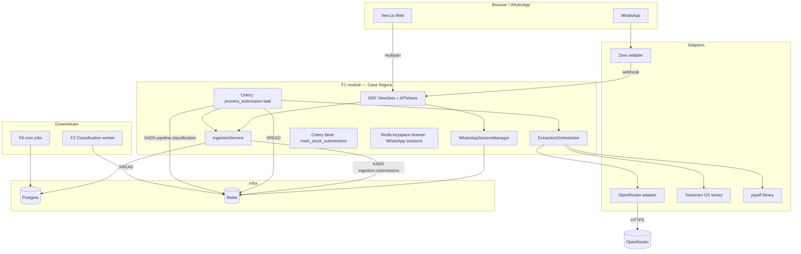
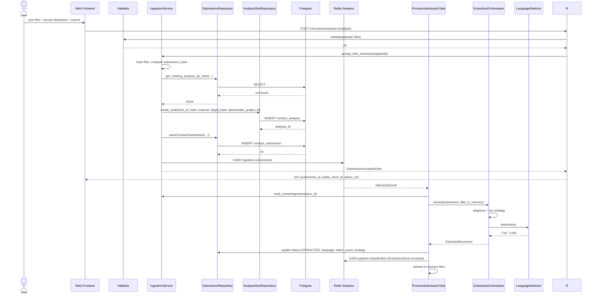
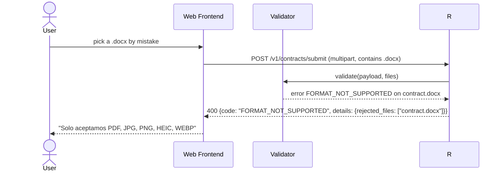
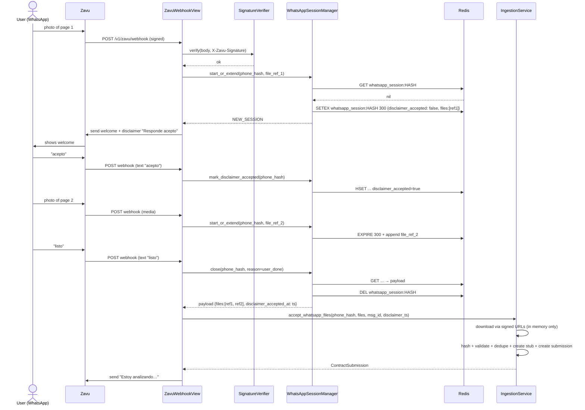
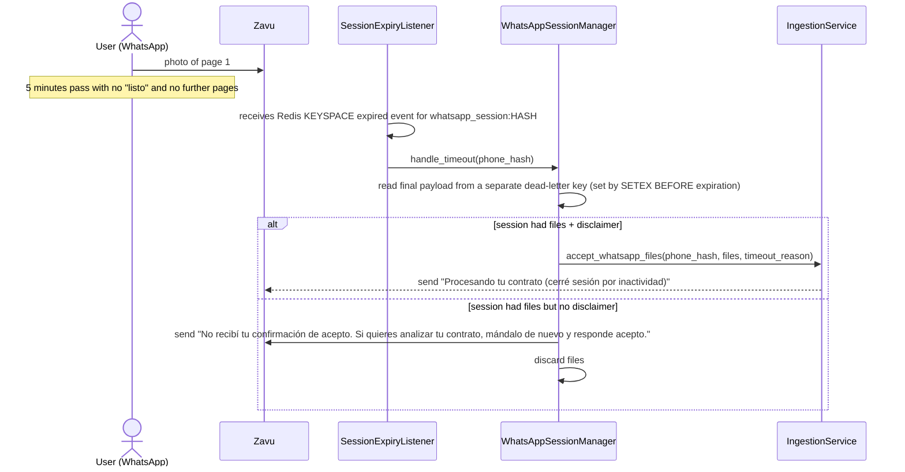
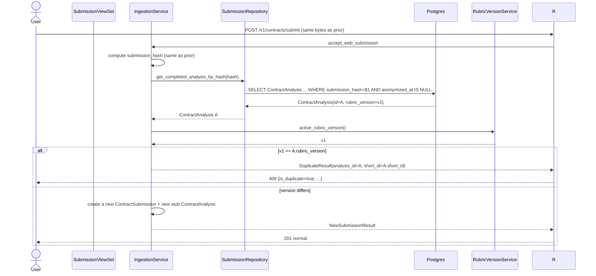
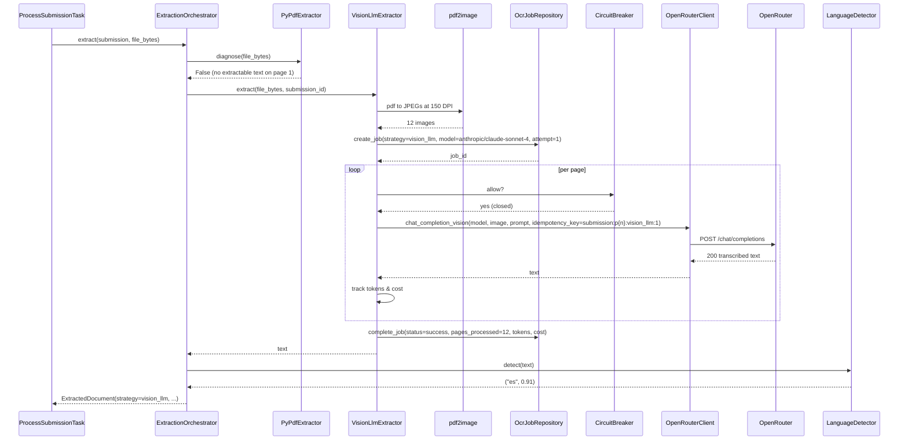
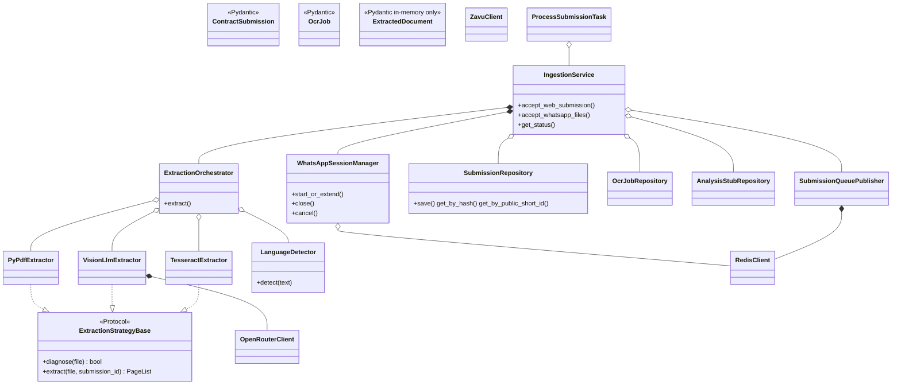

# Interaction Diagrams — F1: Ingestion & Text Extraction Pipeline

> Generated: 2026-05-15
> Companion to `SOLUTION_DIAGRAMS.md`. The diagrams below focus on **inter-component** flows (across modules and external systems) rather than the structural class views in SOLUTION_DIAGRAMS.

---

## Component Overview



---

## Flow: US-01 Web upload — happy path

### Sequence Diagram — Happy Path



### Sequence Diagram — Validation error (FORMAT_NOT_SUPPORTED)



---

## Flow: US-02 WhatsApp — multi-message session

### Sequence Diagram — Happy Path



### Sequence Diagram — Session timeout without "listo"



(Note: Redis keyspace notifications require enabling `notify-keyspace-events Ex` in the Redis config; documented in `IMPLEMENTATION_PLAN.md`.)

---

## Flow: US-03 Deduplication on hash collision

### Sequence Diagram



---

## Flow: US-06 Vision LLM extraction

### Sequence Diagram



### Sequence Diagram — Vision partial failure + Tesseract fallback

```mermaid
sequenceDiagram
    participant V as VisionLlmExtractor
    participant CB as CircuitBreaker
    participant C as OpenRouterClient
    participant T as TesseractExtractor
    participant O as ExtractionOrchestrator
    participant Repo as OcrJobRepository

    V->>C: page 5 chat_completion_vision
    C-->>V: 503 (transient)
    V->>V: backoff 1s
    V->>C: retry attempt 2 (same idempotency key)
    C-->>V: 503
    V->>V: backoff 4s
    V->>C: retry attempt 3 (max)
    C-->>V: 503
    V->>V: mark page 5 failed; continue to page 6
    Note over V: 4 of 12 pages failed → 33% > threshold 30%
    V->>Repo: complete_job(status=failed, pages_failed=4, ...)
    V-->>O: PartialFailure(pages_failed=4)
    O->>O: OCR_TESSERACT_ENABLED → yes
    O->>T: extract(file_bytes, submission_id, only_pages=[5,7,9,12])
    T->>Repo: create_job(strategy=tesseract, attempt=1)
    Repo-->>T: job_id
    T->>T: pytesseract for each failed page
    T->>Repo: complete_job(status=success or failed)
    alt all pages OK and avg confidence >= 60
        T-->>O: merged text
        O->>O: stitch with vision_llm partial result
    else
        T-->>O: TesseractFailed
        O->>O: mark submission failed_extraction
    end
```

---

## Class Diagram



---

## Notes

- All extractors are wrapped by per-page timeouts (`OCR_VISION_TIMEOUT_PER_PAGE_SECONDS`, `OCR_TESSERACT_TIMEOUT_PER_PAGE_SECONDS`). Timeouts bubble as `JobResult(status=TIMEOUT)` and are noted in `OcrJob` without aborting the whole submission unless they cross the partial-failure threshold.
- The `process_submission` Celery task runs in the standard Celery worker pool. Concurrency is controlled by `CELERY_WORKER_CONCURRENCY` (default 4); each task processes one `submission_id` end-to-end. The worker process holds the in-memory file bytes only as long as the task is running; the Redis blob key with the original bytes has TTL ≤ 300 s and is explicitly `DEL`'d in `finally`.
- The Redis keyspace notification needed for WhatsApp session timeout requires `notify-keyspace-events Ex` set in `redis.conf` or via `CONFIG SET`.
- `LanguageDetector` is intentionally a thin wrapper; the dependency (`langdetect` or `lingua-py`) is chosen at module-load time based on `OCR_LANGUAGE_DETECTOR` env var (default `langdetect`).
- `OpenRouterClient` exposes one public method (`chat_completion_vision`). The decision to log `extra={"cost_cents": ..., "tokens": ...}` happens inside the client, so the orchestrator does not need to know per-model pricing.

**End of document.**
