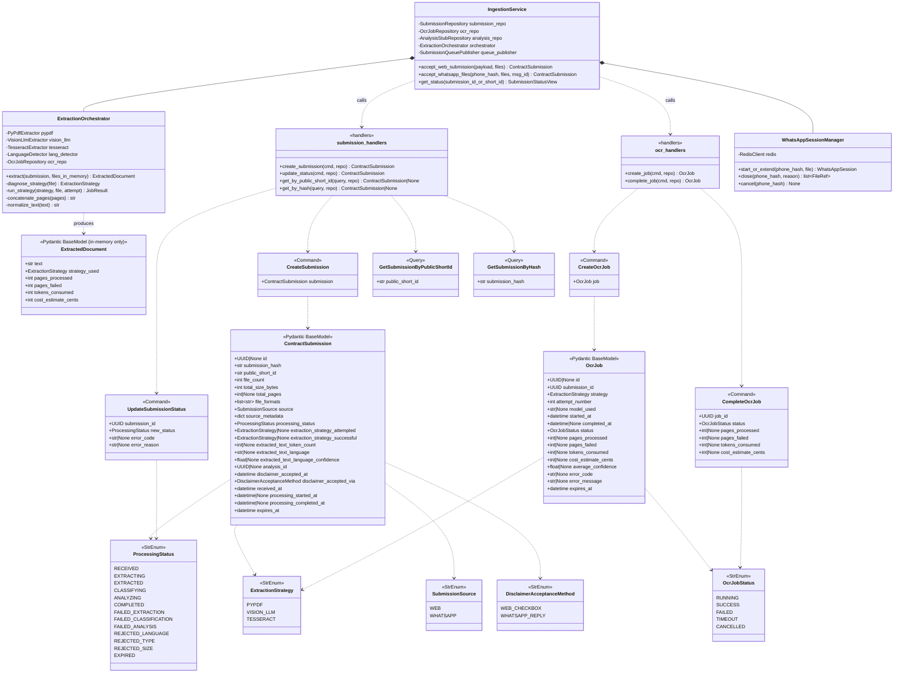
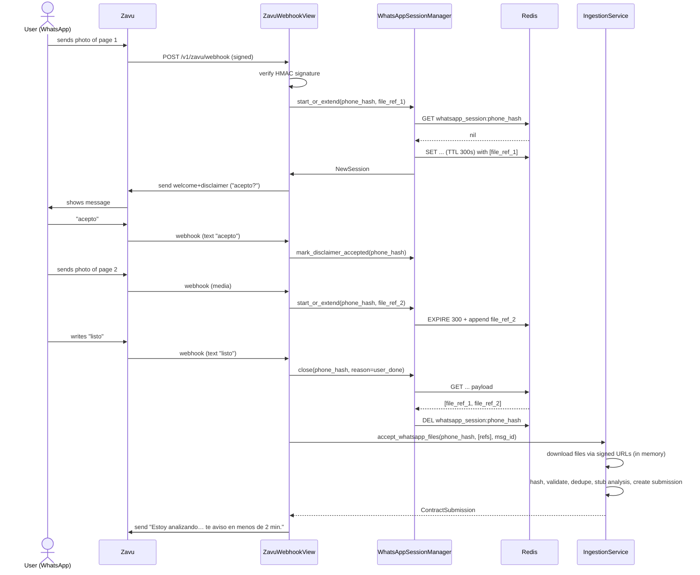
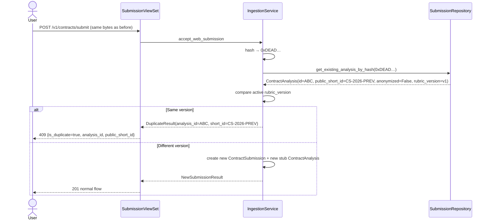
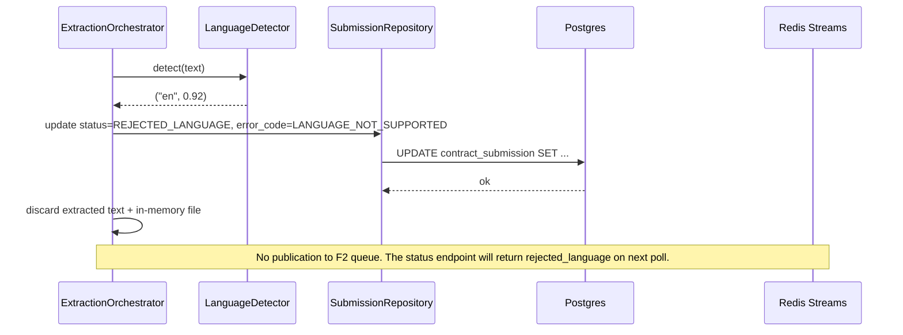
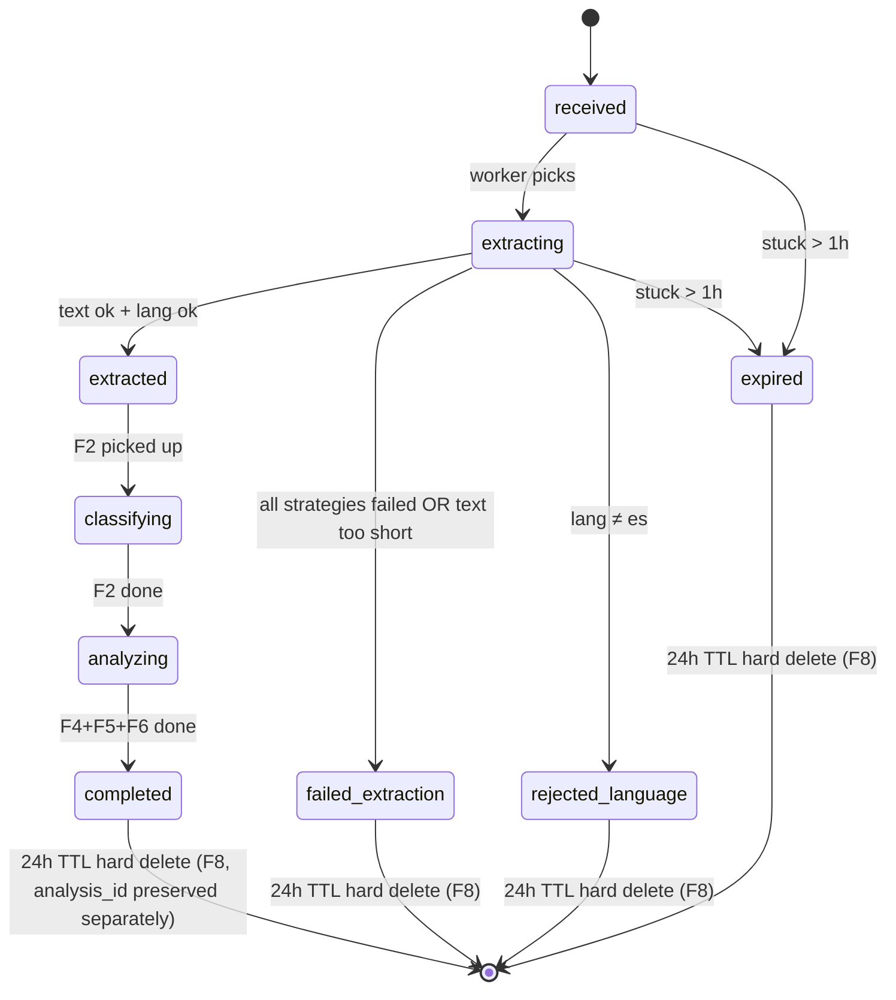
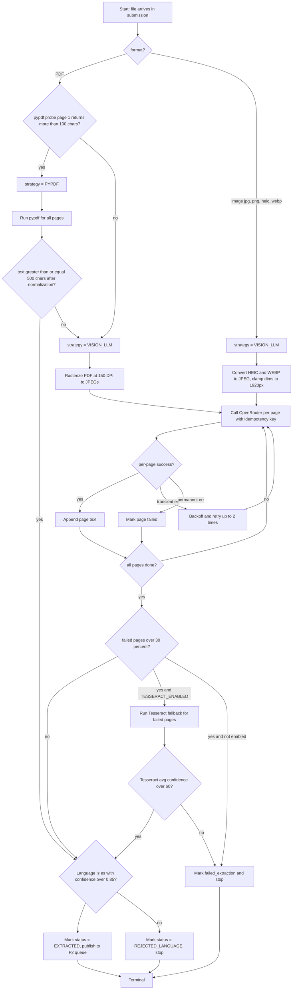
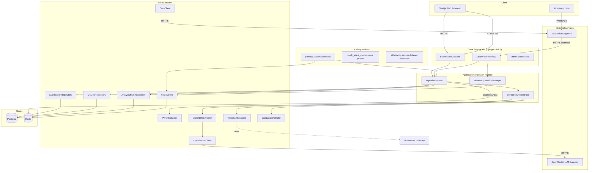
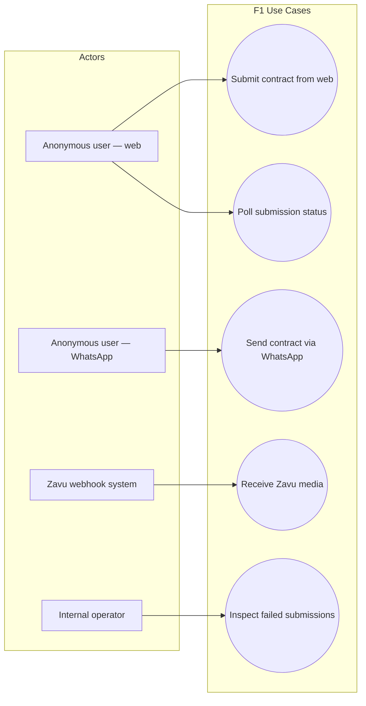

# Solution Diagrams — F1: Ingestion & Text Extraction Pipeline

> Generated: 2026-05-15
> Purpose: Visual validation of the proposed solution using UML notation

---

## 1. Class Diagram (UML)

Structural backbone of F1: every new class, command, query, handler, service, repository, ORM model, and external client introduced. Relationships use UML notation: inheritance (solid line, hollow arrow), composition (filled diamond), dependency (dashed arrow), association (solid line). The diagram is split into two views (domain+application vs. infrastructure) because rendering them together makes the diagram unreadable on a phone screen.

### 1.1 Domain + Application layer



### 1.2 Infrastructure layer

```mermaid
classDiagram
    class ContractSubmissionModel {
        <<Django Model>>
        +UUIDField id
        +TextField submission_hash
        +TextField public_short_id
        +IntegerField file_count
        +BigIntegerField total_size_bytes
        +IntegerField total_pages
        +ArrayField file_formats
        +CharField source
        +JSONField source_metadata
        +CharField processing_status
        +CharField extraction_strategy_attempted
        +CharField extraction_strategy_successful
        +IntegerField extracted_text_token_count
        +CharField extracted_text_language
        +DecimalField extracted_text_language_confidence
        +CharField error_code
        +TextField error_reason
        +UUIDField analysis_id
        +DateTimeField disclaimer_accepted_at
        +CharField disclaimer_accepted_via
        +DateTimeField received_at
        +DateTimeField processing_started_at
        +DateTimeField processing_completed_at
        +DateTimeField expires_at
    }

    class OcrJobModel {
        <<Django Model>>
        +UUIDField id
        +ForeignKey submission
        +CharField strategy
        +IntegerField attempt_number
        +CharField model_used
        +DateTimeField started_at
        +DateTimeField completed_at
        +CharField status
        +IntegerField pages_processed
        +IntegerField pages_failed
        +IntegerField tokens_consumed
        +IntegerField cost_estimate_cents
        +DecimalField average_confidence
        +CharField error_code
        +TextField error_message
        +DateTimeField expires_at
    }

    class ContractSubmissionRepository {
        <<DjangoFullRepository>>
        +to_entity(model) ContractSubmission
        +to_orm_model(entity) SubmissionOrmModel
        +get_by_hash(hash) ContractSubmission|None
        +get_by_public_short_id(short_id) ContractSubmission|None
        +list_in_progress() list~ContractSubmission~
    }

    class OcrJobRepository {
        <<DjangoFullRepository>>
        +to_entity(model) OcrJob
        +to_orm_model(entity) OcrJobOrmModel
        +list_by_submission(submission_id) list~OcrJob~
    }

    class AnalysisStubRepository {
        <<DjangoFullRepository>>
        +create_stub(short_id, submission_hash, channel, target_hash, project_id) UUID
    }

    class PyPdfExtractor {
        <<Strategy>>
        -int timeout_seconds
        -int min_text_chars
        +diagnose(file_bytes) bool
        +extract(file_bytes, submission_id) PageList
    }

    class VisionLlmExtractor {
        <<Strategy>>
        -OpenRouterClient client
        -str model
        -int dpi
        -int max_image_dim_px
        -int timeout_per_page
        -int max_retries_per_page
        -float partial_failure_threshold
        +extract(file_bytes_or_image, submission_id, page_offset) PageList
        -rasterize_pdf(pdf_bytes) list~JpegBytes~
        -build_prompt(page_n, total) ChatMessages
        -call_per_page(image, idempotency_key) str
    }

    class TesseractExtractor {
        <<Strategy>>
        -str language
        -int min_confidence
        -int timeout_per_page
        +extract(file_bytes, submission_id) PageList
        -preprocess(image) Image
    }

    class LanguageDetector {
        +detect(text_sample) tuple~str, float~
    }

    class OpenRouterClient {
        -httpx.Client http
        -str api_key
        -CircuitBreaker breaker
        +chat_completion_vision(model, image, prompt, idempotency_key) str
    }

    class ZavuClient {
        -httpx.Client http
        -str api_key
        -str webhook_secret
        +verify_signature(body, header) bool
        +download_media(signed_url) bytes
        +send_message(to, template, params) None
    }

    class RedisClient {
        -redis.Redis client
        +set_session(key, payload, ttl) None
        +get_session(key) dict|None
        +delete_session(key) None
        +xadd(stream, payload) str
        +xreadgroup(stream, group, consumer) list
    }

    class SubmissionQueuePublisher {
        -RedisClient redis
        -str stream_name
        +publish_extraction_done(envelope) str
    }

    class SubmissionViewSet {
        <<DRF ViewSet>>
        +submit(request) Response
        +status(request, pk) Response
    }

    class ZavuWebhookView {
        <<DRF APIView>>
        +post(request) Response
    }

    class InternalRetryView {
        <<DRF APIView>>
        +post(request, pk) Response
    }

    class ProcessSubmissionTask {
        <<Celery shared_task>>
        +run(submission_id) None
    }

    class MarkStuckSubmissionsTask {
        <<Celery shared_task / Beat>>
        +run() dict
    }

    ContractSubmissionRepository ..> ContractSubmissionModel
    ContractSubmissionRepository ..> ContractSubmission : maps
    OcrJobRepository ..> OcrJobModel
    OcrJobRepository ..> OcrJob : maps
    AnalysisStubRepository ..> UUID
    VisionLlmExtractor *-- OpenRouterClient
    ZavuWebhookView ..> ZavuClient
    SubmissionViewSet ..> IngestionService
    SubmissionQueuePublisher *-- RedisClient
    ProcessSubmissionTask ..> IngestionService
    ProcessSubmissionTask *-- RedisClient
    PyPdfExtractor --|> ExtractionStrategyBase
    VisionLlmExtractor --|> ExtractionStrategyBase
    TesseractExtractor --|> ExtractionStrategyBase
```



---

## 2. Sequence Diagrams (UML)

### 2.1 US-01 — Web upload happy path

```mermaid
sequenceDiagram
    actor User
    participant FE as Web Frontend
    participant View as SubmissionViewSet
    participant Svc as IngestionService
    participant Repo as SubmissionRepository
    participant Stub as AnalysisStubRepository
    participant DB as Postgres
    participant Q as Redis Streams
    participant W as ProcessSubmissionTask
    participant Orch as ExtractionOrchestrator
    participant PyP as PyPdfExtractor
    participant Lang as LanguageDetector

    User->>FE: Picks files, accepts disclaimer, submits
    FE->>View: POST /v1/contracts/submit (multipart, disclaimer_accepted=true, channel, target)
    View->>View: validate file formats, sizes, page caps
    View->>Svc: accept_web_submission(payload, files)
    Svc->>Svc: hash submission (SHA-256 of joined per-file hashes)
    Svc->>Repo: get_by_hash(submission_hash)
    Repo->>DB: SELECT FROM contract_submission ... WHERE submission_hash=$1
    DB-->>Repo: not found
    Repo-->>Svc: None
    Svc->>Stub: create_stub(short_id, hash, channel, target_hash, placeholder_project_id)
    Stub->>DB: INSERT INTO contract_analysis (...)
    DB-->>Stub: analysis_id
    Stub-->>Svc: analysis_id
    Svc->>Repo: save(ContractSubmission(... analysis_id=X, status=RECEIVED))
    Repo->>DB: INSERT INTO contract_submission (...)
    DB-->>Repo: submission_id
    Repo-->>Svc: ContractSubmission
    Svc->>Q: XADD ingestion.submissions {submission_id, in_memory_blob_ref}
    Svc-->>View: ContractSubmission
    View-->>FE: 201 {submission_id, public_short_id, status_url}
    FE-->>User: "Tu análisis está listo en menos de 90s, ID: CS-2026-A1B2C3"

    Q-->>W: XREAD claims the submission
    W->>Svc: mark status=EXTRACTING
    W->>Orch: extract(submission, in_memory_files)
    Orch->>PyP: diagnose(file1)
    PyP-->>Orch: returns True (text-extractable)
    Orch->>PyP: extract(file1)
    PyP->>PyP: pypdf.PdfReader; for each page extract_text(); normalize
    PyP-->>Orch: pages text + token count
    Orch->>Lang: detect(first 2000 chars)
    Lang-->>Orch: ("es", 0.94)
    Orch-->>W: ExtractedDocument(strategy=PYPDF, text=…)
    W->>Repo: update status=EXTRACTED, extracted_text_token_count, language, strategy
    W->>Q: XADD pipeline.classification (envelope F1→F2)
    W->>Svc: discard in-memory file
```

### 2.2 US-06 — Scanned PDF (vision LLM)

```mermaid
sequenceDiagram
    participant Task as ProcessSubmissionTask
    participant Orch as ExtractionOrchestrator
    participant PyP as PyPdfExtractor
    participant Vis as VisionLlmExtractor
    participant Open as OpenRouterClient
    participant CB as CircuitBreaker
    participant OcrR as OcrJobRepository
    participant Lang as LanguageDetector

    Task->>Orch: extract(submission, [scanned_pdf_bytes])
    Orch->>PyP: diagnose(scanned_pdf_bytes)
    PyP-->>Orch: returns False (no text in pypdf probe)
    Orch->>Vis: extract(scanned_pdf_bytes, submission_id)
    Vis->>Vis: rasterize with pdf2image at 150 DPI → 12 JPEGs
    Vis->>OcrR: create_job(strategy=VISION_LLM, model=anthropic/claude-sonnet-4)
    OcrR-->>Vis: job_id
    loop For each page (1..12)
        Vis->>CB: allow?
        alt Circuit closed
            CB-->>Vis: yes
            Vis->>Open: chat_completion_vision(image, prompt, key=submission:p1:vision_llm:1)
            Open-->>Vis: transcribed text or error
        else Circuit open
            CB-->>Vis: NO
            Vis->>Vis: skip remaining LLM calls, escalate to fallback
        end
        Vis->>Vis: if error: backoff 1s, 4s; max 2 retries
        Vis->>Vis: track tokens + cost
    end
    Vis->>OcrR: complete_job(status=SUCCESS|FAILED, tokens, cost, pages_processed, pages_failed)
    alt success rate > 70%
        Vis-->>Orch: ExtractedDocument(strategy=VISION_LLM, …)
        Orch->>Lang: detect(text)
        Lang-->>Orch: ("es", 0.91)
        Orch-->>Task: ExtractedDocument
    else success rate ≤ 70%
        Vis-->>Orch: PartialFailure
        Orch->>Orch: escalate to TesseractExtractor (if OCR_TESSERACT_ENABLED)
    end
```

### 2.3 US-02 — WhatsApp multi-file session



### 2.4 US-03 — Deduplication on resubmission



### 2.5 Error path — Language not Spanish



---

## 3. State Diagram — Submission processing



---

## 4. Activity Diagram — Strategy routing & extraction



---

## 5. Component Diagram



---

## 6. Use Case Diagram

Casa Segura has no user accounts; the actors are roles, not authenticated users.



---

## Notes

- The class diagram uses two views to remain readable. In the implementation, both layers exist together.
- `ExtractionStrategyBase` is the implicit interface every extractor satisfies (`extract(file, submission_id) -> PageList` and `diagnose(file) -> bool`). It is a Python `Protocol` (structural typing), not a concrete base class.
- The circuit breaker is not shown as a separate class in §1.1 because it is a wrapper at the `OpenRouterClient` level; conceptually it is part of `VisionLlmExtractor`'s resilience strategy.
- Idempotency keys for OpenRouter calls follow the format `submission_id:page_number:strategy:attempt_number`, as mandated by `PRD_F1` BR-05.
- All diagrams are intentionally limited to F1 boundaries. F2/F3/F4 interactions appear as "out arrows" only.

**End of document.**
