# Entity Relationship Diagram — F2: Contract Classification & Structured Extraction

> Generated: 2026-05-15
> Source: `PRD_F2_CLASIFICACION.md` §5 + `DOMAIN_MODEL.md` + F8 canonical schema

---

## Overview

F2 does **not** introduce new persistent tables. It writes columns on the already-existing `contract_analysis` (stub row created by F1) and reads/upserts `project`. An optional `classification_job` table is added for granular observability, transient (24-hour TTL, cleaned by F8). All schema is owned by `platform` (F8); F2's `infrastructure/django/models.py` re-imports the relevant classes for code locality.

The relationship is straightforward: a `Project` has many `ContractAnalysis`; F2 owns the moment the FK is set from the placeholder project to the real one (or to a freshly-created `unknown_<hash>` placeholder).

---

## Mermaid Diagram

```mermaid
erDiagram
    PROJECT ||--o{ CONTRACT_ANALYSIS : "1 — N (FK set by F2)"
    CONTRACT_ANALYSIS ||--o{ CLASSIFICATION_JOB : "0 — N (optional, observability)"

    PROJECT {
        uuid id PK
        text canonical_name
        text normalized_name UK
        timestamptz first_seen
        timestamptz last_analyzed
        timestamptz last_recomputed_at
        int total_analyses
        numeric avg_score
        jsonb score_distribution
        jsonb metadata
    }

    CONTRACT_ANALYSIS {
        uuid id PK
        text public_short_id UK
        uuid project_id FK
        text submission_hash
        text contract_type
        text contract_type_declared
        bool contract_type_reclassified
        text reclassification_reason
        jsonb reclassification_indicators
        numeric classification_confidence
        int classification_attempts
        jsonb elements_detected
        numeric score_total
        text band
        text_array override_triggered
        jsonb scores_by_category
        jsonb criterion_evaluations
        jsonb findings
        int findings_count
        int critical_findings_count
        int unverifiable_count
        text executive_summary
        jsonb economic_summary
        text rubric_version FK
        text corpus_version FK
        text benchmark_version FK
        text delivery_status
        text delivery_channel
        text delivery_target_hash
        timestamptz link_expires_at
        int resend_count
        timestamptz anonymized_at
        timestamptz created_at
    }

    CLASSIFICATION_JOB {
        uuid id PK
        uuid submission_id FK
        uuid analysis_id FK
        text step
        int attempt_number
        text model_used
        timestamptz started_at
        timestamptz completed_at
        text status
        int tokens_consumed
        int cost_estimate_cents
        text error_code
        text error_message
        timestamptz expires_at
    }
```



---

## Entity Definitions

### Project (read/write by F2)

**Purpose:** Aggregation unit. F2 looks up by `normalized_name`; creates on miss; updates `last_analyzed` and `total_analyses` on hit.

#### ORM Model (`projects/infrastructure/django/models.py`, declared in `platform.infrastructure.django.models`)

Already declared by F8. F2 imports and uses it; no schema change.

#### Domain Entity (`projects/domain/entities.py`)

| Field | Type | Default | Description |
|---|---|---|---|
| `id` | `UUID \| None` | None | — |
| `canonical_name` | `str` | — | Name as it appears in the contract, whitespace-normalized |
| `normalized_name` | `str` | — | Slug used for matching |
| `first_seen` | `datetime` | `now()` | When the project was created in the system |
| `last_analyzed` | `datetime` | `now()` | When the latest analysis was associated |
| `total_analyses` | `int` | 0 | Count of associated analyses |
| `avg_score` | `Decimal \| None` | None | Moving average; recomputed by F8 cron |
| `score_distribution` | `dict` | `{green:0, yellow:0, red:0}` | Per-band count |
| `metadata` | `dict` | `{}` | Extensible; `placeholder: true` for `unknown_<hash>` projects |

### ContractAnalysis (write by F2)

**Purpose:** Central business entity. F1 creates the stub; F2 fills the classification block; F4/F5/F6/F7 fill the rest.

Columns written by F2 (full table declared in F8):

| Field | Type | Nullable | Constraints | Description (F2-relevant) |
|---|---|---|---|---|
| `project_id` | UUID | NO | FK → `project(id)` | F2 replaces the F1 placeholder with the real or freshly-created project |
| `contract_type` | TEXT | NO | enum 9 values | Final detected type after possible reclassification |
| `contract_type_declared` | TEXT | YES | enum 9 values | What the document presents itself as |
| `contract_type_reclassified` | BOOL | NO (default FALSE) | — | TRUE iff the type changed during reclassification |
| `reclassification_reason` | TEXT | YES | — | Verbatim list of detected indicators if reclassified |
| `reclassification_indicators` | JSONB | YES | — | Structured indicators (see §5 below) |
| `classification_confidence` | NUMERIC(3,2) | YES | 0..1 | LLM-reported confidence on the final classification |
| `classification_attempts` | INT | NO (default 1) | — | 1 or 2 (2 only if validation prompt fired) |
| `elements_detected` | JSONB | YES | — | Boolean flag map (warranty, FSV mention, blank signature, etc.) |

### ClassificationJob (optional, F2 owned)

**Purpose:** Per-step observability for the up-to-five LLM calls F2 may issue.

#### ORM Model (`classification/infrastructure/django/models.py`)

| Field | Type | Nullable | Default | Constraints / Index | Description |
|---|---|---|---|---|---|
| `id` | UUID | No | `gen_random_uuid()` | PK | — |
| `submission_id` | UUID | No | — | FK→`contract_submission(id)` ON DELETE CASCADE, INDEX | Source submission |
| `analysis_id` | UUID | YES | — | FK→`contract_analysis(id)` | Set as soon as known |
| `step` | TEXT | No | — | CHECK enum: `'classification' | 'leasing_detection' | 'economic_extraction' | 'elements_detection'` | Step name |
| `attempt_number` | INT | No | 1 | CHECK ≥ 1 | Retry counter |
| `model_used` | TEXT | No | — | — | OpenRouter model id |
| `started_at` | TIMESTAMPTZ | No | `NOW()` | — | — |
| `completed_at` | TIMESTAMPTZ | YES | — | — | — |
| `status` | TEXT | No | — | CHECK `running|success|failed|timeout` | Terminal state |
| `tokens_consumed` | INT | YES | — | — | LLM tokens |
| `cost_estimate_cents` | INT | YES | — | — | USD cents |
| `error_code` | TEXT | YES | — | — | — |
| `error_message` | TEXT | YES | — | — | — |
| `expires_at` | TIMESTAMPTZ | No | `NOW() + 24h` | INDEX | Cleanup trigger |

#### Domain Entity (`classification/domain/entities.py`)

Matching Pydantic structure with `from_attributes=True`.

### ClassificationResult (in-memory, not persisted)

Pydantic envelope F2 produces from the LLM output and passes to F4/F5.

```python
class ClassificationResult(BaseModel):
    contract_type: ContractType                 # enum 9 values
    contract_type_declared: ContractType | None # what the doc claims to be
    contract_type_reclassified: bool = False
    reclassification_reason: str | None = None
    reclassification_indicators: LeasingIndicators | None = None
    classification_confidence: float
    classification_attempts: int = 1
    project_name_canonical: str | None
    project_name_normalized: str
    elements_detected: ElementsDetected
    economic_fields_raw: EconomicFieldsRaw | None  # only when type in {CVP, APV, LEA, FSV, ARV}
```

### LeasingIndicators (in-memory, also persisted as JSONB)

```python
class LeasingIndicators(BaseModel):
    mandatory_term: IndicatorDetection
    predefined_purchase_option: IndicatorDetection
    ownership_retained: IndicatorDetection
    taxes_to_buyer: IndicatorDetection
    risks_to_buyer: IndicatorDetection
    payments_as_rent: IndicatorDetection
    indicators_count: int
    should_reclassify: bool
    reclassification_severity: Literal["high", "medium", "low"]

class IndicatorDetection(BaseModel):
    detected: bool
    evidence: str | None  # verbatim quote, snippet ≤ 500 chars; NOT persisted by F2 (only by F4 inside findings)
```

### ElementsDetected (in-memory, persisted as JSONB)

```python
class ElementsDetected(BaseModel):
    warranty_clause: bool
    warranty_exemption_clause: bool
    bien_de_familia_mention: bool
    fsv_mention: bool
    urbanism_permit_mention: bool
    promise_to_sell: bool
    public_deed: bool
    arbitration_clause: bool
    blank_signature: bool
    rights_waiver: bool
    unilateral_modification: bool
    late_interest_on_total_balance: bool
```

### EconomicFieldsRaw (in-memory, NOT persisted by F2)

Pydantic with one field per economic value (`price_cash`, `down_payment`, `down_payment_pct`, `financed_amount`, `term_months`, `annual_rate_pct`, `monthly_rate_pct`, `monthly_payment`, `payment_periodicity`, `interest_calculation_base`). Each carries `value`, `confidence`, `evidence_snippet`. F5 validates and persists into `economic_summary`.

---

## Relationships with Existing Models

| Relationship | Owner | F2 behavior |
|---|---|---|
| `ContractAnalysis.project_id → Project.id` | F8 (FK) | F2 updates from placeholder to real |
| `ContractAnalysis.rubric_version → RubricVersion.version` | F8 (FK) | F2 sets to active rubric version at processing time |
| `ClassificationJob.submission_id → ContractSubmission.id` | F8 (FK CASCADE) | F2 inserts |
| `ClassificationJob.analysis_id → ContractAnalysis.id` | F8 (FK) | F2 inserts (initially NULL until the analysis row is known) |

---

## Modifications to Existing Models

F2 introduces no DDL. Every column it writes was declared by F8 (`PRD_F8_PERSISTENCIA_PROYECTO_RETENCION.md` §5.1). The new `classification_job` table is a F2-owned migration in `classification/infrastructure/django/migrations/`.

| Model | Field | Change | Reason | Destructive |
|---|---|---|---|---|
| (none on existing tables) | — | — | F2 only writes columns already declared | No |

Adds:

| Model | Field | Change | Reason | Destructive |
|---|---|---|---|---|
| `ClassificationJobModel` | (new model) | ADD | Observability for the 1–5 LLM calls per analysis | No (new table) |

---

## Data Dictionary

| Term | Definition |
|---|---|
| `contract_type` | Final detected type after reclassification; one of `CVC|CVP|ARV|ARC|APV|LEA|IVU|FSV|NOT_CLASSIFIABLE` |
| `contract_type_declared` | What the document claims to be (before reclassification) |
| `classification_confidence` | LLM-self-reported confidence 0..1 on the accepted classification |
| `classification_attempts` | 1 if accepted on first call, 2 if validated by a second call |
| `reclassification_indicators` | JSON object matching `LeasingIndicators` Pydantic shape |
| `elements_detected` | JSON object matching `ElementsDetected` Pydantic shape |
| `normalized_name` | Lowercased, accent-stripped, generic-word-removed slug used for `Project` matching |
| `canonical_name` | Project name exactly as it appears in the contract (whitespace-normalized) |
| `should_reclassify` | True iff `indicators_count ≥ LEASING_RECLASSIFICATION_THRESHOLD` (default 4) |
| `reclassification_severity` | `high` if count ≥ 4, `medium` if count == 3, `low` if count ≤ 2 |

---

## Migration Notes

- F2's first migration `0001_initial.py` creates the `classification_job` table (transient).
- The columns F2 writes on `contract_analysis` are already declared by F8's initial migration; no schema change here.
- Indices added by F2 in its migration:
  - `idx_classification_job_submission` on `classification_job(submission_id)`
  - `idx_classification_job_expires` on `classification_job(expires_at)`
- Project unique constraint on `normalized_name` is declared by F8. F2 relies on it for upsert via `INSERT ... ON CONFLICT (normalized_name) DO UPDATE`.

---

**End of document.**
