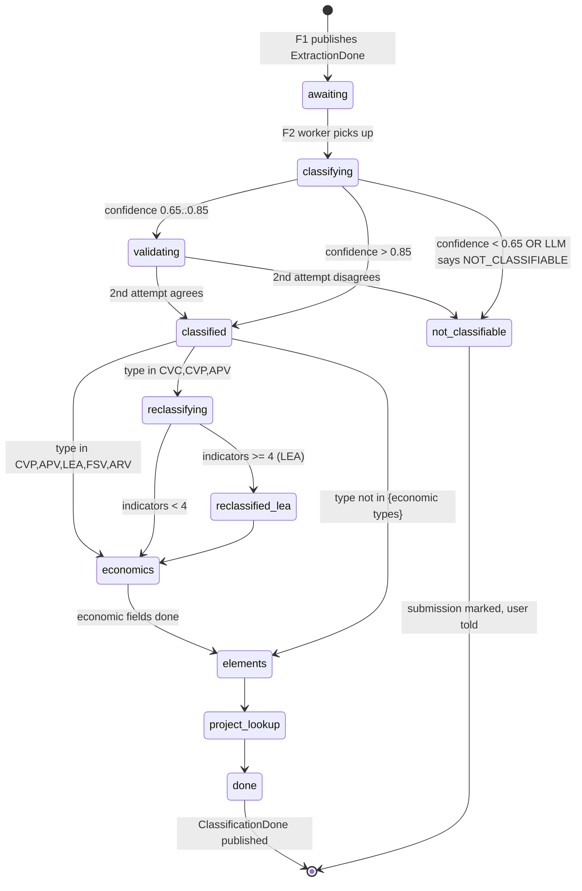

# Feature Overview — F2: Contract Classification & Structured Extraction

> Generated: 2026-05-15
> Source PRD: `docs/Casa Segura Formal PRDs/PRD_F2_CLASIFICACION.md`
> Stack: Django 5.2 LTS + DRF + Celery + Redis + Postgres 15 + pgvector (see `../_shared/GLOBAL_ASSUMPTIONS.md` §1).

---

## Executive Summary

F1 hands the pipeline a string of Spanish-language contract text. F2 is the **brain stage**: it answers four questions before the rubric can run. (1) *What kind of contract is this?* — one of eight covered types or "not classifiable". (2) *Which real estate project does it belong to?* — extract the project name and normalize it for matching. (3) *What basic economic figures appear in it?* — price, down payment, term, rate, monthly payment, computation base. (4) *Is this contract presented as one thing but structurally another?* — detect the six Art. 2 LAF indicators that turn a "compraventa" into financial leasing.

The feature must do this with as few LLM calls as possible (cost) while producing a structured, validatable result (predictability) and rejecting cleanly when the contract is not within scope (honesty). The classification result feeds F4 (rubric engine) and F5 (economic analysis) in parallel.

F2 does **not** persist personal data of the parties. The only piece of contract-derived information that survives in the database is the normalized project name (in `Project`) plus the classification metadata (`contract_type`, `contract_type_declared`, `contract_type_reclassified`, `reclassification_reason`, `reclassification_indicators`, `classification_confidence`, `elements_detected`) attached to the `ContractAnalysis` row.

---

## Key Concepts

| Term | Plain-language definition |
|---|---|
| **Contract type** | One of nine outcomes: `CVC`, `CVP`, `ARV`, `ARC`, `APV`, `LEA`, `IVU`, `FSV`, or `NOT_CLASSIFIABLE` |
| **Reclassification** | When a document claims to be a purchase but the structure is leasing under Art. 2 of the Salvadoran Financial Leasing Law |
| **Project canonical name** | The project name exactly as it appears in the contract (whitespace normalized) |
| **Project normalized name** | The slug used for matching (lowercase, no accents, no special characters, no generic words like "Residencial") |
| **Economic fields (raw)** | Numeric values extracted by F2 but not yet validated or derived (that is F5) |
| **Elements detected** | Boolean flags about clauses present in the contract (warranty, exemption, FSV mention, blank signature, etc.) — used as hints by F4 |
| **Placeholder project** | `unknown_<short_hash>` when project name extraction fails |

---

## How It Works (Step by Step)

1. **F2 receives** the `ExtractionDone` envelope from F1 via Redis Streams (`ingestion.to_classification`). The envelope carries `extracted_text` in memory (still not persisted to disk).
2. **F2 invokes the LLM** once (default `anthropic/claude-sonnet-4` via OpenRouter) with the combined classification + extraction prompt (PRD_F2 §8.1/§8.2). The model returns a single JSON object with `contract_type`, `confidence`, `indicators_found`, `reasoning`, `project_name_canonical`, and `elements_detected`.
3. **If confidence ≥ 0.85**, F2 accepts the classification.
4. **If 0.65 ≤ confidence < 0.85**, F2 retries with the validation prompt (§8.3). If the two calls agree, accept. If they disagree, mark `NOT_CLASSIFIABLE`.
5. **If confidence < 0.65** or the model itself returns `NOT_CLASSIFIABLE`, F2 marks the submission `NOT_CLASSIFIABLE` and tells the user.
6. **If the initial type is CVC, CVP, or APV**, F2 runs the **leasing detection prompt** (§8.4) to look for the six Art. 2 LAF indicators. If ≥ 4 of 6 are present, the type is reclassified to `LEA` and a clear `reclassification_reason` is recorded. If 2–3 indicators are detected, no reclassification — but the suspicion is noted as a yellow finding hint for F4.
7. **For types in {CVP, APV, LEA, FSV, ARV}**, F2 runs the **economic extraction prompt** (§8.5) to pull cash price, down payment, term, rate, monthly payment, interest calculation base, etc. Each field comes with confidence and an evidence snippet. The fields are passed to F5 in memory — **not** persisted here.
8. **F2 looks up the `Project`** by normalized name. If it exists, F2 attaches `project_id` to the `ContractAnalysis` row (replacing the placeholder). If not, F2 creates a new `Project` with `total_analyses=0` (F8's recompute updates the count).
9. **F2 publishes** the `ClassificationDone` envelope to two consumer groups on `classification.to_rubric_and_economics`: one for F4, one for F5.

---

## Business Rules

- **BR-F2-01:** Classification is strict — only nine outcomes; no compound or intermediate types.
- **BR-F2-02:** Reclassification to `LEA` is only attempted when the initial type is `CVC`, `CVP`, or `APV`.
- **BR-F2-03:** Reclassification requires ≥ 4 of 6 LAF indicators (`LEASING_RECLASSIFICATION_THRESHOLD`, configurable). 2–3 indicators are noted but do not reclassify.
- **BR-F2-04:** Personal data of the parties (name, DUI, NIT, address) is **never** persisted, even though the LLM sees it during processing.
- **BR-F2-05:** The project name is normalized before matching: lowercase, accents removed, generic words `proyecto`/`residencial`/`condominio`/`urbanización`/`lotificación`/`complejo`/`parque` removed at start or end, spaces collapsed.
- **BR-F2-06:** Failed name extraction → `unknown_<8 chars of submission_hash>` placeholder project (unique per submission, **not** reused).
- **BR-F2-07:** Economic fields extracted by F2 are raw input; F5 owns validation, normalization, derivations.
- **BR-F2-08:** When the LLM extracts only a monthly rate, F2 records both `monthly_rate_pct` and an derived `annual_rate_pct = (1 + monthly)^12 − 1` with an explicit note.
- **BR-F2-09:** Element flags are **hints** for F4; they do not bind F4's evaluation.
- **BR-F2-10:** P95 latency ≤ 20 s for the full classification chain. Two attempts then `failed_classification`.
- **BR-F2-11:** All LLM calls use idempotency keys `submission_id:f2:{step_name}`.
- **BR-F2-12:** No conversational dialog with the user; if classification is ambiguous, F2 rejects cleanly.

---

## Lifecycle Diagram

---

## What Changes in the System

- New columns on `contract_analysis` (defined in F8 schema, written by F2):
  - `contract_type`, `contract_type_declared`, `contract_type_reclassified`, `reclassification_reason`, `reclassification_indicators`, `classification_confidence`, `classification_attempts`, `elements_detected`, `project_id`
- Optional table `classification_job` for granular observability per LLM step (see PRD §5.2)
- One Celery task per submission: `classification.process` (chains classification → optional leasing → optional economic → elements → project lookup → publish)
- One internal endpoint `POST /v1/internal/classify` (`HasInternalAuthHeader`) for QA
- Three to five OpenRouter calls per analysis depending on flow (1 classification + maybe 1 validation + 1 leasing + 1 economic + 1 elements)

---

## What This Feature Does NOT Do

- Evaluate criteria or compute the score (F4)
- Compute derived economic figures (F5)
- Retrieve legal citations (F3)
- Verify the project name against an external source
- Extract or persist the parties' names, DUI, NIT, or addresses
- Engage the user in dialog to disambiguate

---

## Audit and Compliance

- Log per analysis: classified type, confidence, indicators count, project normalized name, tokens, cost. Never the contract text. Never the parties' personal data.
- Retention: log records survive in `classification_job` for 24 h (transient table, F8 cron). Persisted columns on `contract_analysis` are anonymized at 90 days (F8).
- LLM-cost reproducibility: every call records the `Idempotency-Key` and the model identifier used.

---

## Assumptions Made

The full list is in `EVALUATION_COVERAGE.md`. Headline assumptions:

1. Default LLM `anthropic/claude-sonnet-4` via OpenRouter, configurable via `LLM_CLASSIFICATION_MODEL`.
2. Reclassification threshold = 4 of 6 indicators, configurable (`LEASING_RECLASSIFICATION_THRESHOLD`).
3. Project-name normalization follows the F2 PRD rules (more aggressive than DOMAIN_MODEL), accepting the risk of collapsing legitimately distinct projects.
4. Confidence is **not** shown to the user in the final report (PRD §10 Q-6); only internal logs.
5. Bilingual contracts that pass F1's language check go through F2 normally; only an all-non-Spanish file is rejected.

---

**End of document.**
