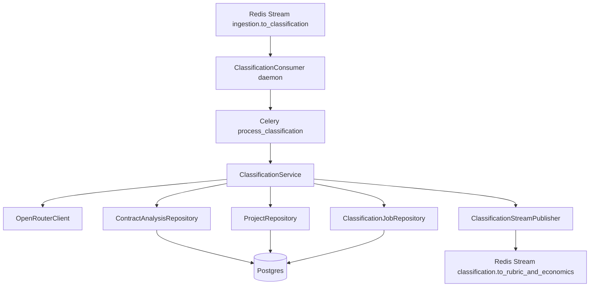
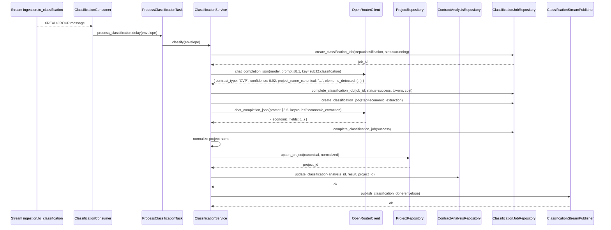
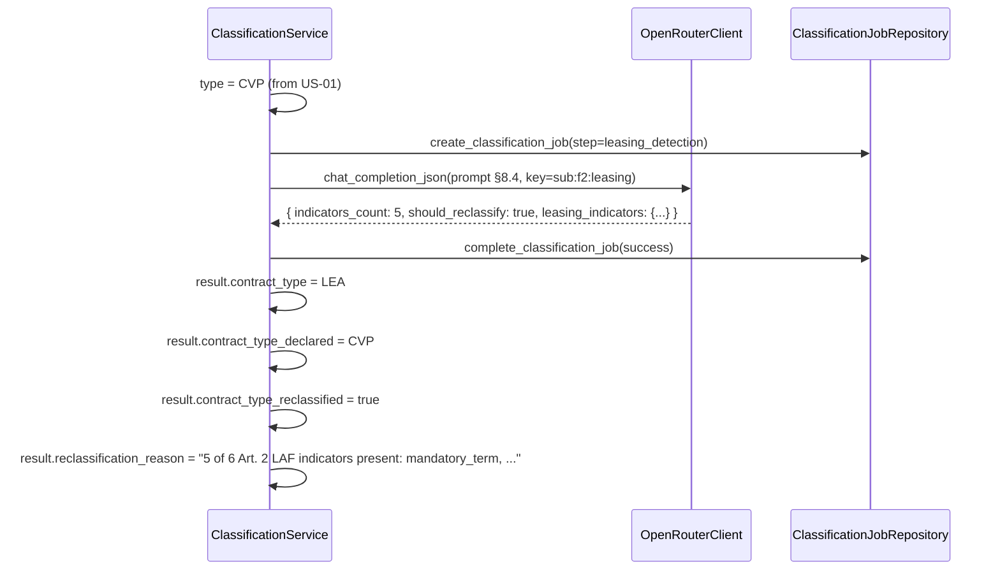
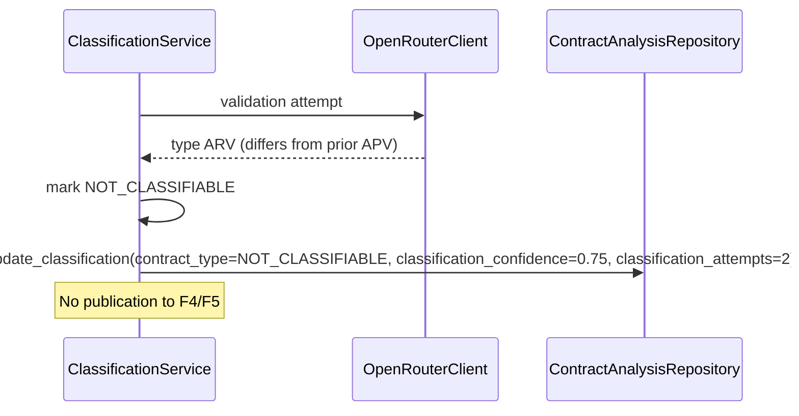
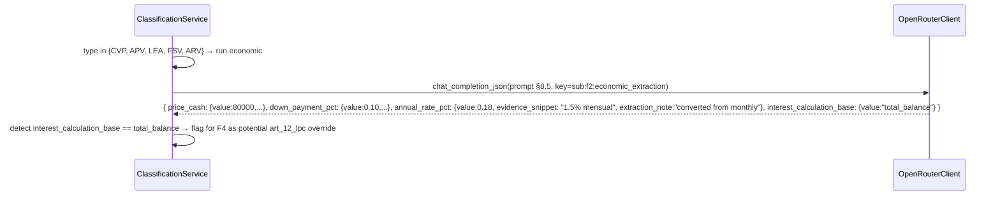
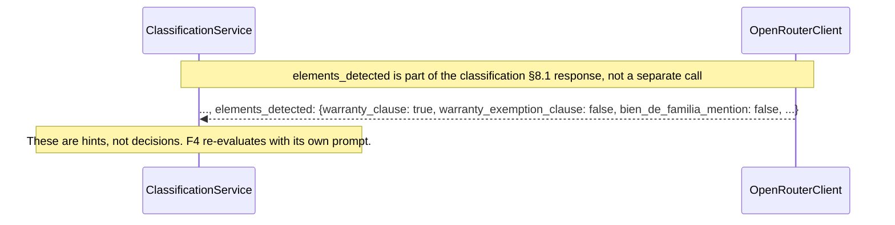
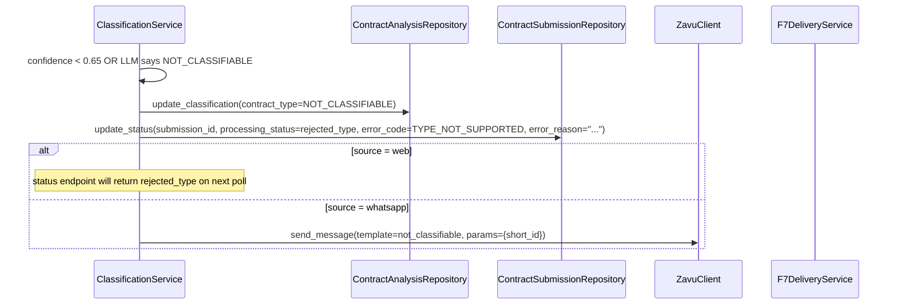
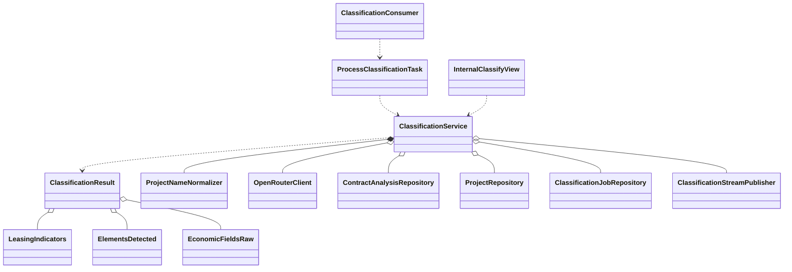

# Interaction Diagrams — F2: Contract Classification & Structured Extraction

> Generated: 2026-05-15
> Companion to `SOLUTION_DIAGRAMS.md`.

---

## Component Overview



---

## Flow: US-01 Classification — confidence high



---

## Flow: US-02 Reclassification CVP → LEA



---

## Flow: US-03 Validation retry on medium confidence

```mermaid
sequenceDiagram
    participant S as ClassificationService
    participant L as OpenRouterClient
    participant JR as ClassificationJobRepository

    S->>L: chat_completion_json(prompt §8.1, key=sub:f2:classification, attempt=1)
    L-->>S: confidence 0.72, type APV
    S->>JR: create_classification_job(step=classification, attempt_number=2)
    S->>L: chat_completion_json(prompt §8.3 validation, key=sub:f2:classification_validation, attempt=2)
    L-->>S: confidence 0.79, type APV (agrees)
    S->>S: accept; classification_attempts=2
```

### Disagreement branch



---

## Flow: US-04 Economic field extraction



---

## Flow: US-05 Element detection (part of classification call)



---

## Flow: US-06 NOT_CLASSIFIABLE clean rejection



---

## Class Diagram (high-level)



---

## Notes

- The `ClassificationConsumer` daemon runs as its own process (`python manage.py run_classification_consumer`). It reads from the Redis stream with `XREADGROUP`, `XACK`s after successfully dispatching the Celery task. Failures during dispatch park the message for re-read.
- All LLM calls are wrapped by the same `OpenRouterClient` (with circuit breaker shared across F1 and F2). When the breaker opens, classification fails fast with `LLM_AUTH_FAILED` or `LLM_TRANSIENT_FAILURE` and the submission goes to `failed_classification`.
- Project upsert uses Postgres `INSERT ... ON CONFLICT (normalized_name) DO UPDATE SET last_analyzed = NOW(), canonical_name = EXCLUDED.canonical_name RETURNING id`. The `total_analyses` increment is left to F8's `recompute_project_metrics` cron so F2's transaction stays narrow.

**End of document.**
