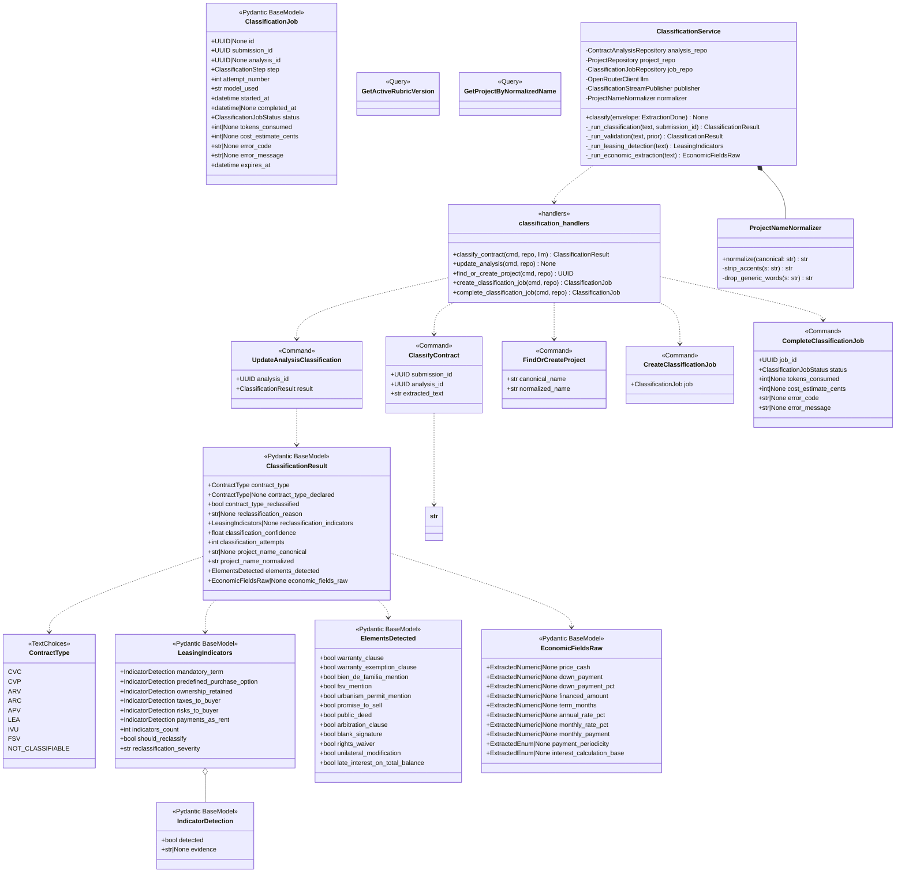
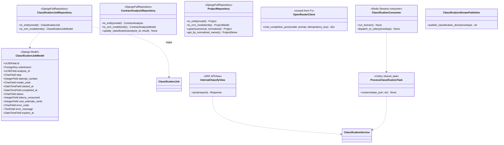
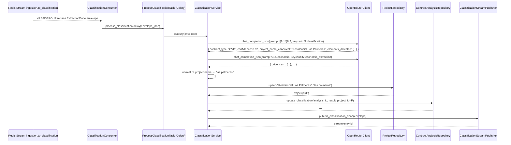
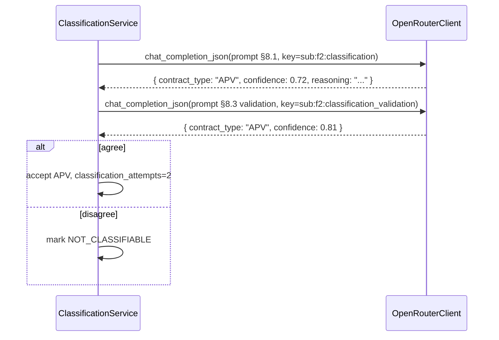
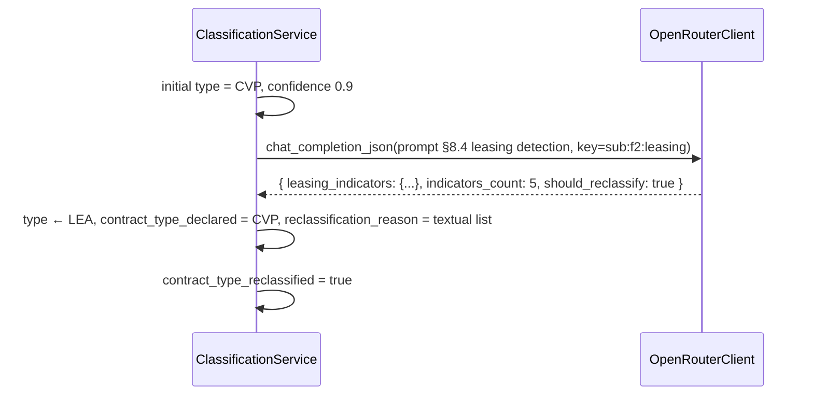
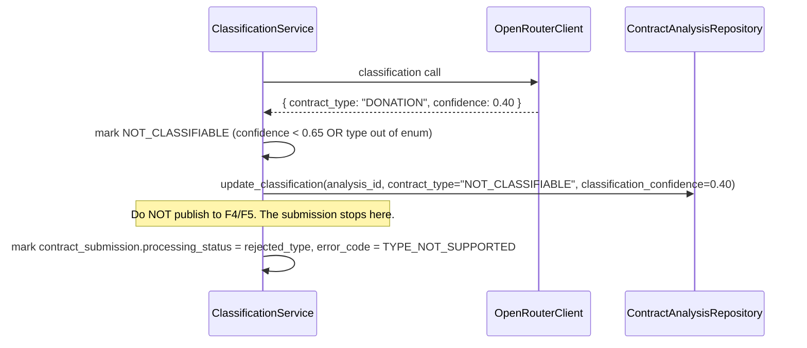
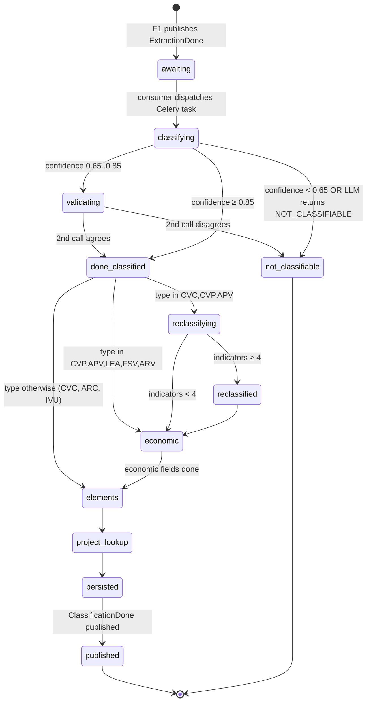
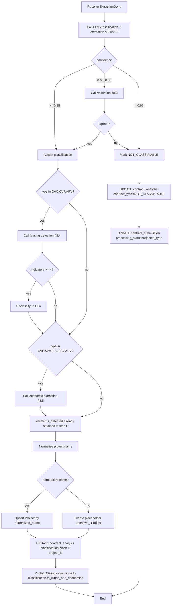
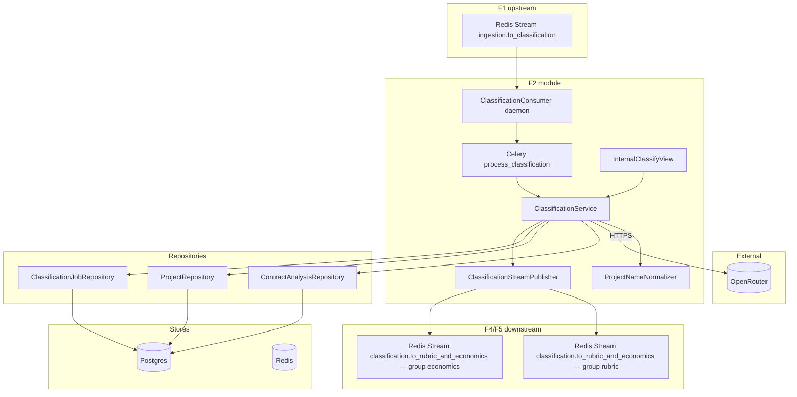
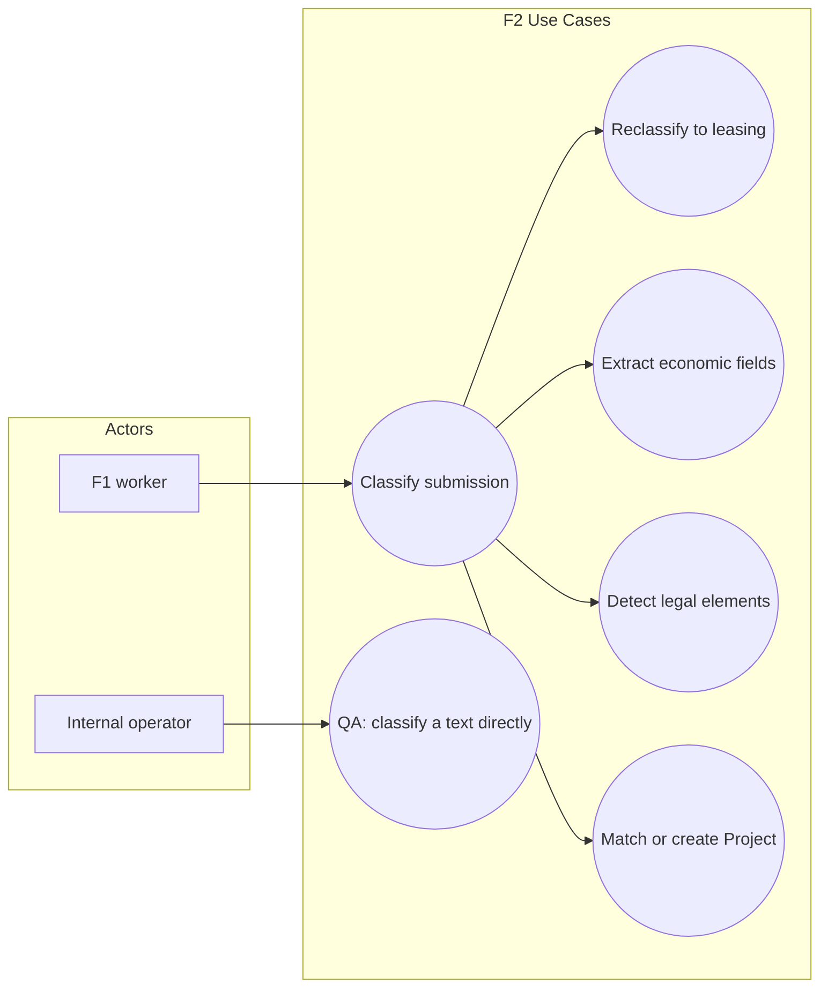

# Solution Diagrams — F2: Contract Classification & Structured Extraction

> Generated: 2026-05-15
> UML diagrams. Companion: `INTERACTION_DIAGRAMS.md` for per-flow detail.

---

## 1. Class Diagram (UML)

### 1.1 Domain + Application layer



### 1.2 Infrastructure layer



---

## 2. Sequence Diagrams (UML)

### 2.1 Happy path — CVP confidence ≥ 0.85, no reclassification



### 2.2 Validation path — confidence 0.65..0.85



### 2.3 Reclassification — CVP → LEA



### 2.4 NOT_CLASSIFIABLE path



### 2.5 Project name extraction fails

```mermaid
sequenceDiagram
    participant S as ClassificationService
    participant ProjRepo as ProjectRepository

    S->>S: project_name_canonical = null
    S->>S: short_hash = first 8 of submission_hash
    S->>ProjRepo: create_placeholder(normalized="unknown_<short_hash>", canonical="Pending project assignment", metadata={placeholder:true})
    ProjRepo-->>S: Project(id=P)
    Note over S: Placeholders are unique per submission; not reused
```

---

## 3. State Diagram



---

## 4. Activity Diagram



---

## 5. Component Diagram



---

## 6. Use Case Diagram



---

## Notes

- The `ClassificationConsumer` is a daemon (one process) subscribed to the Redis stream with consumer group `classification`. On message receipt, it converts the envelope to JSON and dispatches a Celery task. This decouples the Redis-Streams read pattern from Celery's task model and keeps Celery's retry/back-off semantics for the LLM-heavy work.
- All four LLM calls share the same `OpenRouterClient` instance — no separate clients per step. Circuit breaker is reused from F1.
- The economic and elements extractions are sometimes performed inside the single classification call (PRD §8.1 returns `elements_detected` and there's a combined-step option). The implementation follows PRD §3 US-04/US-05 and uses one call per step for predictability and idempotency.

**End of document.**
