# Entity Relationship Diagram — F3: Legal Corpus & Citation Retrieval

> Generated: 2026-05-15
> Source: `PRD_F3_CORPUS_Y_RAG.md` §5 + `DOMAIN_MODEL.md` §3.4–3.6
> Schema owned by F8 (`platform`); F3 owns the operations & ingestion logic.

---

## Overview

F3 introduces three persistent catalog tables (`corpus_version`, `legal_document`, `legal_chunk`) plus one transient observability table (`rag_query_log`, 90-day TTL). The data model lets F4 reproduce exactly the citations that an old report received: an analysis stores `corpus_version`, F3 always filters by that version, and once a version is published it never mutates.

`legal_chunk` is the retrieval unit. Each chunk has both a paraphrase (embedded and searched) and an optional verbatim text (displayed only). The HNSW index over `embedding` enables sub-150 ms semantic search.

---

## Mermaid Diagram

```mermaid
erDiagram
    CORPUS_VERSION ||--o{ LEGAL_DOCUMENT : "1 — N"
    LEGAL_DOCUMENT ||--o{ LEGAL_CHUNK : "1 — N"
    CONTRACT_ANALYSIS }o--|| CORPUS_VERSION : "FK corpus_version"
    RAG_QUERY_LOG }o..o{ CONTRACT_ANALYSIS : "optional FK by analysis_id"

    CORPUS_VERSION {
        text version PK
        timestamptz released_at
        int laws_count
        int articles_count
        int chunks_count
        jsonb manifest
        text changelog
        bool is_active
        text created_by
        timestamptz created_at
    }

    LEGAL_DOCUMENT {
        text law_id PK_part
        text corpus_version PK_part_FK
        text title
        text short_title
        text decree
        date issued_at
        text official_gazette
        text status
        text subject
        text source_url
        date last_verified
        text relevance_to_casa_segura
        text_array covers
        text_array tags
        text file_path
        text content_hash
        timestamptz created_at
    }

    LEGAL_CHUNK {
        uuid id PK
        text corpus_version FK
        text law_id FK
        text article_number
        text anchor
        text text_paraphrased
        text text_verbatim
        vector_384 embedding
        text_array tags
        text_array relevance_for_findings
        text severity_hint
        timestamptz created_at
    }

    RAG_QUERY_LOG {
        uuid id PK
        uuid analysis_id
        text criterion_id
        text query_text_hash
        text corpus_version
        int top_k
        numeric threshold
        text_array filter_tags
        text_array filter_law_ids
        int results_count_total
        int results_count_above_threshold
        numeric top_score
        timestamptz queried_at
        timestamptz expires_at
    }
```



---

## Entity Definitions

### CorpusVersion

**Purpose:** Immutable named snapshot of the legal corpus. Drives reproducibility of past analyses.

#### ORM Model (`corpus/infrastructure/django/models.py`, declared in `platform.infrastructure.django.models`)

| Field | Type | Nullable | Default | Constraints / Index | Description |
|---|---|---|---|---|---|
| `version` | TEXT | No | — | PK | Semver or date string (e.g. `2026-05-10`) |
| `released_at` | TIMESTAMPTZ | No | `NOW()` | — | Publication time |
| `laws_count` | INT | No | — | — | Number of laws |
| `articles_count` | INT | No | — | — | Total articles |
| `chunks_count` | INT | No | — | — | Total chunks (often = articles_count) |
| `manifest` | JSONB | No | — | — | Per-law summary (id, title, count) |
| `changelog` | TEXT | YES | — | — | Notes vs. prior version |
| `is_active` | BOOL | No | FALSE | partial UNIQUE WHERE TRUE | Only one version active |
| `created_by` | TEXT | YES | — | — | Operator who ran ingestion |
| `created_at` | TIMESTAMPTZ | No | `NOW()` | — | — |

#### Domain Entity

```python
class CorpusVersion(BaseModel):
    version: str
    released_at: datetime
    laws_count: int
    articles_count: int
    chunks_count: int
    manifest: dict
    changelog: str | None = None
    is_active: bool = False
    created_by: str | None = None
    created_at: datetime
```

### LegalDocument

**Purpose:** One full law in a specific corpus version.

#### ORM Model

| Field | Type | Nullable | Default | Constraints / Index | Description |
|---|---|---|---|---|---|
| `law_id` | TEXT | No | — | PK (composite) | Slug, e.g. `ley-inquilinato` |
| `corpus_version` | TEXT | No | — | PK + FK → `corpus_version(version)` | — |
| `title` | TEXT | No | — | — | Full title |
| `short_title` | TEXT | YES | — | — | Citation form |
| `decree` | TEXT | YES | — | — | E.g. "D.L. 776 de 2005" |
| `issued_at` | DATE | YES | — | — | Original promulgation |
| `official_gazette` | TEXT | YES | — | — | Diario Oficial reference |
| `status` | TEXT | No | — | CHECK `in_force | repealed | in_force_with_amendments` | Current status |
| `subject` | TEXT | YES | — | — | Subject classification |
| `source_url` | TEXT | YES | — | — | Official source URL |
| `last_verified` | DATE | No | — | — | Last human verification |
| `relevance_to_casa_segura` | TEXT | YES | — | CHECK `high | medium | low` | Editorial relevance |
| `covers` | TEXT[] | YES | `{}` | — | Topics covered |
| `tags` | TEXT[] | YES | `{}` | — | Filter tags at law level |
| `file_path` | TEXT | No | — | — | Source markdown path |
| `content_hash` | TEXT | No | — | — | SHA-256 of source markdown body |
| `created_at` | TIMESTAMPTZ | No | `NOW()` | — | — |

### LegalChunk

**Purpose:** Indexed corpus fragment — the retrieval unit. Typically one article, sometimes a sub-article.

#### ORM Model

| Field | Type | Nullable | Default | Constraints / Index | Description |
|---|---|---|---|---|---|
| `id` | UUID | No | `gen_random_uuid()` | PK | — |
| `corpus_version` | TEXT | No | — | FK → `corpus_version(version)`, INDEX | — |
| `law_id` | TEXT | No | — | (law_id, corpus_version) FK → `legal_document`, INDEX | — |
| `article_number` | TEXT | No | — | UNIQUE (corpus_version, law_id, anchor) | E.g. `Art. 12`, `Art. 19 lit. j` |
| `anchor` | TEXT | No | — | — | Slug, e.g. `art-12`, `art-19-j` |
| `text_paraphrased` | TEXT | No | — | — | Human-curated paraphrase, embedded |
| `text_verbatim` | TEXT | YES | — | — | Verbatim article text, displayable |
| `embedding` | VECTOR(384) | No | — | HNSW INDEX `m=16, ef_construction=64` | Embedding of `text_paraphrased` |
| `tags` | TEXT[] | No | `{}` | GIN INDEX | Filter tags |
| `relevance_for_findings` | TEXT[] | No | `{}` | GIN INDEX | Categories the chunk applies to (`E1`, `B7`, ...) |
| `severity_hint` | TEXT | YES | — | CHECK `override_critical | red | yellow | green | NULL` | Suggested severity |
| `created_at` | TIMESTAMPTZ | No | `NOW()` | — | — |

#### Domain Entity

```python
class LegalChunk(BaseModel):
    id: UUID | None = None
    corpus_version: str
    law_id: str
    article_number: str
    anchor: str
    text_paraphrased: str
    text_verbatim: str | None = None
    embedding: list[float] = Field(min_length=384, max_length=384)
    tags: list[str] = []
    relevance_for_findings: list[str] = []
    severity_hint: Literal["override_critical", "red", "yellow", "green"] | None = None
    created_at: datetime | None = None
```

### LegalReference (in-memory, embedded in `Finding.legal_basis`)

```python
class LegalReference(BaseModel):
    chunk_id: UUID
    law_id: str
    law_title: str
    article: str
    anchor: str
    text_paraphrased: str
    text_verbatim: str | None = None
    similarity_score: float
    tags: list[str]
    severity_hint: str | None = None
    official_source: str | None = None  # decree string
    corpus_version: str
```

### RagQueryLog

**Purpose:** Per-query metadata for quality analysis. The text is hashed, never stored in clear.

| Field | Type | Nullable | Default | Constraints / Index | Description |
|---|---|---|---|---|---|
| `id` | UUID | No | `gen_random_uuid()` | PK | — |
| `analysis_id` | UUID | YES | — | INDEX | Owner analysis (optional) |
| `criterion_id` | TEXT | YES | — | INDEX | Criterion that triggered the query |
| `query_text_hash` | TEXT | No | — | — | salt+SHA-256 of the finding text |
| `corpus_version` | TEXT | No | — | — | Version used |
| `top_k` | INT | No | — | — | Requested count |
| `threshold` | NUMERIC(3,2) | No | — | — | Threshold applied |
| `filter_tags` | TEXT[] | YES | — | — | Filter tags |
| `filter_law_ids` | TEXT[] | YES | — | — | Filter law ids |
| `results_count_total` | INT | No | — | — | Raw results pre-threshold |
| `results_count_above_threshold` | INT | No | — | — | Final result count |
| `top_score` | NUMERIC(4,3) | YES | — | — | Score of the best result |
| `queried_at` | TIMESTAMPTZ | No | `NOW()` | — | — |
| `expires_at` | TIMESTAMPTZ | No | `NOW() + 90 days` | INDEX | Cleanup |

---

## Relationships with Existing Models

- `ContractAnalysis.corpus_version` (FK → `corpus_version.version`) — set by F2 / F4 when the analysis runs. F3 reads it at retrieval time.
- `Criterion.legal_anchor` (text array of anchor slugs, e.g. `['art-1605-cc', 'art-4-ley-inquilinato']`) — F3 uses these as `prefer_anchors` during retrieval.

---

## Modifications to Existing Models

None. F3's three catalog tables are declared by F8's initial migration. F3 does not alter existing schema.

---

## Data Dictionary

| Term | Definition |
|---|---|
| `anchor` | Slug version of the article number (`art-12`, `art-19-j`); URL-safe |
| `article_number` | Article reference as cited in the law ("Art. 12", "Art. 19 lit. j") |
| `content_hash` | SHA-256 of the source markdown body; used to detect content drift |
| `corpus_version` | Tag identifying the corpus snapshot; e.g. `2026-05-10` |
| `cosine_distance` | `1 - cosine_similarity`; used for vector queries via pgvector's `<=>` operator |
| `embedding` | 384-dimensional float vector from `paraphrase-multilingual-MiniLM-L12-v2` |
| `is_active` | TRUE only on the version new analyses use; partial unique index enforces uniqueness |
| `last_verified` | Date a human last verified the paraphrase against the official source |
| `manifest` | JSONB listing the laws included in a version (id, title, count) |
| `relevance_for_findings` | Categories of findings where the chunk is applicable (`['E1','B7']`) |
| `severity_hint` | Editorial hint about how serious a violation is when this article is cited |
| `tags` | Normalized lowercase no-accent filter tags (`['warranty','eviction']`) |
| `text_paraphrased` | Human-curated paraphrase of the article, optimized for finding-like phrasing; the embedded text |
| `text_verbatim` | Verbatim text of the article; optional; displayed by F6 if present |

---

## Migration Notes

- Migration `0001_initial.py` (F8-owned) creates `corpus_version`, `legal_document`, `legal_chunk`, `rag_query_log`, plus the HNSW index on `legal_chunk.embedding`.
- The HNSW index is created via raw SQL `RunSQL` op (Django ORM doesn't natively support HNSW options).
- Tags GIN indexes on `legal_chunk.tags` and `legal_chunk.relevance_for_findings`.
- Unique partial index on `corpus_version (is_active) WHERE is_active = TRUE`.
- Unique on `(corpus_version, law_id, anchor)` in `legal_chunk`.
- Composite PK on `legal_document (law_id, corpus_version)`.

---

**End of document.**
