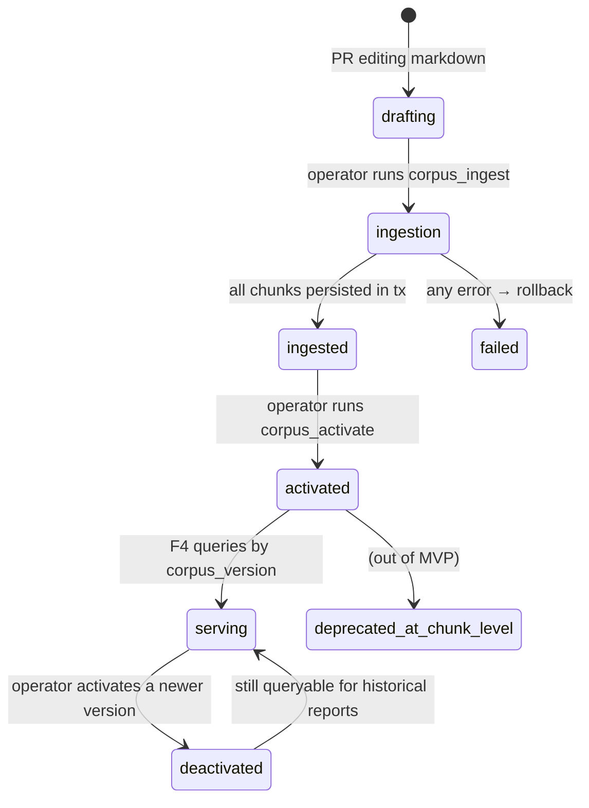

# Feature Overview — F3: Legal Corpus & Citation Retrieval (RAG)

> Generated: 2026-05-15
> Source PRD: `docs/Casa Segura Formal PRDs/PRD_F3_CORPUS_Y_RAG.md`
> Stack: Django 5.2 LTS + DRF + Celery + Postgres 15 + pgvector + sentence-transformers (`paraphrase-multilingual-MiniLM-L12-v2`, 384 dim).

---

## Executive Summary

Casa Segura's differentiator is that every report finding is backed by a **verbatim citation from a specific Salvadoran law**. F3 builds and serves the curated legal corpus that makes this possible. It ingests structured markdown files (one law per file) into Postgres + pgvector, exposes a typed retrieval API (`retrieve_legal_basis`) consumed by F4 when generating findings, and enforces the **"cite or stay silent"** discipline: results below the similarity threshold are discarded, never softened.

The corpus is **versioned and immutable**. A new version is a new full set; old analyses keep referencing their original `corpus_version` for reproducibility. The retrieval API filters by `corpus_version`, supports hybrid search (exact regex match when the finding text cites an article explicitly), and uses tag filters plus `legal_anchor` preferences from `Criterion`.

The embedding model is fixed at the multilingual paraphrase MiniLM (384 dim), which Casa Segura runs locally inside its API/worker process (no LLM call). The chunk being embedded is the **curated paraphrase**, not the verbatim text — paraphrases are written by humans to align with how findings are typically phrased.

---

## Key Concepts

| Term | Plain-language definition |
|---|---|
| **Corpus** | The full set of legal documents Casa Segura cites in reports |
| **CorpusVersion** | An immutable named snapshot (e.g. `2026-05-10`) of the corpus |
| **LegalDocument** | One full law within a corpus version (e.g. Ley de Inquilinato) |
| **LegalChunk** | An indexed fragment, typically one article. The unit of retrieval |
| **Embedding** | Numeric vector representation of the chunk's paraphrase |
| **Cite-or-stay-silent** | If similarity is below threshold, return empty; never approximate |
| **Hybrid search** | Exact regex match by article number first; fall back to semantic |
| **`is_active`** | Pointer to the version new analyses use; old versions remain accessible |
| **`severity_hint`** | Optional per-chunk hint (`override_critical`, `red`, `yellow`, `green`) |
| **RAG query log** | Per-query metadata for quality analysis; 90-day TTL |

---

## How It Works (Step by Step)

### Ingestion (operator-triggered)

1. **An operator** edits markdown files under `corpus/laws/`. Each file has YAML frontmatter with `law_id`, `title`, `decree`, `status`, `source_url`, `last_verified`, etc., plus a body with `### Art. N` headings followed by paraphrase and optional verbatim blocks.
2. **The operator** runs `python manage.py corpus_ingest --version 2026-05-10 --path ./corpus/laws/`.
3. **F3 parses** each markdown: validates frontmatter, splits the body by `### Art. N` headings, normalizes tags, computes content hash.
4. **F3 generates embeddings** for the paraphrase of every chunk using the local sentence-transformers model. The chunk's `text_verbatim` is preserved separately (not embedded).
5. **F3 persists** in a single transaction: one `CorpusVersion` row, one `LegalDocument` per law, N `LegalChunk` rows. If any step fails → full rollback.
6. **The operator** later runs `python manage.py corpus_activate --version 2026-05-10` to set `is_active = TRUE` (the partial unique index allows only one active version).

### Retrieval (called by F4)

1. **F4** calls `LegalCitationService.retrieve_legal_basis(finding_text, corpus_version, top_k=5, threshold=0.65, filter_tags=[...], prefer_anchors=[...])`.
2. **F3** checks the text for explicit article references via regex (`art\.?\s*1605\s*c\.?c\.?` patterns from PRD §6.2).
3. **If found**, fetch the matching chunk by `(law_id, article_number, corpus_version)`. Return with `similarity_score=1.0`.
4. **Otherwise**, encode `finding_text` with the same embedding model.
5. **Run cosine similarity** against `legal_chunk.embedding` filtered by `corpus_version`, optionally by `tags` and `relevance_for_findings`. Use HNSW index.
6. **If `prefer_anchors` is set**, the query restricts to chunks whose `anchor IN (prefer_anchors)` first; if zero results above threshold, fall back to a broader search.
7. **Filter by threshold** (cosine ≥ 0.65 by default). Discard everything below.
8. **Return** the top-K results sorted by descending similarity, each as a `LegalReference` ready to embed in a `Finding`.
9. **Log** the query: hash of `finding_text`, top score, results count, criterion (when known) to `rag_query_log` (90-day TTL).

### Audit (operator)

`python manage.py corpus_audit --version latest_active` produces a coverage report: laws included, articles count, most-cited chunks, findings without citation (from logs), chunks with stale `last_verified`.

---

## Business Rules

- **BR-F3-01:** Cite-or-stay-silent is invariant. Below threshold = empty result.
- **BR-F3-02:** Embeddings are computed over `text_paraphrased`, not `text_verbatim`.
- **BR-F3-03:** `CorpusVersion` is immutable post-publication; new corpus = new version.
- **BR-F3-04:** Paraphrases are human-curated. The system does not auto-generate.
- **BR-F3-05:** `text_verbatim` is optional; when present, F6 may display it.
- **BR-F3-06:** Default similarity threshold = 0.65; per-call override allowed but discouraged.
- **BR-F3-07:** When `Criterion.legal_anchor` is set, F3 uses it as the priority filter.
- **BR-F3-08:** Tags normalized (lowercase, no accents, no special chars) both at ingestion and at query time.
- **BR-F3-09:** Changing the embedding model requires full re-ingestion of all corpora; old corpora are kept for historical reports.
- **BR-F3-10:** Markdown files are the source of truth; the DB is a query index, reconstructible from files.
- **BR-F3-11:** `severity_hint` is informational; F4 may contradict it.
- **BR-F3-12:** `rag_query_log` has 90-day TTL; never stores finding text in clear.

---

## Lifecycle Diagram

---

## What Changes in the System

- New persistent tables: `corpus_version`, `legal_document`, `legal_chunk`, `rag_query_log` (declared by F8, populated by F3's ingestion).
- New management commands: `corpus_ingest`, `corpus_activate`, `corpus_list`, `corpus_query`, `corpus_audit`.
- New internal endpoint: `POST /v1/internal/rag/query` (HasInternalAuthHeader) for QA.
- Local file `corpus/manifest.yaml` declaring the active corpus version.
- Per-module python dependency: `sentence-transformers`, `torch`, `pgvector`, `pyyaml`, `markdown-it-py`.

---

## What This Feature Does NOT Do

- Auto-generate paraphrases from verbatim laws.
- Maintain corpora of other countries.
- Cite doctrine, case law, or secondary regulation.
- Provide an admin UI for editing the corpus (it is edited as files).
- Detect legal reforms automatically.
- Cache results across queries (queries are sub-150 ms; cache adds invalidation surface for negligible gain).

---

## Audit and Compliance

- Every ingestion writes one row to `privacy_audit_log` (`event_type='corpus_version_published'`).
- `rag_query_log` records per-query metadata; the finding text is **hashed**, never stored in clear.
- Coverage audit and outdated-verification audit run weekly via Celery Beat (`corpus_weekly_audit`).
- Embedding model integrity check at process startup (warm the model and run a known sentence; assert the embedding matches the reference vector to within ε).

---

## Assumptions Made

- Embedding model: `sentence-transformers/paraphrase-multilingual-MiniLM-L12-v2` (384 dim). Per `_shared/GLOBAL_ASSUMPTIONS.md` §10.
- HNSW index `m=16, ef_construction=64` (recommended in PRD §5.2).
- Threshold default 0.65; per-criterion override allowed (e.g., higher for very specific criteria).
- The local model loads once per worker process; ~80 MB on disk.
- LLM re-ranker is **not** in MVP (PRD §8.1 explicitly out of MVP).
- `corpus/laws/` lives in the same repository as the application code; ingestion runs as a one-time CI step in production deploys.

---

**End of document.**
