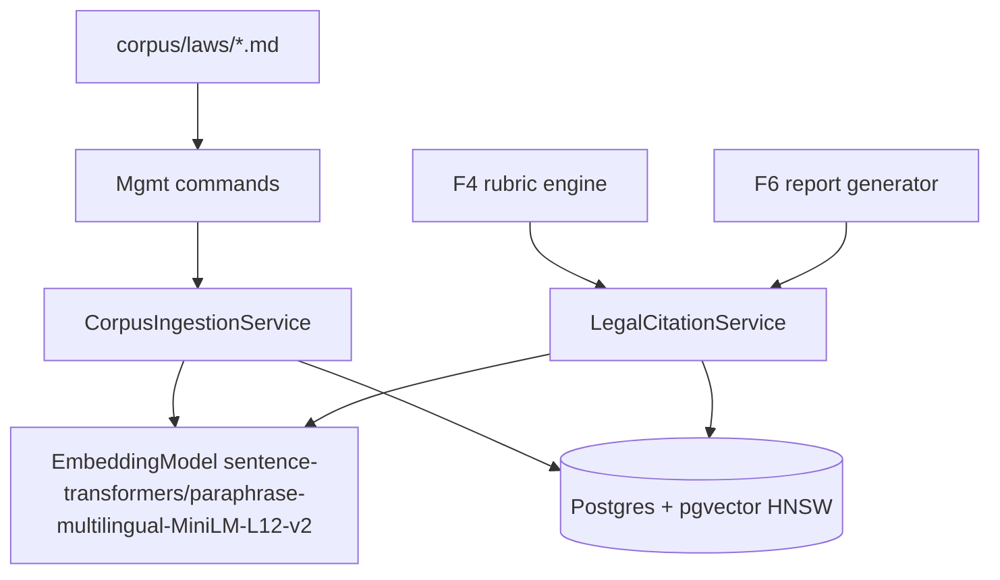
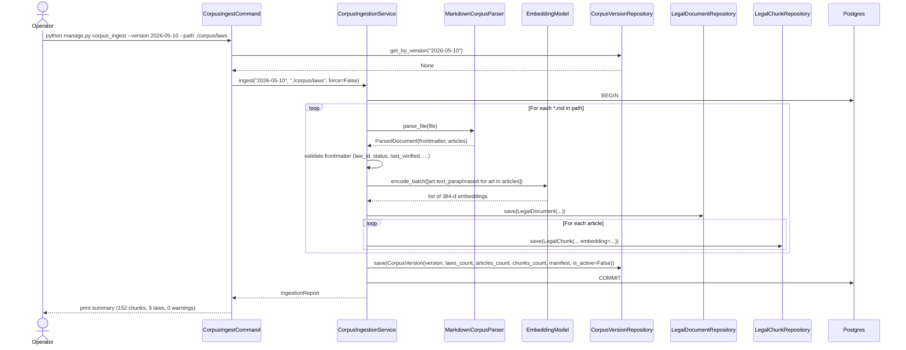
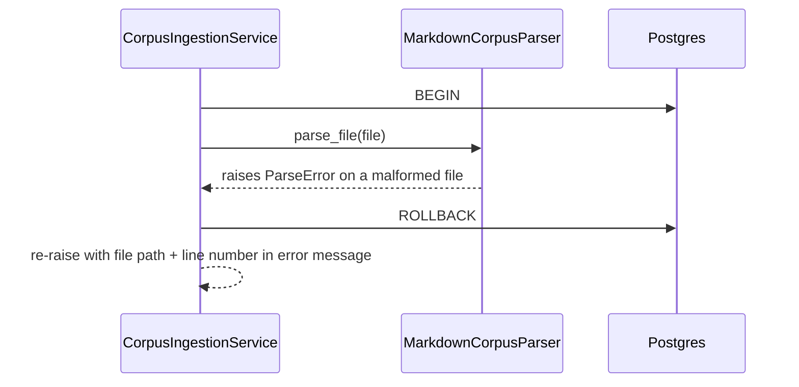
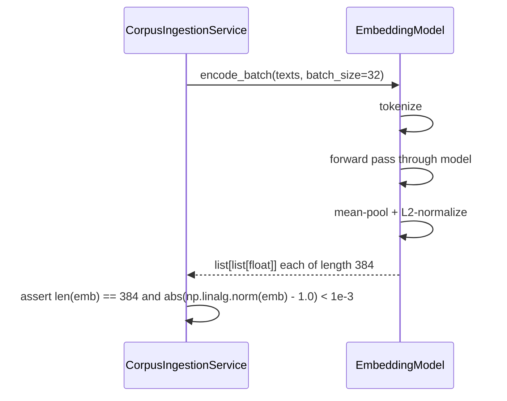
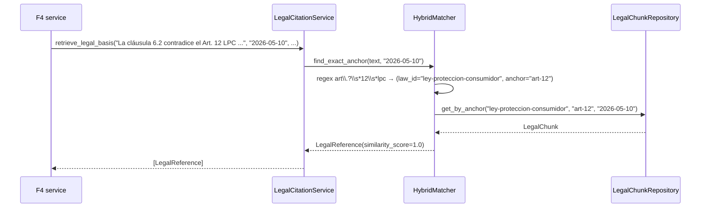
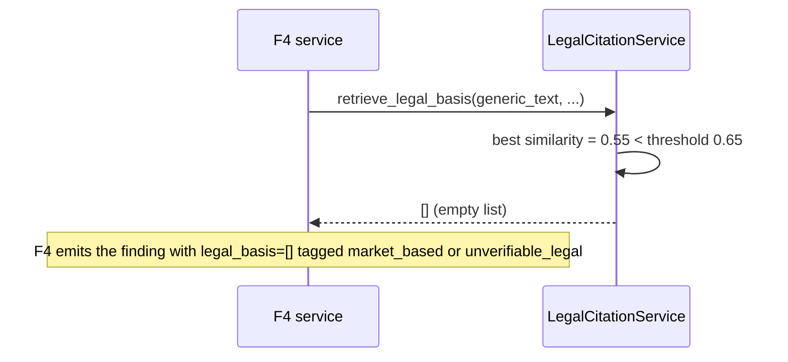
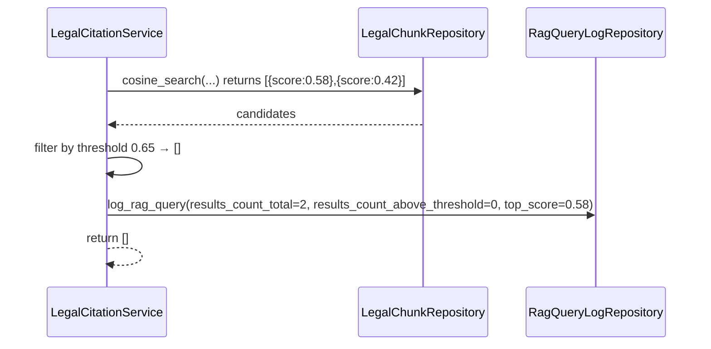
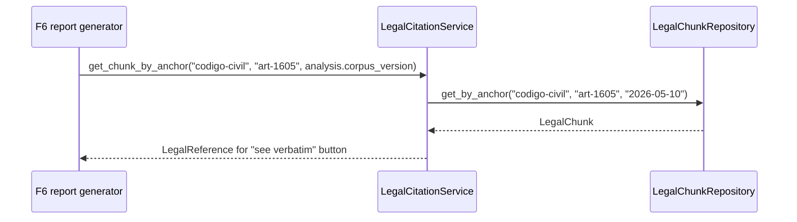
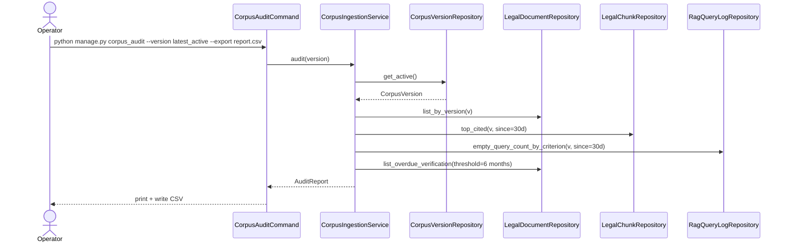
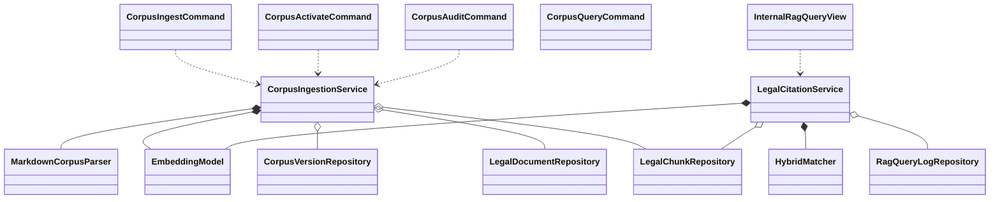

# Interaction Diagrams — F3: Legal Corpus & Citation Retrieval

> Generated: 2026-05-15
> Companion: `SOLUTION_DIAGRAMS.md`

---

## Component Overview



---

## Flow: US-01 Ingest a corpus version

### Happy Path



### Failure path (atomic rollback)



---

## Flow: US-02 Build embeddings



`EmbeddingModel` is wrapped so the underlying `SentenceTransformer` is a singleton lazy-loaded on first call; CPU is the default device.

---

## Flow: US-03 F4 retrieves legal basis

### Semantic path

```mermaid
sequenceDiagram
    participant F4 as F4 service
    participant Svc as LegalCitationService
    participant Hybrid as HybridMatcher
    participant Emb as EmbeddingModel
    participant CRepo as LegalChunkRepository
    participant LogRepo as RagQueryLogRepository
    participant PG as Postgres

    F4->>Svc: retrieve_legal_basis(finding_text, corpus_version="2026-05-10", top_k=3, threshold=0.65, prefer_anchors=criterion.legal_anchor, criterion_id="B7", analysis_id=A)
    Svc->>Hybrid: find_exact_anchor(finding_text, "2026-05-10")
    Hybrid-->>Svc: None
    Svc->>Emb: encode(finding_text)
    Emb-->>Svc: q  (384-d, normalized)
    Svc->>CRepo: cosine_search(version, q, top_k=3, threshold=0.65, prefer_anchors=["art-12-lpc"])
    CRepo->>PG: SELECT ..., embedding <=> %s AS distance ORDER BY distance LIMIT 3 (with anchor filter first; if 0, broaden)
    PG-->>CRepo: rows with similarity = 1 - distance
    CRepo-->>Svc: list[LegalChunk]
    Svc->>Svc: build LegalReference list (join LegalDocument for law_title)
    Svc->>LogRepo: log_rag_query(query_text_hash=sha256(salt+finding_text), top_score, results_count_above_threshold, criterion_id, analysis_id)
    Svc-->>F4: list[LegalReference]
```

### Hybrid (exact) path



### Empty result



---

## Flow: US-04 Cite-or-stay-silent enforcement



---

## Flow: US-05 Versioning

When F4 needs to regenerate an old report, F6 calls `LegalCitationService.get_chunk_by_anchor(law_id, anchor, corpus_version=analysis.corpus_version)`. The retrieval is always pinned to the analysis's stored version.



---

## Flow: US-06 Operator audits corpus



---

## Class Diagram



---

## Notes

- The `EmbeddingModel` adapter is a thin wrapper around `sentence_transformers.SentenceTransformer`. The model object is held at module scope and lazily constructed; multiple threads share it (the underlying torch model is thread-safe for inference).
- The `HybridMatcher` uses a list of compiled regexes from PRD §6.2. New regexes are added when new laws are absorbed.
- `LegalCitationService.retrieve_legal_basis` is **synchronous** (Django ORM + local model) and fast (sub-150 ms P95). It is called from F4's Celery task in the worker process.

**End of document.**
