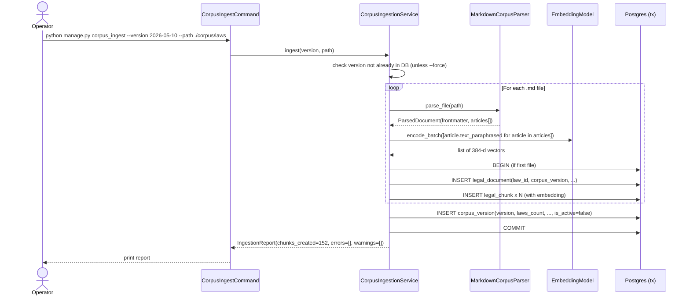
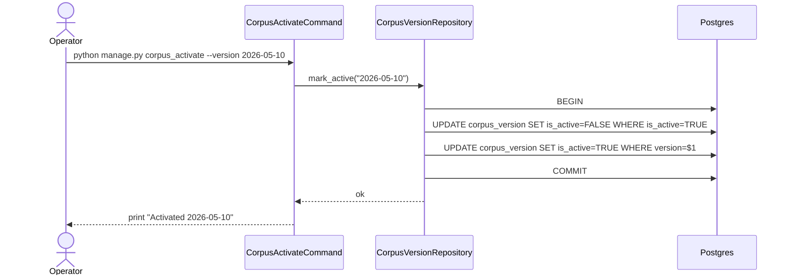
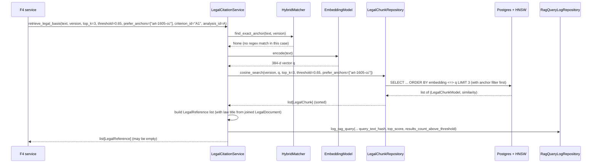
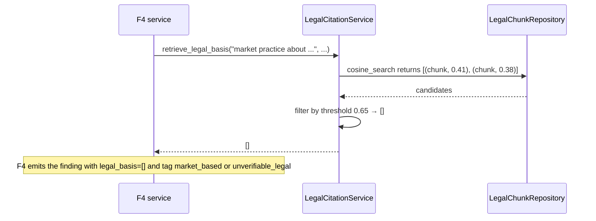
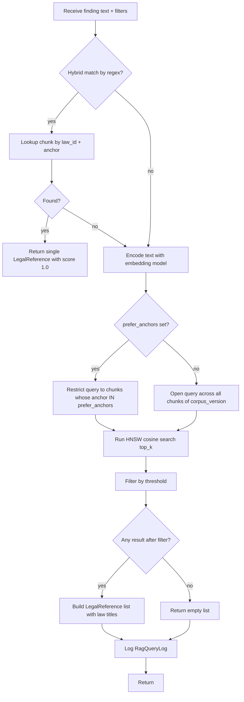
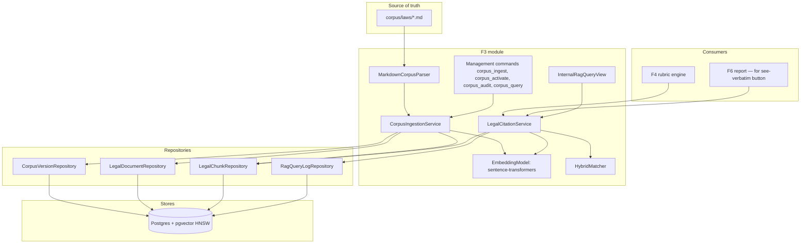
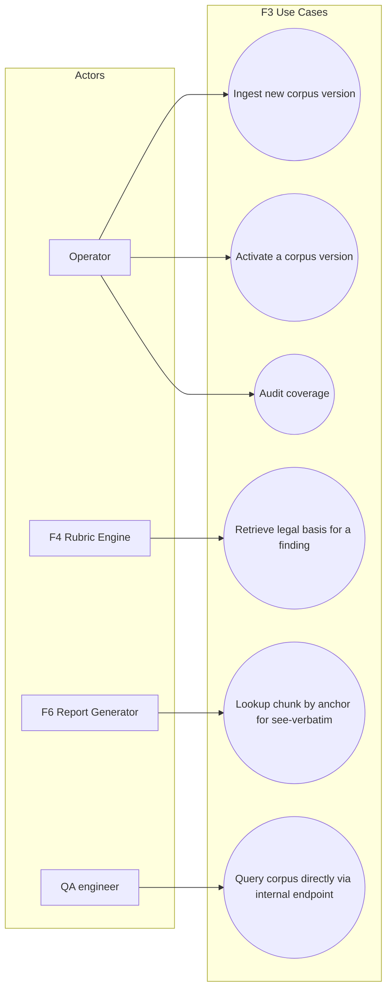

# Solution Diagrams — F3: Legal Corpus & Citation Retrieval

> Generated: 2026-05-15

---

## 1. Class Diagram (UML)

### 1.1 Domain + Application

```mermaid
classDiagram
    class CorpusVersion {
        <<Pydantic>>
        +str version
        +datetime released_at
        +int laws_count
        +int articles_count
        +int chunks_count
        +dict manifest
        +str|None changelog
        +bool is_active
    }
    class LegalDocument {
        <<Pydantic>>
        +str law_id
        +str corpus_version
        +str title
        +str|None short_title
        +str|None decree
        +date|None issued_at
        +str status
        +date last_verified
        +list~str~ tags
        +str file_path
        +str content_hash
    }
    class LegalChunk {
        <<Pydantic>>
        +UUID|None id
        +str corpus_version
        +str law_id
        +str article_number
        +str anchor
        +str text_paraphrased
        +str|None text_verbatim
        +list~float~ embedding
        +list~str~ tags
        +list~str~ relevance_for_findings
        +str|None severity_hint
    }
    class LegalReference {
        <<Pydantic>>
        +UUID chunk_id
        +str law_id
        +str law_title
        +str article
        +str anchor
        +str text_paraphrased
        +str|None text_verbatim
        +float similarity_score
        +list~str~ tags
        +str|None severity_hint
        +str|None official_source
        +str corpus_version
    }
    class RagQueryLog {
        <<Pydantic>>
        +UUID|None id
        +UUID|None analysis_id
        +str|None criterion_id
        +str query_text_hash
        +str corpus_version
        +int top_k
        +float threshold
        +int results_count_total
        +int results_count_above_threshold
        +float|None top_score
        +datetime queried_at
    }
    class IngestCorpusVersion {
        <<Command>>
        +str version
        +Path path
        +bool force
    }
    class ActivateCorpusVersion {
        <<Command>>
        +str version
    }
    class CreateLegalDocument {
        <<Command>>
        +LegalDocument doc
    }
    class CreateLegalChunk {
        <<Command>>
        +LegalChunk chunk
    }
    class CreateCorpusVersion {
        <<Command>>
        +CorpusVersion version
    }
    class LogRagQuery {
        <<Command>>
        +RagQueryLog entry
    }
    class GetActiveCorpusVersion {
        <<Query>>
    }
    class GetChunkByAnchor {
        <<Query>>
        +str law_id
        +str anchor
        +str corpus_version
    }
    class SearchChunks {
        <<Query>>
        +str corpus_version
        +list~float~ embedding
        +int top_k
        +float threshold
        +list~str~|None filter_tags
        +list~str~|None filter_law_ids
        +list~str~|None prefer_anchors
    }
    class corpus_handlers {
        <<handlers>>
        +ingest_version(cmd, ...) IngestionReport
        +activate_version(cmd, repo) CorpusVersion
        +create_legal_document(cmd, repo) LegalDocument
        +create_legal_chunk(cmd, repo) LegalChunk
        +log_rag_query(cmd, repo) RagQueryLog
    }
    class corpus_queries_handlers {
        <<handlers>>
        +get_active_version(query, repo) CorpusVersion|None
        +get_chunk_by_anchor(query, repo) LegalChunk|None
        +search_chunks(query, repo) list~LegalChunk~
    }
    class CorpusIngestionService {
        -CorpusVersionRepository version_repo
        -LegalDocumentRepository doc_repo
        -LegalChunkRepository chunk_repo
        -EmbeddingModel embedder
        -MarkdownCorpusParser parser
        +ingest(version, path, force) IngestionReport
        +activate(version) None
        +audit(version) AuditReport
    }
    class LegalCitationService {
        -LegalChunkRepository chunk_repo
        -EmbeddingModel embedder
        -RagQueryLogRepository log_repo
        -HybridMatcher hybrid
        +retrieve_legal_basis(text, version, top_k, threshold, filter_tags, prefer_anchors, criterion_id, analysis_id) list~LegalReference~
        +get_chunk_by_anchor(law_id, anchor, version) LegalReference|None
    }
    class HybridMatcher {
        +find_exact_anchor(text, version) LegalReference|None
        -ARTICLE_PATTERNS list~Regex~
    }
    class EmbeddingModel {
        <<adapter for SentenceTransformer>>
        +encode(text) list~float~
        +encode_batch(texts) list~list~float~~
        +dim int
    }
    class MarkdownCorpusParser {
        +parse_file(path) ParsedDocument
        +split_articles(body) list~ParsedArticle~
        +normalize_tags(tags) list~str~
    }
    LegalReference o-- LegalChunk : built from
    corpus_handlers ..> IngestCorpusVersion
    corpus_handlers ..> ActivateCorpusVersion
    CorpusIngestionService *-- MarkdownCorpusParser
    CorpusIngestionService *-- EmbeddingModel
    LegalCitationService *-- EmbeddingModel
    LegalCitationService *-- HybridMatcher
```



### 1.2 Infrastructure

```mermaid
classDiagram
    class CorpusVersionModel {
        <<Django Model>>
    }
    class LegalDocumentModel {
        <<Django Model>>
    }
    class LegalChunkModel {
        <<Django Model>>
        +VectorField(384) embedding
    }
    class RagQueryLogModel {
        <<Django Model>>
    }
    class CorpusVersionRepository {
        <<DjangoFullRepository>>
        +get_active() CorpusVersion|None
        +mark_active(version) None
    }
    class LegalDocumentRepository {
        <<DjangoFullRepository>>
    }
    class LegalChunkRepository {
        <<DjangoFullRepository>>
        +cosine_search(version, embedding, top_k, threshold, filter_tags, prefer_anchors) list~LegalChunk~
        +get_by_anchor(law_id, anchor, version) LegalChunk|None
    }
    class RagQueryLogRepository {
        <<DjangoFullRepository>>
    }
    class CorpusIngestCommand {
        <<Django management command>>
        +handle(version, path, force) None
    }
    class CorpusActivateCommand {
        <<Django management command>>
    }
    class CorpusAuditCommand {
        <<Django management command>>
    }
    class InternalRagQueryView {
        <<DRF APIView>>
        +post(request) Response
    }
    LegalChunkRepository ..> LegalChunkModel
    CorpusIngestCommand ..> CorpusIngestionService
    InternalRagQueryView ..> LegalCitationService
```



---

## 2. Sequence Diagrams

### 2.1 Corpus ingestion



### 2.2 Activation



### 2.3 Retrieval (semantic)



### 2.4 Retrieval (hybrid — exact match)

```mermaid
sequenceDiagram
    participant F4 as F4 service
    participant Svc as LegalCitationService
    participant Hybrid as HybridMatcher
    participant Repo as LegalChunkRepository

    F4->>Svc: retrieve_legal_basis("Art. 1605 CC says ...", version, ...)
    Svc->>Hybrid: find_exact_anchor(text, version)
    Hybrid->>Hybrid: regex match art\.?\s*1605\s*c\.?c\.?  → law_id="codigo-civil", anchor="art-1605"
    Hybrid->>Repo: get_by_anchor("codigo-civil", "art-1605", version)
    Repo-->>Hybrid: LegalChunk
    Hybrid-->>Svc: LegalReference(similarity_score=1.0)
    Svc-->>F4: [LegalReference]
    Note over Svc: Hybrid match short-circuits; semantic search not run.
```

### 2.5 Empty result (cite-or-stay-silent)



---

## 3. State Diagram — CorpusVersion lifecycle

```mermaid
stateDiagram-v2
    [*] --> draft: markdown editing (PR)
    draft --> ingested: operator runs corpus_ingest
    ingested --> active: operator runs corpus_activate
    active --> deactivated: another version is activated
    deactivated --> active: re-activate (rare; manual)
    ingested --> [*]: corpus is queryable for historical reports even when not active
```



---

## 4. Activity Diagram — Retrieve_legal_basis



---

## 5. Component Diagram



---

## 6. Use Case Diagram



---

## Notes

- The HNSW index is created once via `RunSQL` in a Django migration:
  ```sql
  CREATE INDEX idx_legal_chunk_embedding ON legal_chunk
  USING hnsw (embedding vector_cosine_ops)
  WITH (m = 16, ef_construction = 64);
  ```
- `pgvector.django.VectorField(dimensions=384)` is the Django field; cosine distance via `CosineDistance(...)`.
- Each Celery worker process and Django ASGI worker loads the embedding model lazily on first use; warm-up at process start avoids first-request latency.

**End of document.**
