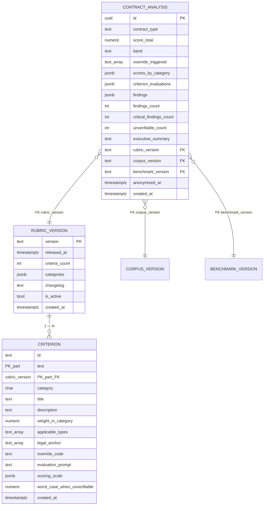

# Entity Relationship Diagram — F4: Rubric Engine

> Generated: 2026-05-15

---

## Overview

F4 introduces two new persistent catalog tables — `rubric_version` and `criterion` (both declared and migrated by `platform` per `_shared/GLOBAL_ASSUMPTIONS.md` §11). F4 writes 11 columns on `contract_analysis` and three embedded structures inside JSONB columns: `scores_by_category`, `criterion_evaluations`, `findings`. The catalog tables follow the versioned-immutable-catalog pattern: once published, a `RubricVersion` does not mutate.

The relationships are: one `RubricVersion` has many `Criterion` rows; one `ContractAnalysis` references one `RubricVersion`, one `CorpusVersion`, one `BenchmarkVersion`. F4 reads the corpus via F3's `LegalCitationService`, not via direct FK from `contract_analysis.findings`.

---

## Mermaid Diagram



---

## Entity Definitions

### RubricVersion (catalog, F4 reads only)

| Field | Type | Nullable | Constraints / Index | Description |
|---|---|---|---|---|
| `version` | TEXT | No | PK | Semver, e.g. `1.0.0` |
| `released_at` | TIMESTAMPTZ | No | — | Publication time |
| `criteria_count` | INT | No | — | 38 in v1.0.0 |
| `categories` | JSONB | No | — | Global weights per category, e.g. `{"A":0.20,"B":0.30,...}` |
| `changelog` | TEXT | YES | — | Notes |
| `is_active` | BOOL | No (default FALSE) | partial UNIQUE WHERE TRUE | Only one active |
| `created_at` | TIMESTAMPTZ | No | — | — |

#### Pydantic

```python
class RubricVersion(BaseModel):
    model_config = ConfigDict(from_attributes=True)
    version: str
    released_at: datetime
    criteria_count: int
    categories: dict[str, float]
    changelog: str | None = None
    is_active: bool = False
    created_at: datetime
```

### Criterion (catalog, F4 reads only)

| Field | Type | Nullable | Constraints / Index | Description |
|---|---|---|---|---|
| `id` | TEXT | No | PK (composite) | E.g. `A1`, `B2`, `E7` |
| `rubric_version` | TEXT | No | PK + FK → `rubric_version` | — |
| `category` | CHAR(1) | No | CHECK in A..F, INDEX | A..F |
| `title` | TEXT | No | — | Short title |
| `description` | TEXT | No | — | What is assessed |
| `weight_in_category` | NUMERIC(4,2) | No | CHECK > 0 AND ≤ 100 | Percentage within the category |
| `applicable_types` | TEXT[] | No | GIN INDEX | Contract types where it applies |
| `legal_anchor` | TEXT[] | No (default `{}`) | — | Slugs F3 prefers for retrieval |
| `override_code` | TEXT | YES | — | One of 11 override codes |
| `evaluation_prompt` | TEXT | No | — | Prompt template (Spanish) |
| `scoring_scale` | JSONB | No | — | Discrete 0-10 scale definition |
| `worst_case_when_unverifiable` | NUMERIC(3,1) | No (default 4.0) | — | Score added when unverifiable |
| `created_at` | TIMESTAMPTZ | No | — | — |

#### Pydantic

```python
class Criterion(BaseModel):
    model_config = ConfigDict(from_attributes=True)
    id: str
    rubric_version: str
    category: Literal["A","B","C","D","E","F"]
    title: str
    description: str
    weight_in_category: float
    applicable_types: list[str]
    legal_anchor: list[str] = []
    override_code: str | None = None
    evaluation_prompt: str
    scoring_scale: dict
    worst_case_when_unverifiable: float = 4.0
```

### ContractAnalysis columns written by F4

`score_total`, `band`, `override_triggered`, `scores_by_category`, `criterion_evaluations`, `findings`, `findings_count`, `critical_findings_count`, `unverifiable_count`, `executive_summary`, `rubric_version` (FK).

### Embedded structures (JSONB)

#### CategoryScore (inside `scores_by_category`)

```python
class CategoryScore(BaseModel):
    category: Literal["A","B","C","D","E","F"]
    category_name: str  # human-readable
    weight_global: float
    weight_effective: float
    score: float
    criteria_count_total: int
    criteria_count_applicable: int
    criteria_count_unverifiable: int
```

#### CriterionEvaluation (inside `criterion_evaluations`)

```python
class CriterionEvaluation(BaseModel):
    criterion_id: str
    category: Literal["A","B","C","D","E","F"]
    applicable: bool
    evaluated: bool
    unverifiable: bool
    score: float
    weight_in_category: float
    override_triggered: str | None = None
    justification: str
    evidence_snippet: str | None = None  # ≤ 500 chars
```

#### Finding (inside `findings`)

```python
class Finding(BaseModel):
    id: str  # F-NNN
    severity: Literal["critical","red","yellow","green","unverifiable"]
    title: str
    description: str
    evidence_clause_snippet: str | None = None  # ≤ 500 chars; persisted; anonymized at 90 days
    legal_basis: list[LegalReference] = []  # up to 3
    recommendation: str
    related_criterion_id: str
    anchors_to_override: str | None = None
    tags: list[str] = []  # e.g. ["market_based"] or ["unverifiable_legal"]
```

(See F3's `LegalReference` for the structure.)

---

## Relationships with Existing Models

- `Criterion.rubric_version` → `RubricVersion.version`
- `ContractAnalysis.rubric_version` → `RubricVersion.version`
- `ContractAnalysis.corpus_version` → `CorpusVersion.version` (F3-owned)
- `ContractAnalysis.benchmark_version` → `BenchmarkVersion.version` (F5-owned)
- F4 reads `LegalChunk` via `LegalCitationService` (no direct FK from `findings`)

---

## Modifications to Existing Models

F4 introduces no DDL beyond the two catalog tables. The columns it writes on `contract_analysis` were declared by F8.

---

## Data Dictionary

| Term | Definition |
|---|---|
| `band` | One of `green` (≥8), `yellow` (5..7.9), `red` (<5), `not_analyzable` (set elsewhere) |
| `category` | One of A-F per rubric |
| `criterion_id` | Stable id, e.g. `A1`, `B2`, `E7` |
| `evidence_clause_snippet` | Verbatim contract clause supporting the finding, up to 500 chars |
| `override_code` | One of 11 codes (`art_1605_cc`, `art_12_lpc`, ...) per `DOMAIN_MODEL.md` §6.6 |
| `override_triggered` | Array of fired override codes on the analysis |
| `score_total` | 0..10 with one decimal; forced to 0 if any override |
| `severity` | Finding severity; criterion score determines mapping by default |
| `unverifiable` | The criterion could not be evaluated; contributes `worst_case_when_unverifiable` |
| `weight_in_category` | Criterion's weight within its category (percentage); renormalized when some criteria don't apply |
| `worst_case_when_unverifiable` | Score added when criterion is unverifiable |

---

## Migration Notes

- `rubric_version` and `criterion` tables created by `platform` migrations.
- Seed migration in `rubric/infrastructure/django/migrations/0001_seed_rubric_v1.py` loads the 38 criteria from `rubric/criteria/v1.0.0.yaml` into the `criterion` table for `rubric_version='1.0.0'`.
- The active rubric is `1.0.0` at MVP (`is_active=true`).
- F4 reads `Criterion` rows at evaluation time; no runtime modification of catalog tables.

---

**End of document.**
