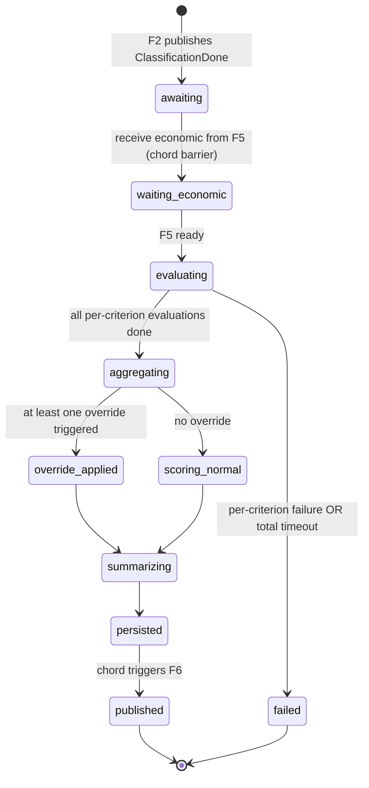

# Feature Overview — F4: Rubric Engine & Score Computation

> Generated: 2026-05-15
> Source PRD: `docs/Casa Segura Formal PRDs/PRD_F4_MOTOR_RUBRICA.md`
> Stack: Django 5.2 LTS + Celery + Postgres.
> Depends on: F2 (classification), F3 (RAG), F5 (economic summary), F8 (schema).
> Blocks: F6 (report).

---

## Executive Summary

F4 is the **product's brain**. It takes the classified contract from F2, the economic summary from F5, and the legal corpus from F3, and produces the 38-criterion evaluation that becomes the user's report: a 0-10 score, a green/yellow/red band, prioritized findings with verbatim legal citations, recommendations to negotiate with the seller, and overrides that force the score to 0 when an absolute nullity is detected.

The execution is structurally simple — evaluate each applicable criterion, gather findings, compute weighted averages with renormalization — but the demands are strict:

- **Asymmetric penalty**: conditions favorable to the buyer never lower the score.
- **Unverifiable adds worst case**: better a false negative than a false positive.
- **Cite or stay silent**: every legal-violation claim must be anchored to F3's corpus; F4 never invents references.
- **Overrides**: any of 11 critical conditions forces `score_total=0` and `band='red'`.
- **Reproducibility**: same inputs + same rubric + same corpus = same score ± 0.2.

F4 makes ~30-32 LLM calls per analysis (one per applicable criterion) plus one for the executive summary. Cost budget: under $0.30 USD per analysis. Latency: P95 ≤ 60 s.

---

## Key Concepts

| Term | Plain-language definition |
|---|---|
| **Criterion** | One of 38 rubric items (e.g., B2 "Effective annual rate"); each has a scale, weight, applicability, and prompt |
| **Category** | One of six groups: A legal validity, B economic health, C guarantees, D property risks, E abusive clauses, F transparency |
| **Override** | One of 11 critical conditions that, if triggered, forces final score to 0 and band to red |
| **Unverifiable** | A criterion that cannot be evaluated from the contract; adds `worst_case_when_unverifiable` to the score |
| **Finding** | A user-facing item (severity, title, description, evidence snippet, legal basis, recommendation) corresponding to one criterion |
| **`evidence_clause_snippet`** | Verbatim clause from the contract supporting the finding; capped at 500 chars; anonymized at 90 days |
| **`legal_basis`** | Up to 3 `LegalReference` objects from F3; can be empty (then finding is `market_based` or `unverifiable_legal`) |
| **Renormalization** | Reweighting categories/criteria when some don't apply to the contract type |

---

## How It Works (Step by Step)

1. **F4 consumes** the `ClassificationDone` envelope from F2 via Redis Streams. It also waits for F5's `economic_done` signal (Celery task chord).
2. **F4 loads** the active `RubricVersion` and the criteria applicable to `analysis.contract_type`. For a typical `CVP`, ~32 of 38 criteria apply.
3. **For each applicable criterion**, F4 builds a prompt from `Criterion.evaluation_prompt` plus context (contract text, F2 elements detected, F5 economic summary), runs an LLM call (default `anthropic/claude-sonnet-4`, temp 0.1, idempotency key per criterion), parses the JSON response, and writes a `CriterionEvaluation` to memory.
4. **Concurrency**: criterion evaluations run in parallel with `asyncio.gather(...)` bounded by a semaphore (`LLM_RUBRIC_CONCURRENCY=8`). Each call has a 30 s timeout.
5. **Unverifiable handling**: if the LLM returns `unverifiable=true`, the score is forced to `Criterion.worst_case_when_unverifiable` (typically 4.0), not the LLM's number.
6. **Override detection**: if any evaluation has `override_triggered` (one of 11 codes), F4 records it. After all evaluations, if at least one override fired → `score_total=0, band='red'`.
7. **Finding emission**: every criterion with `should_emit_finding=true` (score < 10) yields one `Finding`. F4 calls **F3** (`LegalCitationService.retrieve_legal_basis`) per finding to anchor it. If F3 returns empty, the finding is tagged `market_based` (no `legal_anchor` in criterion) or `unverifiable_legal` (has `legal_anchor` but corpus has no match).
8. **Score computation**: per-category weighted average (renormalize when criteria don't apply); global weighted average (renormalize when categories have zero applicable criteria). Round to 1 decimal. Band assigned by ranges (≥8 green, 5–7.9 yellow, <5 red).
9. **Executive summary**: one final LLM call (prompt §8.3) produces a 2-3 sentence Spanish "tú" summary.
10. **Persist atomically**: F4 updates `contract_analysis` with `score_total`, `band`, `override_triggered`, `scores_by_category`, `criterion_evaluations`, `findings`, `findings_count`, `critical_findings_count`, `unverifiable_count`, `executive_summary`, `rubric_version`, `corpus_version`, `benchmark_version`, `processing_completed_at`.
11. **Publish** to F6's Celery chain.

---

## Business Rules

- **BR-F4-01:** Only applicable criteria enter the computation (no zero-padding).
- **BR-F4-02:** Asymmetric penalty: favorable values score 10.
- **BR-F4-03:** Unverifiable adds the configured worst case, not the LLM's score.
- **BR-F4-04:** Overrides force final score 0, band red.
- **BR-F4-05:** Findings without `legal_basis` are tagged; never invent.
- **BR-F4-06:** One criterion per LLM call (no batching).
- **BR-F4-07:** Temperature 0.1; seed when supported.
- **BR-F4-08:** Concurrency cap 8 simultaneous calls.
- **BR-F4-09:** P95 ≤ 60 s; over → `failed_analysis`, `error_code=TIMEOUT_EXCEEDED`.
- **BR-F4-10:** Persisted `rubric_version` = the one used; new version = new analysis.
- **BR-F4-11:** No conversational dialog.
- **BR-F4-12:** Exactly one finding per criterion (or zero if score=10).
- **BR-F4-13:** Recommendations are actionable and specific.
- **BR-F4-14:** F4 only evaluates the document, not the seller's behavior outside it.
- **BR-F4-15:** When F5 flags an economic value unverifiable, the F4 criteria depending on it are marked unverifiable without LLM call.
- **BR-F4-16:** `evidence_clause_snippet` ≤ 500 chars; anonymized at 90 days.

---

## Lifecycle Diagram

---

## What Changes in the System

- New persistent catalog tables (declared by F8): `criterion`, `rubric_version`
- Columns written on `contract_analysis`: `score_total`, `band`, `override_triggered`, `scores_by_category`, `criterion_evaluations`, `findings`, `findings_count`, `critical_findings_count`, `unverifiable_count`, `executive_summary`, `rubric_version`
- Two Celery tasks: `rubric.evaluate_analysis` (the main one), `rubric.absorb_economic_summary` (chord callback)
- Internal endpoints: `POST /v1/internal/rubric/evaluate-criterion` (QA), `GET /v1/internal/rubric/version/{version}` (list criteria)
- Per-rubric YAML loader: criteria definitions live in `rubric/criteria/v1.0.0.yaml`; the seed migration loads them into the `criterion` table

---

## What This Feature Does NOT Do

- Define the rubric (that's product work in `RUBRICA_CONTRATO.md`)
- Curate the corpus (F3)
- Compute economic figures (F5; F4 only consumes)
- Generate the HTML/PDF (F6)
- Deliver (F7)
- Allow user/admin overrides
- Manage appeals
- Compare against external analyzers

---

## Audit and Compliance

- Each LLM call is logged with `analysis_id`, `criterion_id`, `attempt`, `tokens`, `cost_cents`, `idempotency_key`
- The full evaluation result (`criterion_evaluations`, `findings`) is persisted in `contract_analysis`; after 90 days the snippets are replaced by a sentinel and detailed evaluations are reduced to per-category aggregates
- `rubric_version`, `corpus_version`, `benchmark_version` are mandatory FK; regeneration of the report uses the stored versions

---

## Assumptions Made

- Default LLM `anthropic/claude-sonnet-4` via OpenRouter, temp 0.1.
- Concurrency cap 8 LLM calls; each 30 s timeout.
- One finding per criterion strictly.
- Executive summary is LLM-generated (prompt §8.3); deterministic fallback template if the call fails.
- The criteria YAML is the canonical source of `evaluation_prompt`, `scoring_scale`, `applicable_types`, `legal_anchor`, `override_code`, `weight_in_category`, `worst_case_when_unverifiable`. The seed migration loads it into the `criterion` table.
- Open question on cap-of-findings-shown (PRD §10 Q-3): F4 emits all findings; the **cap of visible findings** is a F6 rendering concern, not F4's responsibility.

---

**End of document.**
