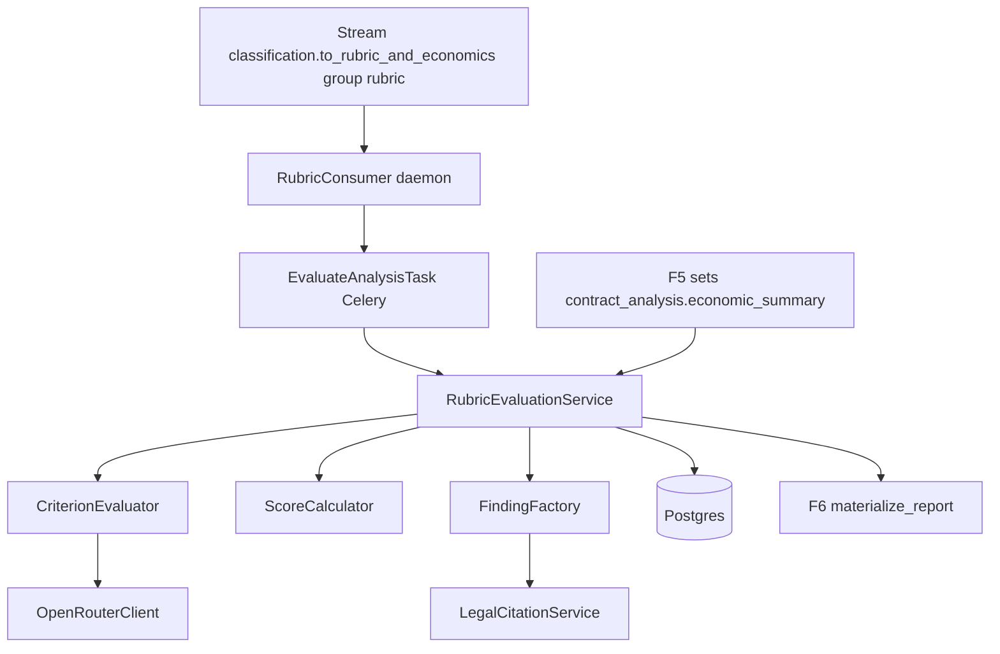
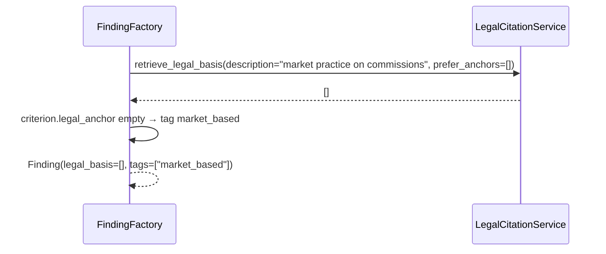
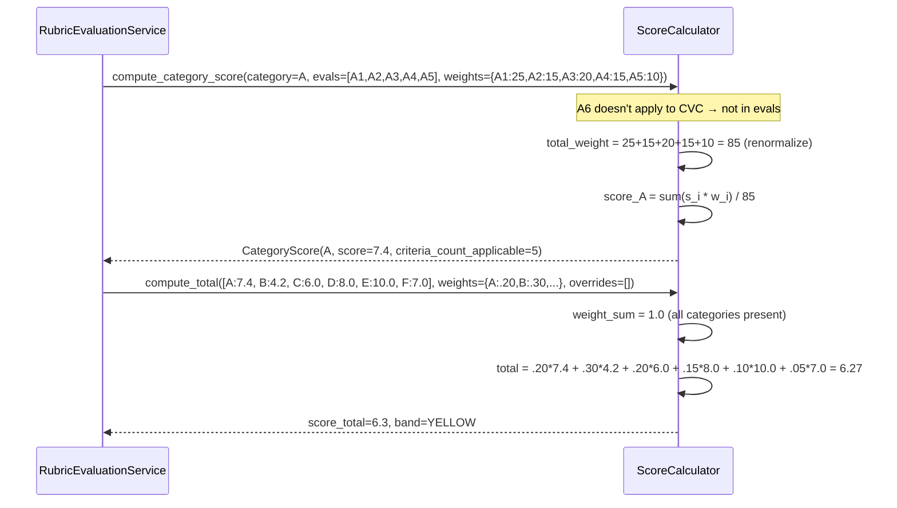
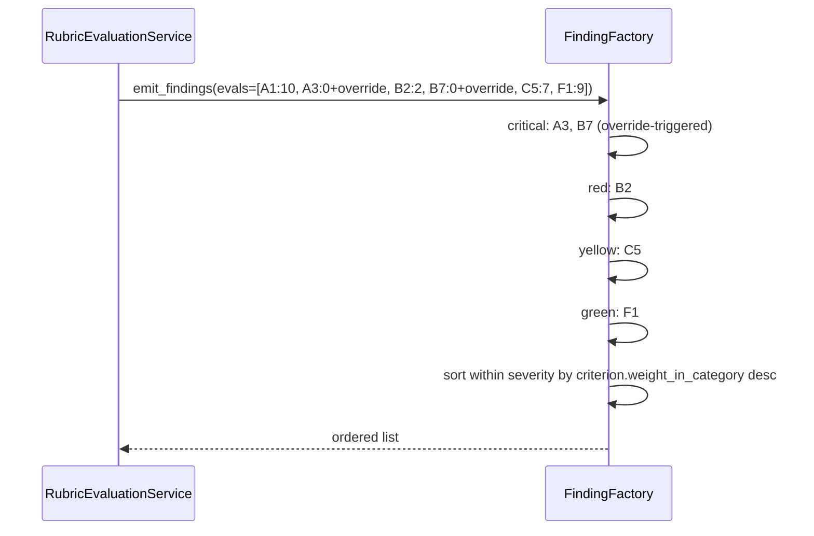
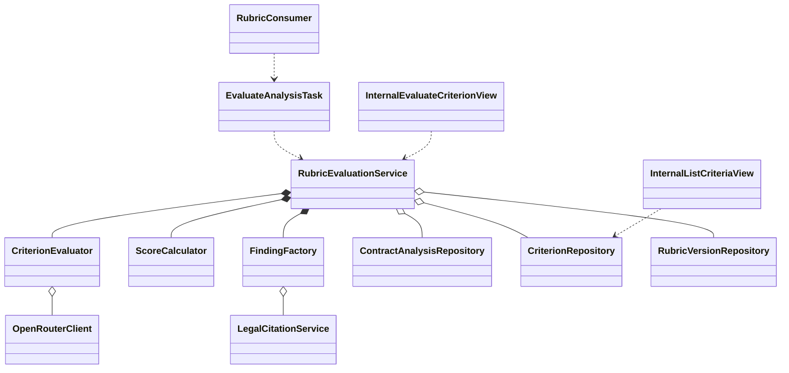

# Interaction Diagrams — F4: Rubric Engine

> Generated: 2026-05-15
> Companion to `SOLUTION_DIAGRAMS.md`

---

## Component Overview



---

## Flow: US-01 Full evaluation (happy path)

```mermaid
sequenceDiagram
    participant Q as Stream
    participant C as Consumer
    participant T as EvaluateAnalysisTask
    participant Svc as RubricEvaluationService
    participant AR as ContractAnalysisRepository
    participant CR as CriterionRepository
    participant E as CriterionEvaluator
    participant L as OpenRouterClient
    participant SC as ScoreCalculator
    participant FF as FindingFactory
    participant F3 as LegalCitationService
    participant F6 as F6 chain dispatcher

    Q-->>C: XREADGROUP envelope
    C->>T: rubric.evaluate_analysis.delay(analysis_id)
    T->>Svc: evaluate(analysis_id)
    Svc->>AR: load_full(analysis_id) returns ContractAnalysis, ClassificationDone, EconomicSummary, ElementsDetected
    Svc->>Svc: wait until ContractAnalysis.economic_summary IS NOT NULL (polling with backoff up to 60s; F5 sets it)
    Svc->>CR: list_for_version(rubric_version, applicable_to=contract_type)
    CR-->>Svc: 32 Criterion rows
    par parallel up to 8
        loop 32 criteria
            Svc->>E: evaluate(criterion, ctx)
            E->>L: chat_completion_json(prompt §8.1+§8.2, key=analysis:f4:crit:{id})
            L-->>E: { score, unverifiable, override_triggered, justification, evidence_snippet, recommendation }
            E-->>Svc: CriterionEvaluation
        end
    end
    Svc->>SC: compute_category_score per category
    SC-->>Svc: list[CategoryScore]
    Svc->>SC: compute_total(category_scores, overrides)
    SC-->>Svc: score_total, band
    Svc->>FF: emit_findings(evals, criteria)
    loop per finding
        FF->>F3: retrieve_legal_basis(description, corpus_version, prefer_anchors)
        F3-->>FF: list[LegalReference]
        FF->>FF: build Finding with severity from score+override
    end
    FF-->>Svc: list[Finding]
    Svc->>L: chat_completion_json(executive summary prompt §8.3, key=analysis:f4:summary)
    L-->>Svc: text
    Svc->>AR: persist_evaluation(analysis_id, result)
    AR-->>Svc: ok
    Svc->>F6: chain(reports_tasks.materialize_report.s(analysis_id), delivery_tasks.deliver_to_user.s()).apply_async()
```

---

## Flow: US-02 Override detected mid-evaluation

```mermaid
sequenceDiagram
    participant Svc as RubricEvaluationService
    participant E as CriterionEvaluator
    participant L as OpenRouterClient
    participant SC as ScoreCalculator

    Note over Svc,L: Evaluations run in parallel; cap 8.
    Svc->>E: evaluate(B7 — late interest)
    E->>L: chat_completion_json(...)
    L-->>E: { score: 0, override_triggered: "art_12_lpc", justification: "...", evidence_snippet: "..." }
    E-->>Svc: CriterionEvaluation(override_triggered="art_12_lpc")
    Note over Svc: Other parallel evaluations continue normally
    Svc->>SC: compute_total(scores, overrides=["art_12_lpc"])
    SC-->>Svc: score_total = 0.0, band = RED
    Note over Svc: Per-category honest averages are still persisted; only score_total is overridden
```

---

## Flow: US-03 Unverifiable criterion (no LLM call when F5 says so)

```mermaid
sequenceDiagram
    participant Svc as RubricEvaluationService
    participant E as CriterionEvaluator
    participant L as OpenRouterClient

    Svc->>Svc: F5 warning "annual_rate_not_expressed" present
    Note over Svc: per BR-15, F4 marks B2 unverifiable WITHOUT calling LLM
    Svc-->>Svc: CriterionEvaluation(B2, unverifiable=true, score=4.0, justification="annual rate not expressed; F5 confirmed")
    Note over Svc,L: For other criteria F5 didn't flag, normal LLM evaluation proceeds.
```

---

## Flow: US-04 Finding emission with empty F3 result



```mermaid
sequenceDiagram
    participant FF as FindingFactory
    participant F3 as LegalCitationService

    FF->>F3: retrieve_legal_basis(description="warranty waiver", prefer_anchors=["art-1644-cc"])
    F3-->>FF: []  (corpus gap; rare)
    FF->>FF: criterion.legal_anchor set → tag unverifiable_legal
    FF-->>FF: Finding(legal_basis=[], tags=["unverifiable_legal"])
```

---

## Flow: US-05 Score computation



---

## Flow: US-06 Findings ordering



---

## Class Diagram (high-level)



---

## Notes

- The barrier waiting for F5 is implemented as a polling loop inside `RubricEvaluationService.evaluate` with backoff: 1 s, 2 s, 4 s, 8 s, up to 60 s. If F5 hasn't written `economic_summary` after 60 s, F4 evaluates economic criteria as unverifiable (BR-15 also covers this case implicitly).
- `CriterionEvaluator.evaluate` is async; the service uses `asyncio.gather` bounded by a `asyncio.Semaphore(LLM_RUBRIC_CONCURRENCY)`.
- The LLM prompt for each criterion includes a system message ("you are an expert; output JSON exactly") plus a user message built from `Criterion.evaluation_prompt` (interpolated with contract text, F2 hints, F5 economic values).
- `FindingFactory` strictly enforces: 1 finding per (non-perfect) criterion; if F3 returns ≥ 1 references, attach up to 3; otherwise tag.

**End of document.**
