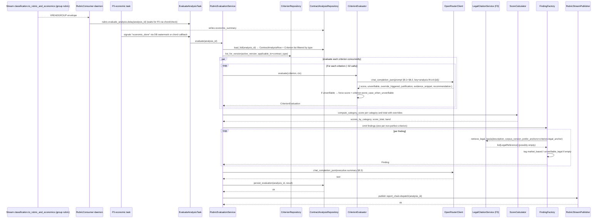
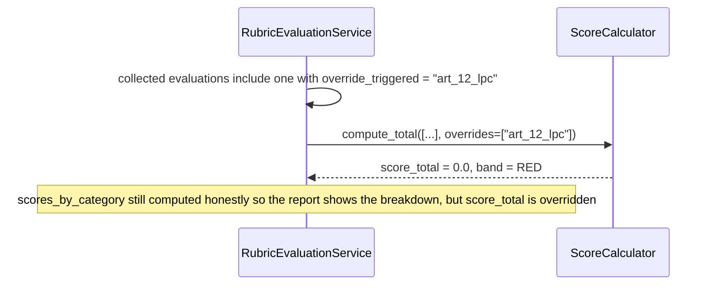
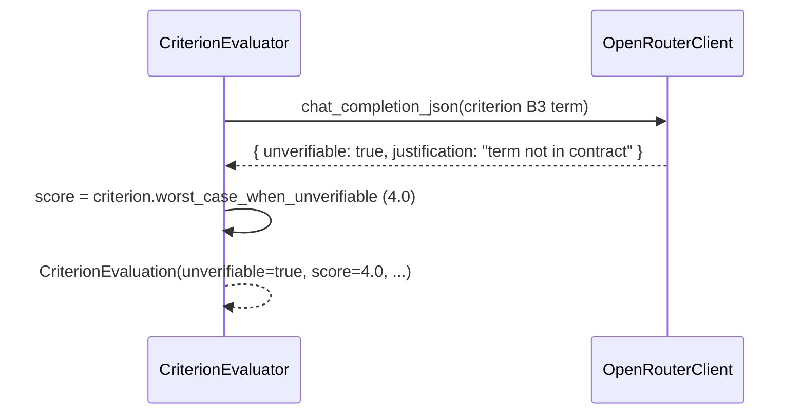
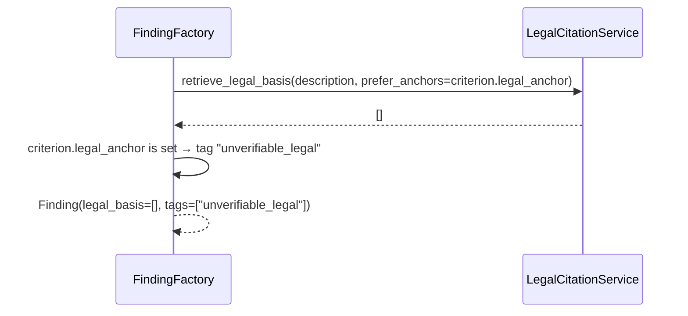
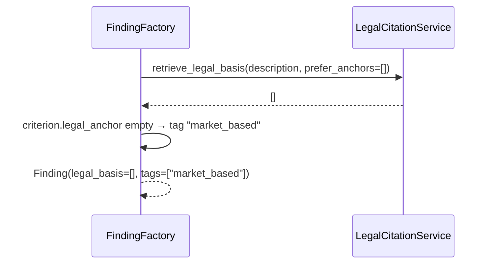
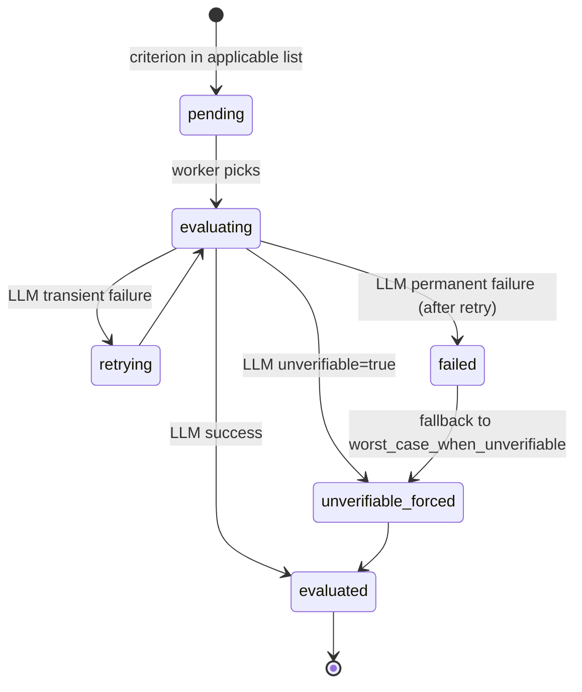
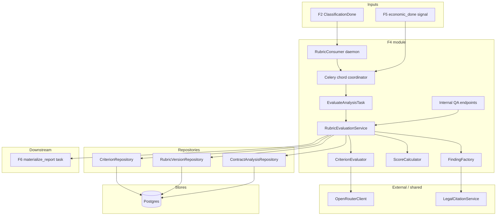
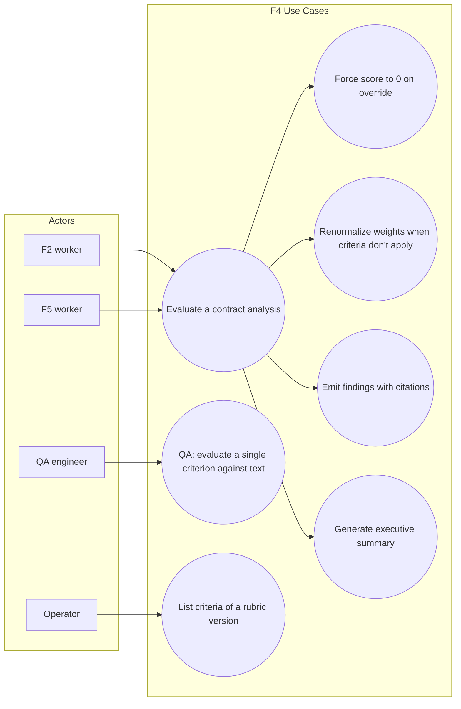

# Solution Diagrams — F4: Rubric Engine

> Generated: 2026-05-15

---

## 1. Class Diagram

### 1.1 Domain + Application

```mermaid
classDiagram
    class Band {
        <<TextChoices>>
        GREEN
        YELLOW
        RED
        NOT_ANALYZABLE
    }
    class Severity {
        <<TextChoices>>
        CRITICAL
        RED
        YELLOW
        GREEN
        UNVERIFIABLE
    }
    class OverrideCode {
        <<TextChoices>>
        ART_1605_CC
        ART_1613_CC
        ART_1644_CC
        ART_1425_CC
        ART_3_IVU_FAMILY_HOMESTEAD
        ART_5_LPC_NON_WAIVABLE
        ART_12_LPC
        ART_13_LPC
        ART_18_LPC_BLANK_SIGNATURE
        ART_17H_LPC_ARBITRATION
        ART_58_FSV
    }
    class RubricVersion {
        <<Pydantic>>
        +str version
        +datetime released_at
        +int criteria_count
        +dict categories
        +bool is_active
    }
    class Criterion {
        <<Pydantic>>
        +str id
        +str rubric_version
        +str category
        +str title
        +str description
        +float weight_in_category
        +list~str~ applicable_types
        +list~str~ legal_anchor
        +str|None override_code
        +str evaluation_prompt
        +dict scoring_scale
        +float worst_case_when_unverifiable
    }
    class CriterionEvaluation {
        <<Pydantic>>
        +str criterion_id
        +str category
        +bool applicable
        +bool evaluated
        +bool unverifiable
        +float score
        +float weight_in_category
        +str|None override_triggered
        +str justification
        +str|None evidence_snippet
    }
    class CategoryScore {
        <<Pydantic>>
        +str category
        +str category_name
        +float weight_global
        +float weight_effective
        +float score
        +int criteria_count_total
        +int criteria_count_applicable
        +int criteria_count_unverifiable
    }
    class Finding {
        <<Pydantic>>
        +str id
        +Severity severity
        +str title
        +str description
        +str|None evidence_clause_snippet
        +list~LegalReference~ legal_basis
        +str recommendation
        +str related_criterion_id
        +str|None anchors_to_override
        +list~str~ tags
    }
    class EvaluateContractAnalysis {
        <<Command>>
        +UUID analysis_id
    }
    class AbsorbEconomicSummary {
        <<Command>>
        +UUID analysis_id
    }
    class GetCriteriaForRubricVersion {
        <<Query>>
        +str rubric_version
        +list~str~|None applicable_to_types
    }
    class rubric_handlers {
        <<handlers>>
        +evaluate_analysis(cmd) FullAnalysisResult
        +absorb_economic(cmd) None
        +list_criteria(query, repo) list~Criterion~
    }
    class RubricEvaluationService {
        -ContractAnalysisRepository analysis_repo
        -CriterionRepository criterion_repo
        -RubricVersionRepository rubric_version_repo
        -OpenRouterClient llm
        -LegalCitationService cite_service
        -CriterionEvaluator evaluator
        -ScoreCalculator score_calc
        -RubricStreamPublisher publisher
        +evaluate(analysis_id) None
        -load_inputs(analysis_id) EvaluationInputs
        -evaluate_criteria(inputs) list~CriterionEvaluation~
        -compute_scores(evals) tuple~list~CategoryScore~, float, Band~
        -emit_findings(evals, criteria) list~Finding~
        -generate_executive_summary(...) str
        -persist(analysis_id, result) None
    }
    class CriterionEvaluator {
        -OpenRouterClient llm
        +evaluate(criterion, ctx) CriterionEvaluation
        -build_prompt(criterion, ctx) ChatMessages
        -parse_response(raw) RawEvaluation
    }
    class ScoreCalculator {
        +compute_category_score(evals, criteria) CategoryScore
        +compute_total(category_scores, weights, overrides) tuple~float, Band~
        +assign_band(score, overrides_active) Band
    }
    class FindingFactory {
        -LegalCitationService cite_service
        +from_evaluation(eval, criterion, ctx) Finding
        -classify_severity(score, override) Severity
        -fetch_legal_basis(finding_description, criterion) list~LegalReference~
        -tag_when_empty(criterion, has_anchor) str
    }
    Criterion ..> OverrideCode
    CriterionEvaluation ..> OverrideCode
    Finding ..> Severity
    Finding ..> OverrideCode
    rubric_handlers ..> EvaluateContractAnalysis
    rubric_handlers ..> AbsorbEconomicSummary
    RubricEvaluationService *-- CriterionEvaluator
    RubricEvaluationService *-- ScoreCalculator
    RubricEvaluationService *-- FindingFactory
    RubricEvaluationService ..> rubric_handlers
```



### 1.2 Infrastructure

```mermaid
classDiagram
    class RubricVersionModel {
        <<Django Model>>
    }
    class CriterionModel {
        <<Django Model>>
        +TextField id
        +TextField rubric_version
        +CharField category
        +TextField title
        +TextField description
        +DecimalField weight_in_category
        +ArrayField applicable_types
        +ArrayField legal_anchor
        +CharField override_code
        +TextField evaluation_prompt
        +JSONField scoring_scale
        +DecimalField worst_case_when_unverifiable
    }
    class CriterionRepository {
        <<DjangoFullRepository>>
        +list_for_version(version, applicable_to_types) list~Criterion~
        +get_active_rubric_version() RubricVersion
    }
    class RubricVersionRepository {
        <<DjangoFullRepository>>
    }
    class ContractAnalysisRepository {
        <<DjangoFullRepository>>
        +load_full(analysis_id) FullContractAnalysisData
        +persist_evaluation(analysis_id, result) None
    }
    class OpenRouterClient {
        <<reused>>
        +chat_completion_json(model, prompt, idempotency_key) dict
    }
    class LegalCitationService {
        <<from F3>>
        +retrieve_legal_basis(text, corpus_version, top_k, threshold, prefer_anchors) list~LegalReference~
    }
    class EvaluateAnalysisTask {
        <<Celery shared_task>>
        +run(analysis_id) None
    }
    class AbsorbEconomicTask {
        <<Celery shared_task>>
        +run(analysis_id) None
    }
    class ClassificationConsumer {
        <<from F2>>
        +dispatch(envelope) None
    }
    class InternalEvaluateCriterionView {
        <<DRF APIView>>
        +post(request) Response
    }
    class InternalListCriteriaView {
        <<DRF APIView>>
        +get(request, version) Response
    }
    CriterionRepository ..> CriterionModel
    EvaluateAnalysisTask ..> RubricEvaluationService
    InternalEvaluateCriterionView ..> RubricEvaluationService
```



---

## 2. Sequence Diagrams

### 2.1 Full evaluation (chord with F5)



### 2.2 Override path



### 2.3 Unverifiable criterion



### 2.4 Finding without legal basis (cite-or-stay-silent)





---

## 3. State Diagram — Per-criterion evaluation



---

## 4. Activity Diagram

```mermaid
flowchart TD
    A[Receive analysis_id from F2 envelope + F5 done] --> B[Load analysis + criteria + economic_summary + elements_detected]
    B --> C[Filter criteria by contract_type]
    C --> D[Run per-criterion evaluations in parallel cap 8]
    D --> E{Any override triggered?}
    E -->|yes| F[Set score_total=0, band=RED]
    E -->|no| G[Compute per-category weighted average with renormalization]
    G --> H[Compute total weighted average with category renormalization]
    H --> I{score >= 8?}
    I -->|yes| J[Band=GREEN]
    I -->|no| K{score >= 5?}
    K -->|yes| L[Band=YELLOW]
    K -->|no| M[Band=RED]
    F --> N[Emit findings]
    J --> N
    L --> N
    M --> N
    N --> O{For each finding, call F3}
    O -->|results above threshold| P[Attach LegalReferences]
    O -->|empty| Q{criterion.legal_anchor empty?}
    Q -->|yes| R[Tag market_based]
    Q -->|no| S[Tag unverifiable_legal]
    P --> T[Generate executive summary via LLM]
    R --> T
    S --> T
    T --> U[Persist contract_analysis update atomically]
    U --> V[Dispatch F6 task]
    V --> [*]
```

---

## 5. Component Diagram



---

## 6. Use Case Diagram



---

## Notes

- The "chord with F5" can be implemented two ways: (a) a Celery `chord([f4_eval, f5_eval], report_callback)` from the F2 dispatch step, (b) a database watermark: F4's task polls `contract_analysis.economic_summary IS NOT NULL` before starting; F5 sets it. Option (b) is simpler and is what the implementation plan picks.
- `CriterionEvaluator` runs LLM calls with concurrency bounded by `LLM_RUBRIC_CONCURRENCY`; uses `asyncio.Semaphore(8)`.
- `FindingFactory.from_evaluation` may produce zero findings only when `eval.score == 10`. Otherwise exactly one finding per evaluation.
- The `executive_summary` step is the only place F4 invokes the LLM after all criteria are evaluated; the prompt receives only aggregates (band, score, counts), not the contract text — keeps the call cheap and predictable.

**End of document.**
