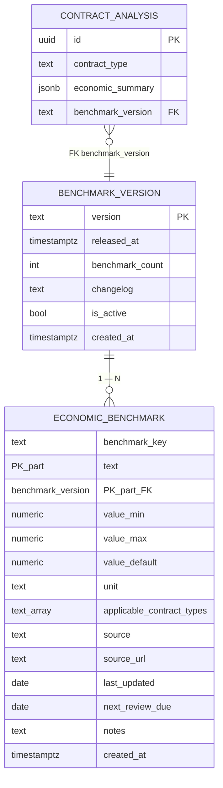

# Entity Relationship Diagram — F5: Economic Analysis & Benchmarks

> Generated: 2026-05-15

---

## Overview

F5 introduces two persistent catalog tables (`benchmark_version`, `economic_benchmark`) plus the embedded `EconomicSummary` and `BenchmarkComparison` structures inside `contract_analysis.economic_summary` JSONB. The catalog is loaded from the versioned `economic_benchmarks.yaml`. The relationship is the same versioned-immutable pattern: published benchmark versions never mutate.

---

## Mermaid Diagram



---

## Entity Definitions

### BenchmarkVersion

| Field | Type | Constraints | Description |
|---|---|---|---|
| `version` | TEXT | PK | Quarter or date tag, e.g. `2026-Q2` |
| `released_at` | TIMESTAMPTZ | default `NOW()` | — |
| `benchmark_count` | INT | — | Number of benchmark rows |
| `changelog` | TEXT | nullable | — |
| `is_active` | BOOL | partial UNIQUE WHERE TRUE | Only one active |
| `created_at` | TIMESTAMPTZ | default `NOW()` | — |

### EconomicBenchmark

| Field | Type | Constraints | Description |
|---|---|---|---|
| `benchmark_key` | TEXT | PK part | E.g. `bank_mortgage_rate_mid` |
| `benchmark_version` | TEXT | PK part, FK | — |
| `value_min` | NUMERIC(10,4) | nullable | When the benchmark is a range |
| `value_max` | NUMERIC(10,4) | nullable | — |
| `value_default` | NUMERIC(10,4) | nullable | When the benchmark is a single value |
| `unit` | TEXT | CHECK `pct|usd|months|multiplier|ratio` | — |
| `applicable_contract_types` | TEXT[] | GIN | Which contract types the benchmark applies to |
| `source` | TEXT | — | Cited source |
| `source_url` | TEXT | nullable | — |
| `last_updated` | DATE | — | — |
| `next_review_due` | DATE | — | Operational alert when overdue |
| `notes` | TEXT | nullable | — |
| `created_at` | TIMESTAMPTZ | default `NOW()` | — |

### Embedded in `contract_analysis.economic_summary` (JSONB)

```python
class EconomicSummary(BaseModel):
    contract_type: ContractType
    currency: str = "USD"
    currency_conversion_note: str | None = None
    fields_extracted: ExtractedFields
    fields_derived: DerivedFields
    benchmark_comparisons: list[BenchmarkComparison] = []
    overcost: Overcost | None = None
    warnings: list[EconomicWarning] = []
    benchmark_version: str
    derivation_status: Literal["ok","partial","insufficient_data"] = "ok"
    anonymized: bool = False  # set true after F8 bucketization

class ExtractedFields(BaseModel):
    price_cash: float | None
    down_payment: float | None
    down_payment_pct: float | None
    financed_amount: float | None
    term_months: int | None
    annual_rate_pct: float | None
    monthly_rate_pct: float | None
    monthly_payment: float | None
    payment_periodicity: str | None
    interest_calculation_base: str | None

class DerivedFields(BaseModel):
    total_cost_paid: float | None
    total_cost_vs_cash_multiplier: float | None
    monthly_payment_theoretical: float | None
    monthly_payment_coherent: bool | None

class BenchmarkComparison(BaseModel):
    metric: str  # 'annual_rate', 'down_payment_pct', 'term_months', 'cost_multiplier', 'monthly_payment'
    metric_label: str
    contract_value: float
    benchmark_value: float
    benchmark_key: str
    benchmark_source: str
    delta_pct_points: float | None = None
    delta_absolute: float | None = None
    assessment: Literal["within_market","slightly_above_market","above_market","well_above_market","below_market_favorable"]

class Overcost(BaseModel):
    vs_benchmark_usd: float
    explanation: str
    what_changes_would_save: list[str]

class EconomicWarning(BaseModel):
    code: Literal["monthly_payment_higher_than_theoretical","down_payment_inconsistent","interest_calculation_base_unfavorable","total_cost_not_disclosed","annual_rate_not_expressed","term_excessive"]
    severity_suggested: Literal["yellow","red"]
    description: str
    related_field: str | None = None
```

After 90-day anonymization (F8 owned):

```python
class AnonymizedEconomicSummary(BaseModel):
    contract_type: ContractType
    currency: str
    price_cash_bucket: str | None       # e.g. "60k-100k"
    down_payment_pct_bucket: str | None # e.g. "10-15"
    annual_rate_pct_bucket: str | None  # e.g. "15-20"
    term_months_bucket: str | None      # e.g. "180-240"
    overcost_label: Literal["none","small","medium","large"] | None
    benchmark_comparisons: list[AnonymizedComparison]
    anonymized: bool = True
    benchmark_version: str

class AnonymizedComparison(BaseModel):
    metric: str
    assessment: str  # preserved
    # contract_value and benchmark_value erased
```

---

## Migration Notes

- Catalog tables declared by `platform` (per Global Assumptions). F5 owns the YAML loader.
- Seed migration `economics/infrastructure/django/migrations/0001_seed_benchmarks_v_2026_Q2.py` loads the YAML into the tables.

---

**End of document.**
