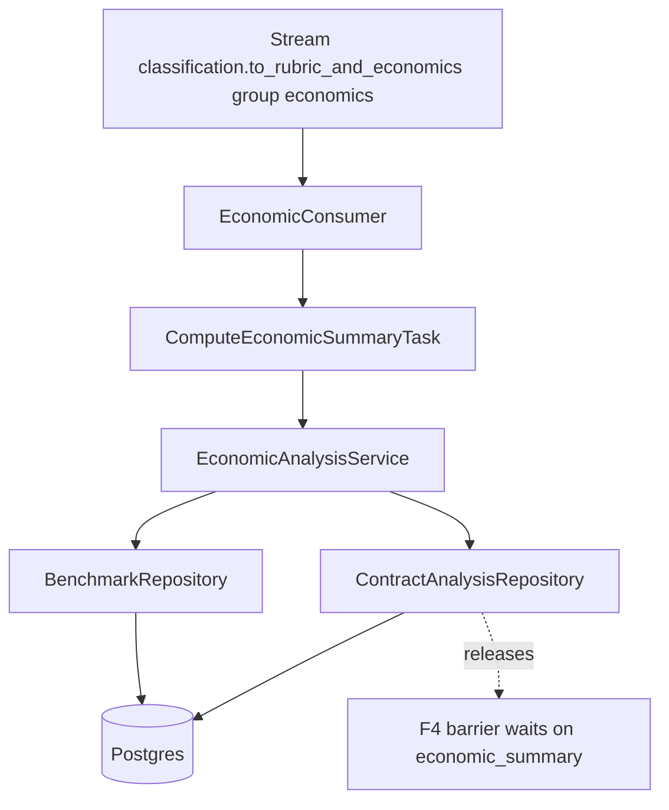
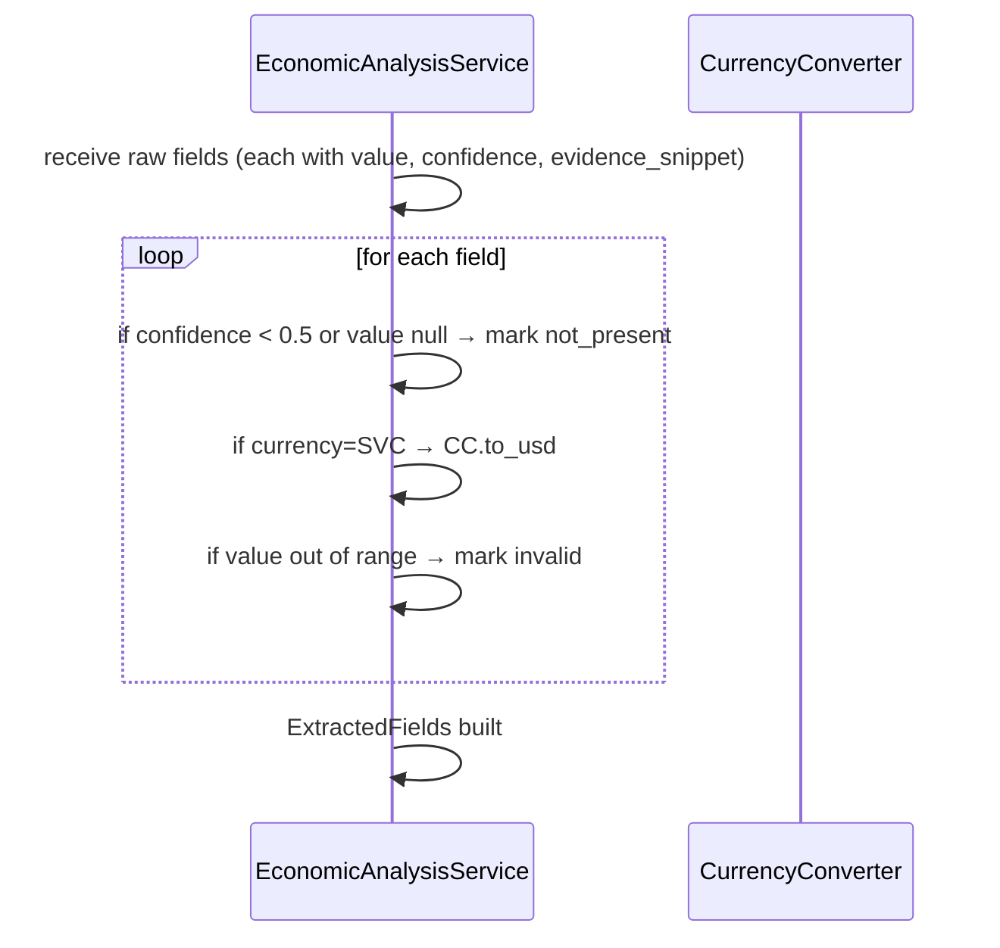
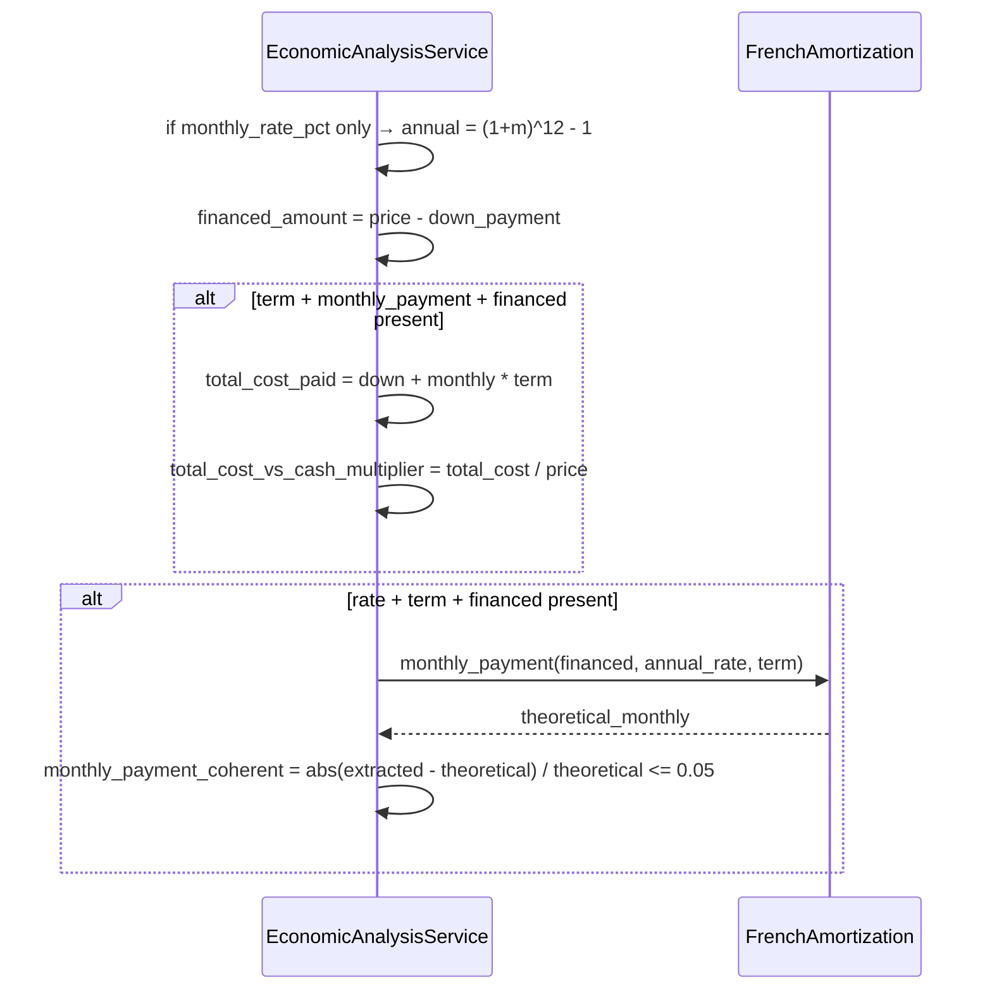
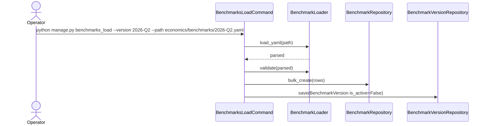
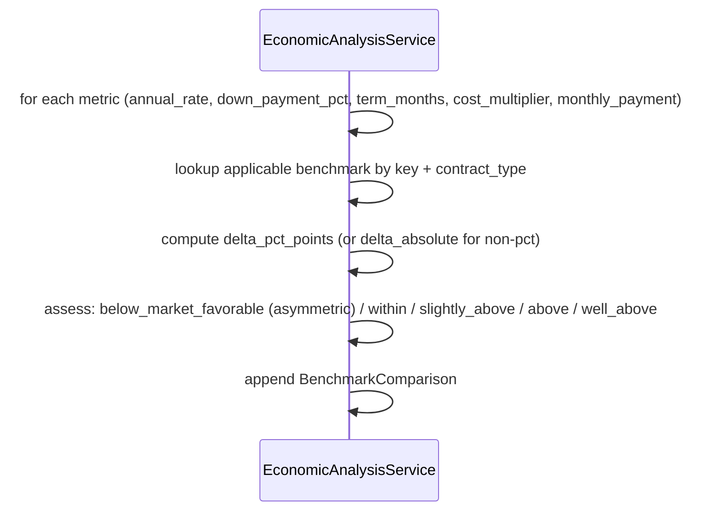
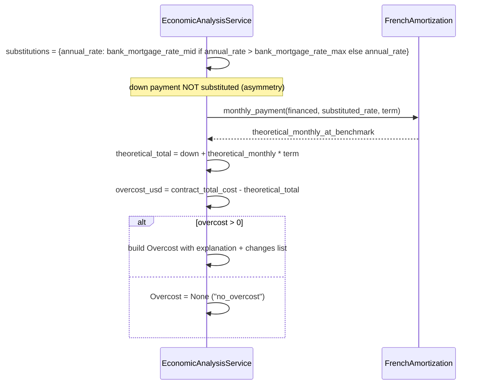
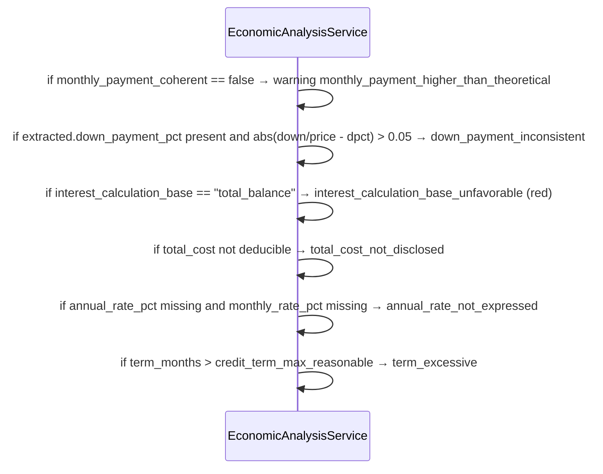
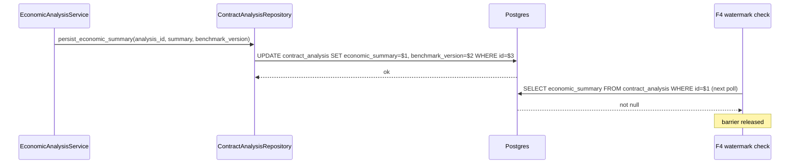
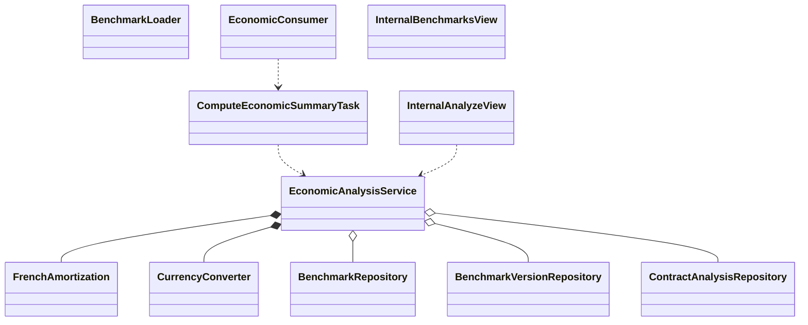

# Interaction Diagrams — F5: Economic Analysis & Benchmarks

> Generated: 2026-05-15

---

## Component Overview



---

## Flow: US-01 Validate and normalize



---

## Flow: US-02 Derive fields



---

## Flow: US-03 Load benchmarks



---

## Flow: US-04 Build benchmark comparisons



Rate assessment rule (illustrative):

```text
delta = (contract_rate - benchmark_mid) * 100  # pct points
if delta < 0  → below_market_favorable
if 0 <= delta < 1 → within_market
if 1 <= delta < 2 → slightly_above_market
if 2 <= delta < 5 → above_market
if delta >= 5 → well_above_market
```

---

## Flow: US-05 Compute overcost



---

## Flow: US-06 Emit warnings



---

## Flow: US-07 Persist EconomicSummary



---

## Class Diagram



**End of document.**
