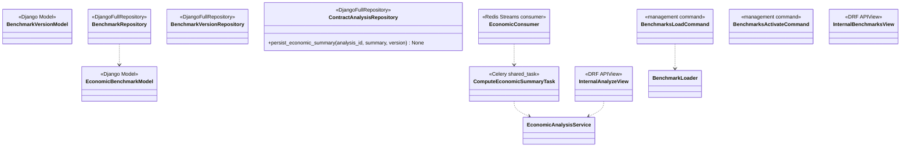
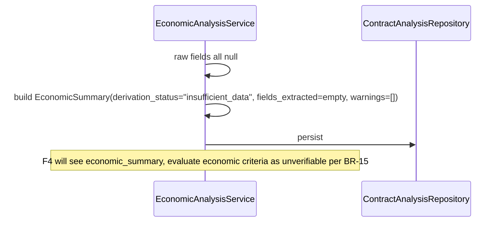
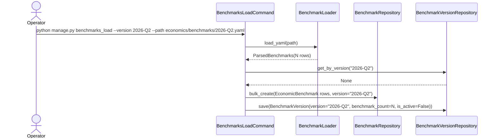
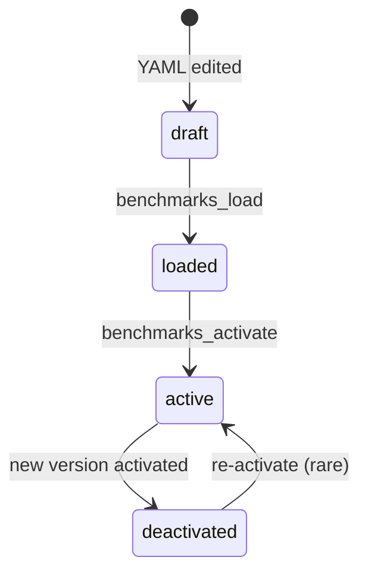
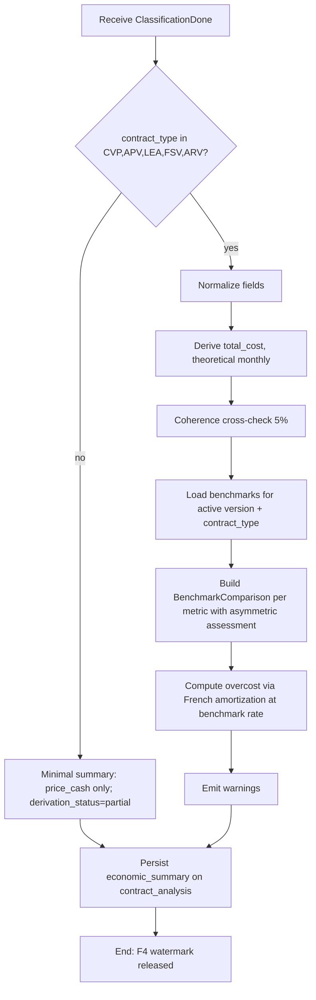
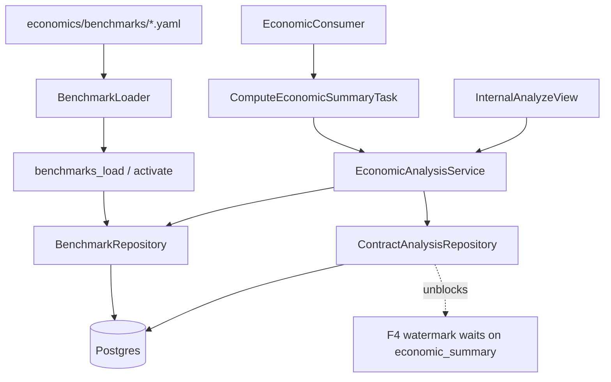
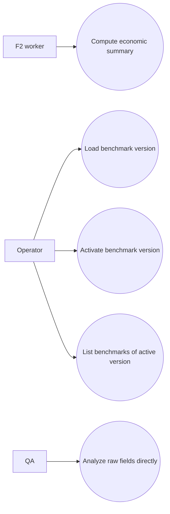

# Solution Diagrams — F5: Economic Analysis & Benchmarks

> Generated: 2026-05-15

---

## 1. Class Diagram

### 1.1 Domain + Application

```mermaid
classDiagram
    class EconomicSummary { <<Pydantic>> }
    class ExtractedFields { <<Pydantic>> }
    class DerivedFields { <<Pydantic>> }
    class BenchmarkComparison { <<Pydantic>> }
    class Overcost { <<Pydantic>> }
    class EconomicWarning { <<Pydantic>> }
    class BenchmarkVersion { <<Pydantic>> }
    class EconomicBenchmark { <<Pydantic>> }
    class ComputeEconomicSummary {
        <<Command>>
        +UUID analysis_id
        +EconomicFieldsRaw raw_fields
        +ContractType contract_type
    }
    class LoadBenchmarks {
        <<Command>>
        +str version
    }
    class ActivateBenchmarks {
        <<Command>>
        +str version
    }
    class GetActiveBenchmarkVersion {
        <<Query>>
    }
    class GetBenchmarksFor {
        <<Query>>
        +str benchmark_version
        +ContractType contract_type
    }
    class economic_handlers {
        <<handlers>>
        +compute_summary(cmd) EconomicSummary
        +load_benchmarks(cmd) None
        +activate_benchmarks(cmd) None
    }
    class EconomicAnalysisService {
        -BenchmarkRepository repo
        -BenchmarkVersionRepository ver_repo
        -ContractAnalysisRepository analysis_repo
        +compute(analysis_id, raw, contract_type) EconomicSummary
        -normalize(raw) ExtractedFields
        -derive(extracted) DerivedFields
        -compare(extracted, derived, benchmarks, contract_type) list~BenchmarkComparison~
        -compute_overcost(...) Overcost|None
        -emit_warnings(extracted, derived, comparisons) list~EconomicWarning~
    }
    class BenchmarkLoader {
        +load_yaml(path) ParsedBenchmarks
        +validate(parsed) None
    }
    class FrenchAmortization {
        +monthly_payment(financed, annual_rate, term_months) float
        +total_cost(financed, monthly, term) float
    }
    class CurrencyConverter {
        +to_usd(value, currency) float
    }
    EconomicAnalysisService *-- FrenchAmortization
    EconomicAnalysisService *-- CurrencyConverter
    economic_handlers ..> ComputeEconomicSummary
    economic_handlers ..> LoadBenchmarks
    economic_handlers ..> ActivateBenchmarks
```



### 1.2 Infrastructure



---

## 2. Sequence Diagrams

### 2.1 Compute summary (happy path)

```mermaid
sequenceDiagram
    participant Q as Stream classification.to_rubric_and_economics (group economics)
    participant C as EconomicConsumer
    participant T as ComputeEconomicSummaryTask
    participant S as EconomicAnalysisService
    participant BR as BenchmarkRepository
    participant AR as ContractAnalysisRepository

    Q-->>C: XREADGROUP envelope (ClassificationDone)
    C->>T: economics.compute_summary.delay(analysis_id, raw_fields_json, contract_type)
    T->>S: compute(analysis_id, raw, contract_type)
    S->>S: normalize raw fields (currency, %, term, rates)
    S->>S: derive financed_amount, total_cost, monthly_payment_theoretical
    S->>S: coherence cross-check (5%)
    S->>BR: get_for(version=active, contract_type)
    BR-->>S: list[EconomicBenchmark]
    S->>S: build BenchmarkComparison per metric (asymmetric assessments)
    S->>S: compute overcost (FrenchAmortization at benchmark rate)
    S->>S: emit warnings
    S->>AR: persist_economic_summary(analysis_id, summary, benchmark_version)
    AR-->>S: ok
    Note over S,AR: F4 watermark check now sees economic_summary; barrier releases
```

### 2.2 Insufficient data path



### 2.3 Benchmark load



---

## 3. State Diagram — BenchmarkVersion



---

## 4. Activity Diagram



---

## 5. Component Diagram



---

## 6. Use Case Diagram



**End of document.**
