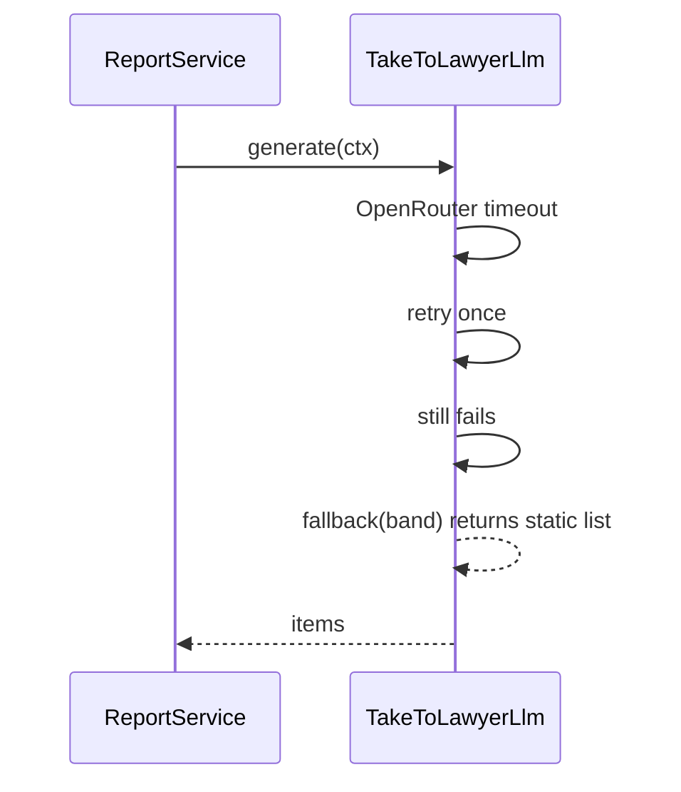

# Complete Flows — F6: Report Generation

> Generated: 2026-05-15

---

## Flow Index

| # | Flow |
|---|---|
| 1 | User views report via public link |
| 2 | F7 renders PDF for email |
| 3 | User clicks "see verbatim" |
| 4 | Anonymized report |
| 5 | LLM failure → fallback |
| 6 | Internal preview (QA) |

---

## Flow 1: User views report via public link

### Pre-conditions
- `ContractAnalysis` complete (`delivery_status != 'pending'`)
- The user has the `public_short_id`
- Link not expired

### Trigger
User visits `https://casasegura.sv/r/CS-2026-A1B2C3` (handled by F7).

### Happy Path
1. F7 looks up by `public_short_id`, verifies `link_expires_at > NOW()`, calls `ReportService.generate_html(analysis_id)`.
2. F6 loads `ContractAnalysis` joined with `Project`, `RubricVersion`.
3. F6 detects `anonymized_at IS NULL` → full path.
4. F6 calls `TakeToLawyerLlm.generate(ctx)` (LLM).
5. F6 renders `v1/full.html.j2` with the context.
6. F6 writes `ReportGenerationLog(success, ms, bytes)`.
7. F7 returns `Response(html, headers={X-Robots-Tag: 'noindex, nofollow', Cache-Control: 'no-store'})`.

### Errors
- 404 if analysis doesn't exist (handled by F7)
- 410 if link expired (handled by F7)
- 500 if F6 rendering fails (F7 retries; rare)

---

## Flow 2: F7 renders PDF for email

### Trigger
F7's `email_delivery_task` calls `ReportService.generate_pdf(analysis_id)`.

### Happy Path
1. Same as Flow 1 steps 2-5.
2. F6 calls `ReportPdfRenderer.to_pdf(html_string)`.
3. WeasyPrint produces bytes (Letter, 1.5 cm margins, page numbering, subtle watermark).
4. F6 logs and returns the bytes to F7.

### Errors
- WeasyPrint fail → fall back to "HTML only" (F7's responsibility); F6 returns explicit error to F7.

---

## Flow 3: User clicks "see verbatim"

### Trigger
The HTML report has a `<button data-anchor="...">Ver texto completo</button>`. JS fires `fetch('/r/{short_id}/legal/{law_id}/{anchor}')`.

### Happy Path
1. F6 view receives the request, validates short_id matches the analysis, calls `ReportService.fetch_verbatim(law_id, anchor, analysis.corpus_version)`.
2. `fetch_verbatim` → `LegalCitationService.get_chunk_by_anchor(...)`.
3. Returns JSON `{ text_verbatim, text_paraphrased, anchor, law_title, article }`.
4. Frontend JS expands the box.

---

## Flow 4: Anonymized report

### Trigger
`analysis.anonymized_at IS NOT NULL`.

### Happy Path
1. F6 detects branch.
2. Loads minimal context: band, score, executive_summary, severity counts, bucketed economic_summary.
3. Renders `v1/anonymized.html.j2`.
4. The disclaimer "Este análisis fue anonimizado el {fecha}" is shown.

---

## Flow 5: LLM failure → fallback



---

## Flow 6: Internal preview (QA)

`POST /v1/internal/reports/preview` body:
```json
{
    "mock_analysis": {...},  // full ContractAnalysis-like JSON
    "template_version": "v1",
    "format": "html"
}
```

The service uses an in-memory mock repository instead of Postgres. Useful for designers iterating on templates.

---

**End of document.**
