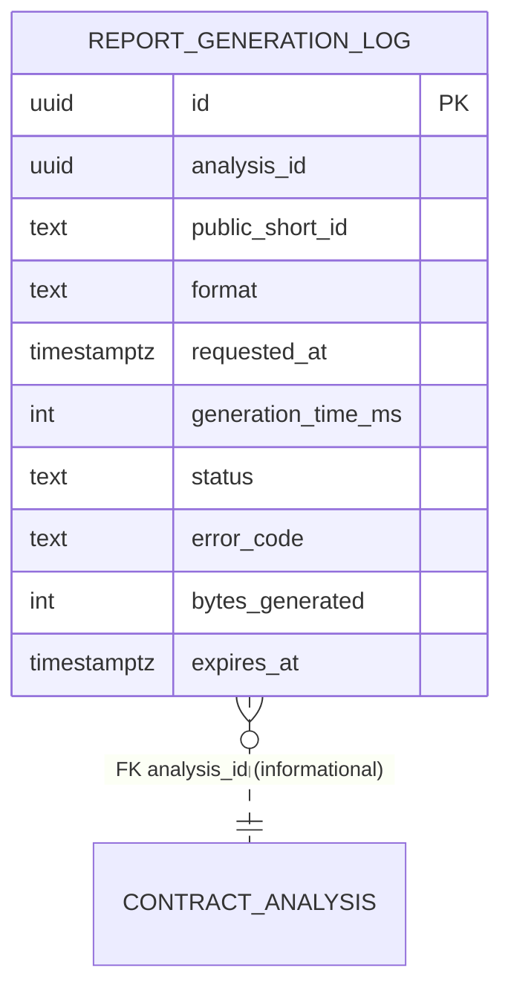

# Entity Relationship Diagram — F6: Report Generation

> Generated: 2026-05-15

---

## Overview

F6 introduces one optional observability table (`report_generation_log`, 30-day TTL). It does **not** create any business entity. It reads `ContractAnalysis`, `Project`, `RubricVersion`, `LegalChunk` (via F3) and renders templates.



## Entity Definitions

### ReportGenerationLog (optional)

| Field | Type | Constraints | Description |
|---|---|---|---|
| `id` | UUID | PK | — |
| `analysis_id` | UUID | INDEX | The analysis whose report was generated |
| `public_short_id` | TEXT | INDEX | For human correlation |
| `format` | TEXT | CHECK `html|pdf` | — |
| `requested_at` | TIMESTAMPTZ | default `NOW()` | — |
| `generation_time_ms` | INT | — | Latency |
| `status` | TEXT | CHECK `success|failed` | — |
| `error_code` | TEXT | nullable | — |
| `bytes_generated` | INT | — | Output size |
| `expires_at` | TIMESTAMPTZ | default `NOW() + 30 days`, INDEX | Cleanup by F8 |

### Domain entity

```python
class ReportGenerationLog(BaseModel):
    model_config = ConfigDict(from_attributes=True)
    id: UUID | None = None
    analysis_id: UUID
    public_short_id: str
    format: Literal["html","pdf"]
    requested_at: datetime
    generation_time_ms: int | None = None
    status: Literal["success","failed"]
    error_code: str | None = None
    bytes_generated: int | None = None
    expires_at: datetime
```

### In-memory ReportBuildContext (not persisted)

```python
class ReportBuildContext(BaseModel):
    analysis_id: UUID
    public_short_id: str
    project: Project  # from F8
    analysis: ContractAnalysisView  # full data
    rubric_version: RubricVersion
    corpus_version: str
    benchmark_version: str
    is_anonymized: bool
    art_1686_warning_mode: Literal["always","when_red","never"]
    template_version: str  # "v1"
    findings_visible_cap: int = 25
    actions_take_to_lawyer: list[str]  # LLM-generated
    rendered_at: datetime
```

## Migration Notes

- `report_generation_log` is owned by F6's migrations (or by `platform` per the global convention — either is acceptable; F6 owns its observability table for cohesion).
- TTL is enforced by F8's cleanup cron over `expires_at < NOW()`.

**End of document.**
