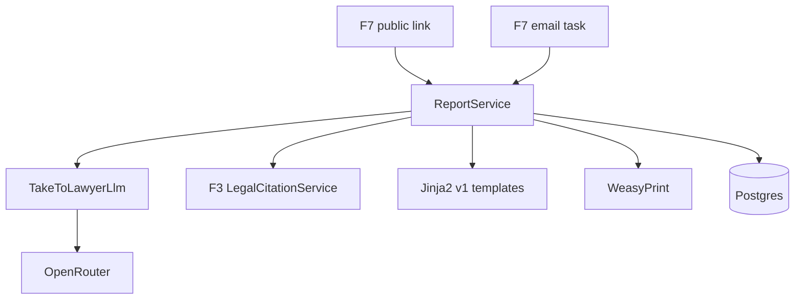
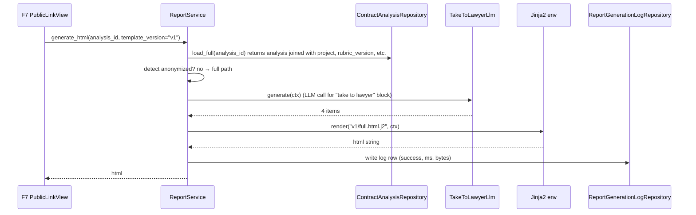
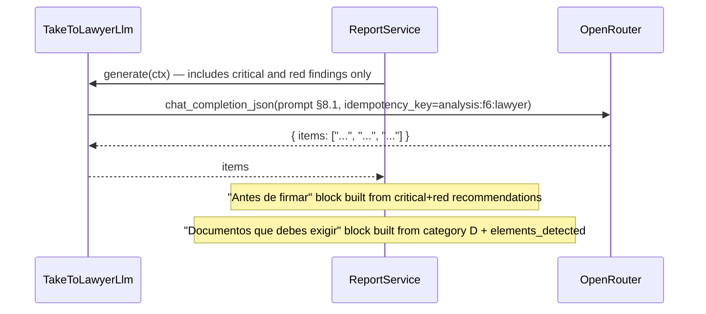
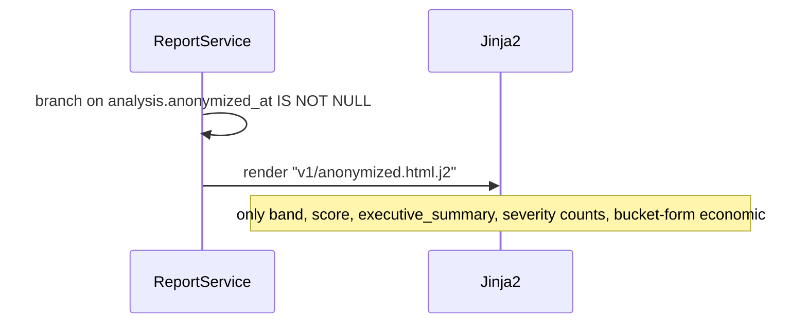
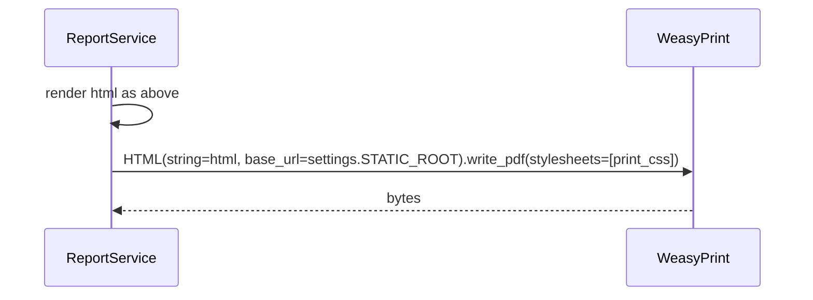
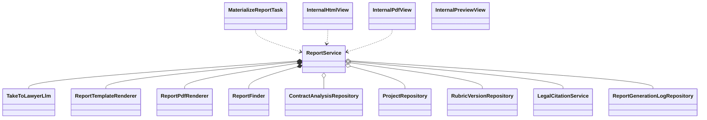

# Interaction Diagrams — F6: Report Generation

> Generated: 2026-05-15

---

## Component Overview



---

## Flow: US-01 Compose full HTML



---

## Flow: US-02 Header with disclaimer

(Pure templating; nothing remote.)

---

## Flow: US-03 Verdict section

(Includes large score, band-coloured div, executive summary text from `contract_analysis.executive_summary`. Override box rendered conditionally when `override_triggered` is non-empty.)

---

## Flow: US-04 Economic visualization

```mermaid
sequenceDiagram
    participant J as Jinja2
    participant Svc as ReportService

    Svc->>J: data ctx.analysis.economic_summary.benchmark_comparisons
    J->>J: for each comparison render inline SVG horizontal bar
    Note over J: contract bar width = contract_value/scale_max; benchmark bar width = benchmark_value/scale_max
    J->>J: render overcost block if economic_summary.overcost is not null
    J->>J: render Art. 1686 CC warning if mode applies
```

---

## Flow: US-05 Categories breakdown

```mermaid
sequenceDiagram
    participant J as Jinja2
    participant Svc as ReportService

    Svc->>J: for category in ctx.analysis.scores_by_category, sorted by global weight desc
    J->>J: render collapsed block; expand reveals criterion_evaluations filtered by category
```

---

## Flow: US-06 Findings list

```mermaid
sequenceDiagram
    participant J as Jinja2
    participant Svc as ReportService
    participant F3 as LegalCitationService

    Note over Svc: F4 already stored legal_basis inside each finding; F6 does not call F3 here
    Svc->>J: pass findings sorted by severity, weight desc
    J->>J: if any critical, render disclaimer again before list
    J->>J: render each finding with severity icon, evidence_clause_snippet, legal_basis list, recommendation
    J->>J: cap visible at 25, collapse the rest under "Otros puntos"
```

---

## Flow: US-07 Suggested actions



---

## Flow: US-08 Anonymized report



---

## Flow: US-09 PDF rendering



---

## Class Diagram



**End of document.**
