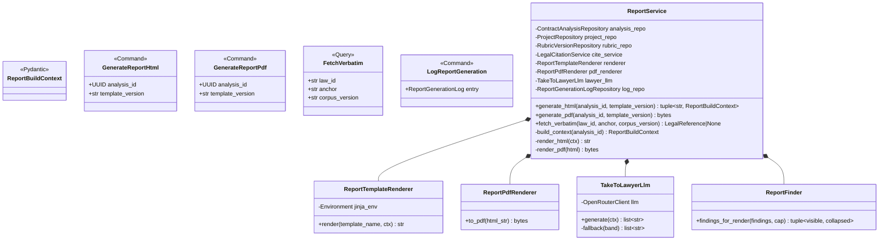
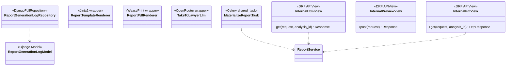
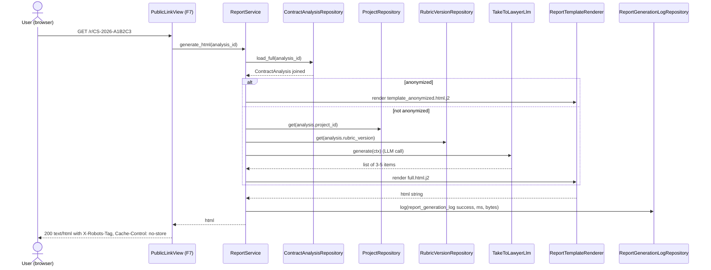
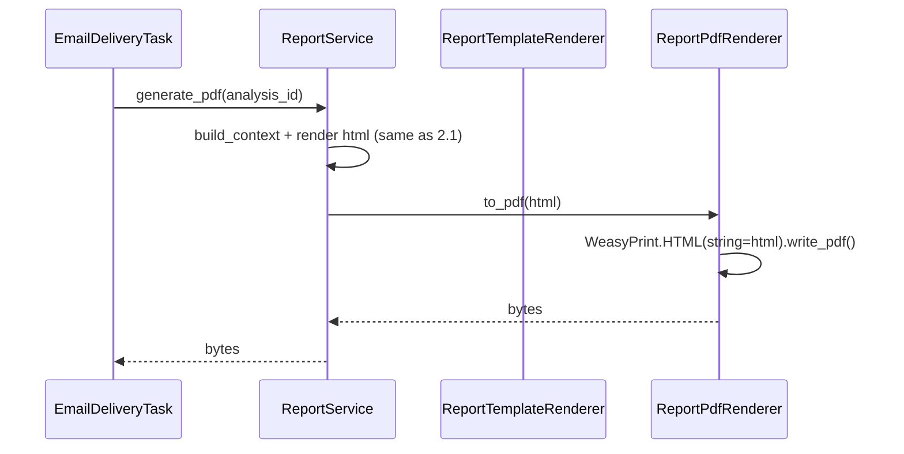
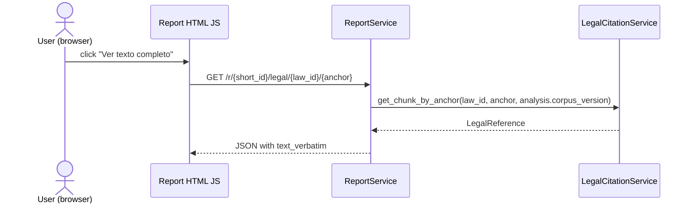
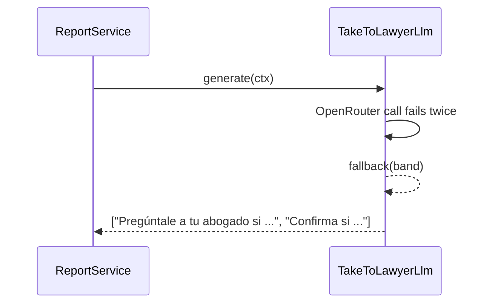
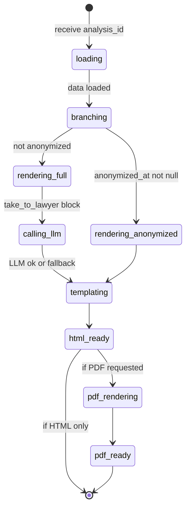
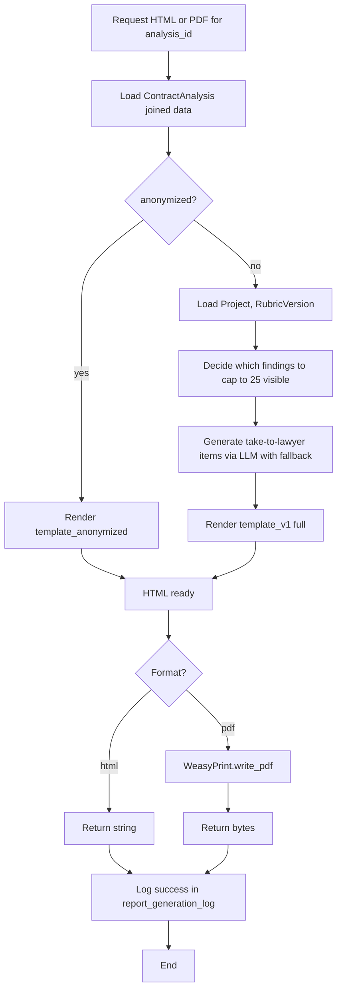
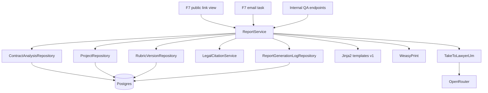
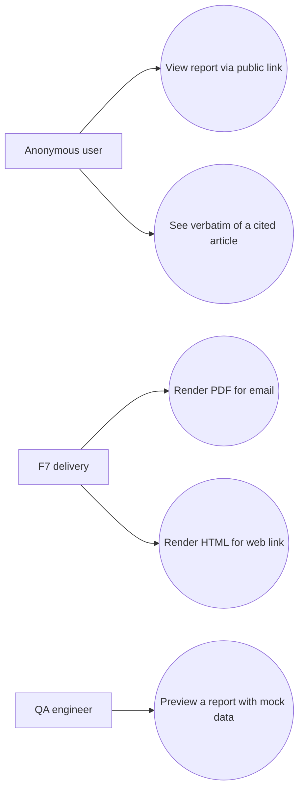

# Solution Diagrams — F6: Report Generation

> Generated: 2026-05-15

---

## 1. Class Diagram

### 1.1 Domain + Application

### 1.2 Infrastructure

---

## 2. Sequence Diagrams

### 2.1 Serve HTML via public link (called from F7)

### 2.2 Generate PDF for email (called from F7)

### 2.3 See verbatim text

### 2.4 LLM failure → deterministic fallback

---

## 3. State Diagram — Report generation per request

---

## 4. Activity Diagram

---

## 5. Component Diagram

---

## 6. Use Case Diagram

**End of document.**
