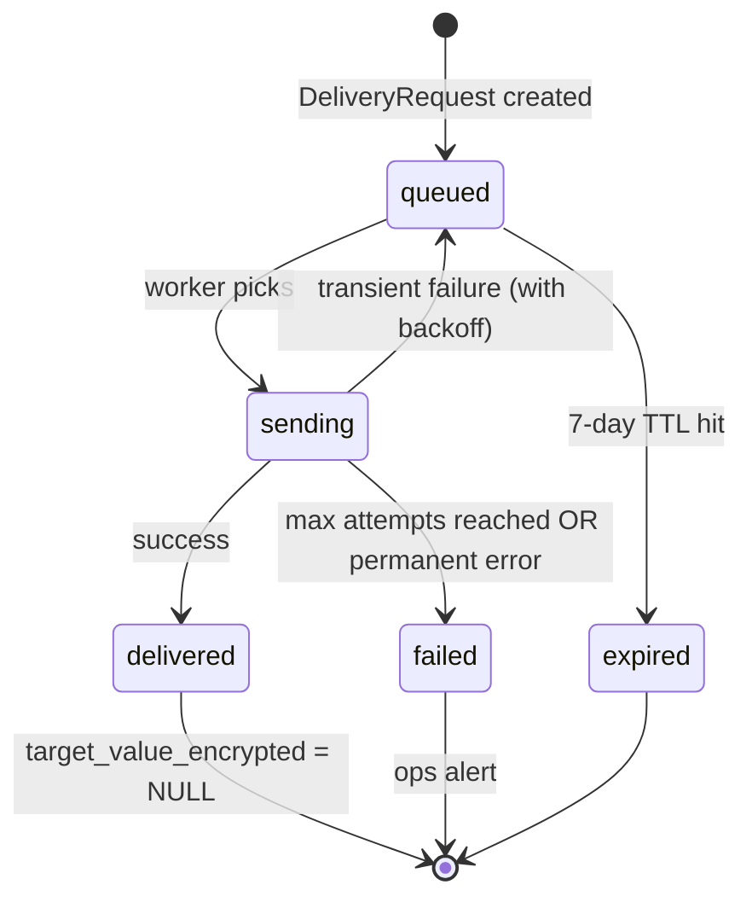

# Feature Overview — F7: Multi-Channel Delivery & Link Management

> Generated: 2026-05-15
> Stack: Django 5.2 LTS + DRF + Celery + Redis + Postgres + KMS (AWS/GCP/local libsodium)
> Depends: F6 (report content), F8 (schema)

---

## Executive Summary

F7 is the **last stage** of the pipeline: it serves the report to the user via one of three channels (SMS summary + link, email with PDF, public web link) and manages link expiration, retries, on-demand resends, and cryptographic protection of the destination address.

The privacy posture is strict: the user's email or phone is **encrypted with a KMS key** while delivery is in progress and **discarded after successful delivery**. Only a salt+SHA-256 hash survives (so resends can authenticate the user). The link is a **capability token** (`public_short_id`); anyone with the link can view the report; without it, no access.

The disclaimer "Esto no es asesoría legal" appears in the SMS body, email body, and the report itself. Casa Segura never sends marketing — every email/message is a direct response to a user action.

---

## Key Concepts

| Term | Plain-language definition |
|---|---|
| **DeliveryRequest** | A single attempt to deliver via a channel; transient (7 days) |
| **`target_value_encrypted`** | KMS-encrypted email/phone, held until delivered or 24 h |
| **`target_hash`** | Salt+SHA-256 of the destination; preserved for resend authentication |
| **TTL** | Public link expiration (default 30 days) |
| **Retry policy** | 3 attempts, exponential 30 s → 5 m → 30 m with ±20% jitter |
| **Capability token** | `public_short_id` acts as the access key to the public report |
| **Resend** | User with the short id can request another delivery to the **same** destination (hash-verified) |

---

## How It Works (Step by Step)

1. **User chooses channel + destination** when submitting the contract (F1 captures this; F1 hashes the destination and stores `delivery_target_hash` + `delivery_channel` on the `ContractAnalysis` stub).
2. **F4 finishes the analysis** and triggers the Celery chain. F6 generates HTML and (for email) PDF. F7's task is the chain's final step.
3. **F7 creates a `DeliveryRequest`** with `status='queued'`, the channel, the hashed target, and the KMS-encrypted target value (decrypted from a Redis blob with TTL ≤ 300 s where F1 placed it).
4. **F7 dispatches** via the channel:
   - `sms_summary`: SMS provider call with concise summary + link
   - `email_pdf`: SMTP send via the configured provider (SendGrid / SES / Postmark) with PDF attached
   - `web_link`: no proactive send; the link is the delivery; the user has the short id
5. **On success**: `status='delivered'`, `delivered_at=NOW()`, `target_value_encrypted` set to NULL (also enforced by F8 cron as a safety net).
6. **On transient failure**: retry per backoff with jitter; max 3 attempts.
7. **On permanent failure**: `status='failed'`, ops alert.
8. **The public `/r/{short_id}` endpoint** is always available while `link_expires_at > NOW()` and the analysis isn't otherwise expired. It is **not** part of `DeliveryRequest`; it is served by F7 directly.
9. **Resends**: `POST /v1/contracts/{short_id}/resend` with the original destination; F7 hashes the submitted destination and compares against `delivery_target_hash`; up to 3 resends.

---

## Business Rules

- **BR-F7-01:** Email/phone never persisted in cleartext on disk; only KMS-encrypted in transit.
- **BR-F7-02:** Hash preserved for the life of the analysis to authorize resends.
- **BR-F7-03:** Resend only to the original destination.
- **BR-F7-04:** Retry: 3 attempts, 30 s / 5 m / 30 m, ±20% jitter.
- **BR-F7-05:** Max 3 resends per analysis.
- **BR-F7-06:** Default link TTL 30 days since `created_at`, configurable.
- **BR-F7-07:** `public_short_id` is the capability token; no auth on `/r/`.
- **BR-F7-08:** Disclaimer in SMS body, email body, report itself.
- **BR-F7-09:** Casa Segura sends no marketing.
- **BR-F7-10:** SMS uses approved transactional template text only.
- **BR-F7-11:** No open / click tracking; no pixels; no cookies.
- **BR-F7-12:** Channel cannot change on resend.
- **BR-F7-13:** `/r/` requires only the short id (no destination validation).
- **BR-F7-14:** "Link expired" page reveals nothing about the analysis.
- **BR-F7-15:** Logs never include encrypted target value or hash (except hash in error correlation, never the cleartext).

---

## Lifecycle Diagram

---

## What Changes in the System

- New persistent table `delivery_request` (declared by F8)
- Columns written on `contract_analysis`: `delivery_status`, `delivery_channel`, `delivery_target_hash`, `link_expires_at`, `resend_count`
- New Celery tasks: `delivery.deliver_to_user`, `delivery.retry_delivery`
- New public endpoint `GET /r/{short_id}` (served by F7, regenerates HTML via F6)
- New endpoints: `POST /v1/contracts/{short_id}/resend`, `GET /v1/contracts/{short_id}/delivery-status`, `POST /v1/internal/delivery/retry/{delivery_request_id}`
- Integrations: SMS provider, SMTP provider, KMS

---

## What This Feature Does NOT Do

- Generate the report content (F6)
- Track open/click engagement
- Send marketing / newsletter
- Change destination on resend
- Deliver WhatsApp/Zavu (out of MVP)

---

## Audit and Compliance

- `DeliveryRequest` rows log every attempt with `attempt_count`, `last_error_code`, `last_error_classification` (transient/permanent), `provider_message_id`.
- `PrivacyAuditLog` records `delivery_target_purged` when `target_value_encrypted` is cleared.
- Prometheus alerts on per-channel failure rate (`> 5%/h email`, `> 10%/h sms`).

---

## Assumptions Made

- SMTP provider: defaulted to SendGrid; configurable. Reputation determines deliverability.
- SMS provider/sender registration completed before production.
- KMS provider AWS; falls back to local libsodium if `KMS_PROVIDER=local`.
- TTL 30 days, configurable.
- Email response: `noreply@casasegura.sv` — replies discarded. (PRD §10 Q-6 — change later if monitored inbox is wanted.)
- Open/click telemetry: disabled (PRD §10 Q-7).

---

**End of document.**
