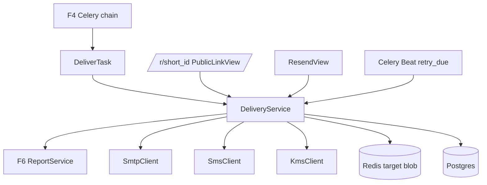
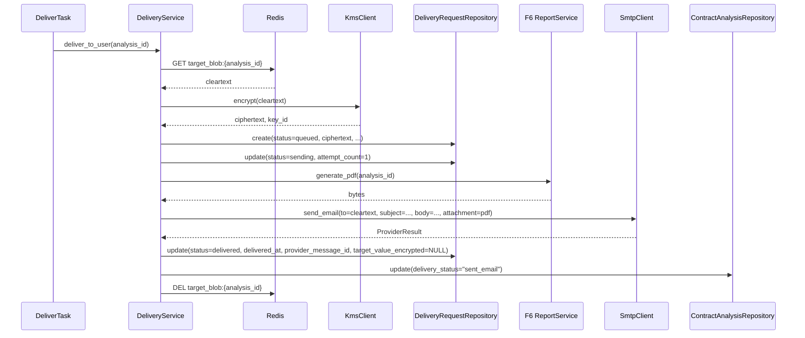
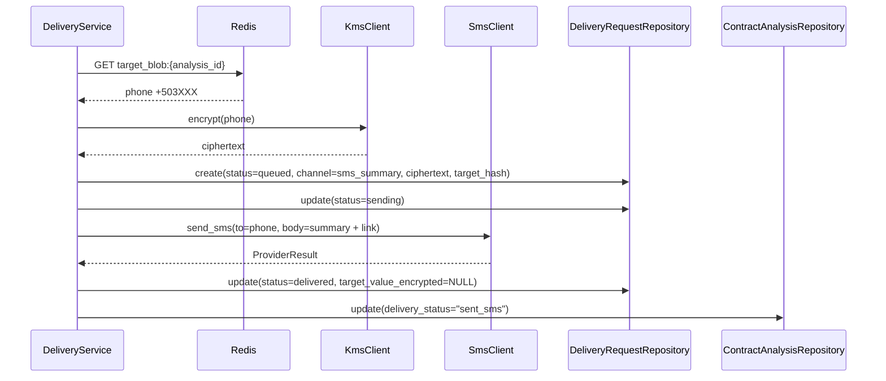
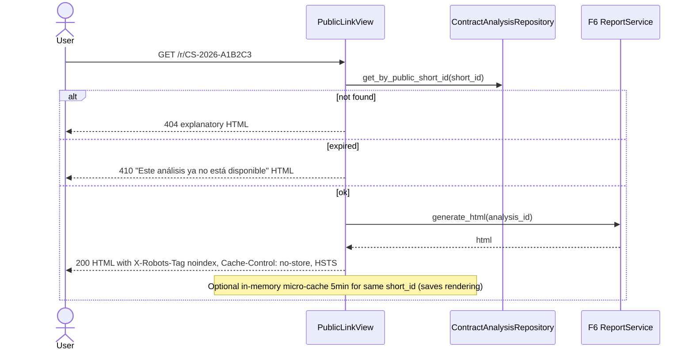
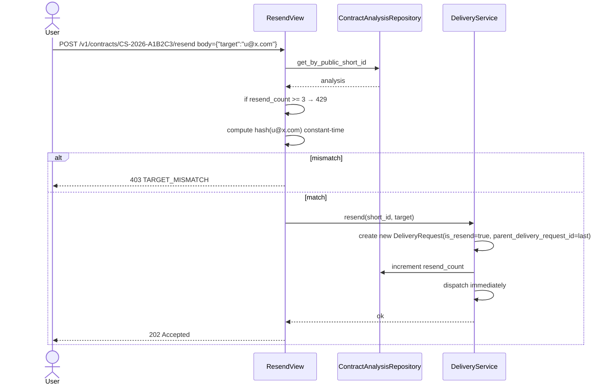
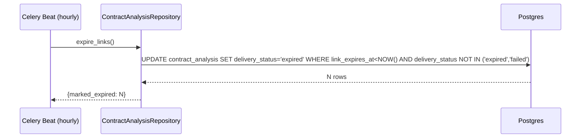
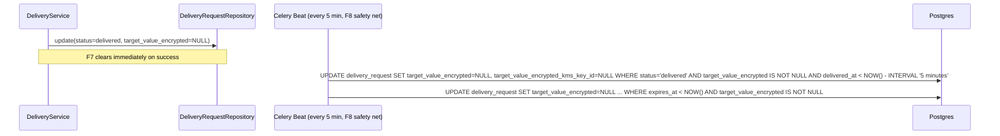
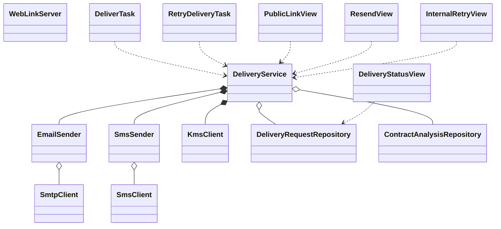

# Interaction Diagrams — F7: Multi-Channel Delivery

> Generated: 2026-05-15

---

## Component Overview



---

## Flow: US-01 User picks channel at upload

(F1 handles capture; persistence into stub analysis. See F1 docs.)

```mermaid
sequenceDiagram
    actor U as User
    participant F1 as F1 IngestionService
    participant KMS as KmsClient
    participant Redis as Redis
    participant AR as ContractAnalysisRepository

    U->>F1: submit + delivery_channel=email_pdf + delivery_target=u@x.com
    F1->>F1: validate email regex, MX lookup
    F1->>KMS: encrypt(u@x.com)
    KMS-->>F1: (ciphertext, key_id) — NOT used by F1; F7 does the encrypt-at-delivery instead
    Note over F1: simpler: F1 places cleartext in Redis (target_blob:{analysis_id} TTL 300s)
    F1->>Redis: SETEX target_blob:{analysis_id} 300 cleartext
    F1->>AR: stub with delivery_target_hash, delivery_channel, link_expires_at = NOW()+30d
```

---

## Flow: US-02 Email delivery



---

## Flow: US-03 SMS delivery



---

## Flow: US-04 Public web link served



---

## Flow: US-05 Resend



---

## Flow: US-06 Retry with exponential backoff

```mermaid
sequenceDiagram
    participant Svc as DeliveryService
    participant SMTP as SmtpClient
    participant DR as DeliveryRequestRepository
    participant Beat as Celery Beat (every 1 min)
    participant Task as RetryDeliveryTask

    Svc->>SMTP: send_email
    SMTP-->>Svc: transient 504
    Svc->>Svc: backoff = 30s × 2^(attempt-1) × jitter(0.8..1.2); attempt=1 → 30s
    Svc->>DR: update(status=queued, attempt_count=1, next_attempt_not_before=NOW()+30s)
    Beat->>DR: SELECT WHERE status=queued AND next_attempt_not_before <= NOW() LIMIT 100
    DR-->>Beat: list of dr_ids
    Beat->>Task: retry_delivery.delay(dr_id) each
    Task->>Svc: retry_failed(dr_id)
    Svc->>SMTP: send_email
    SMTP-->>Svc: 250 OK
    Svc->>DR: update(status=delivered, ...)
```

---

## Flow: US-07 Link expiration cron



---

## Flow: US-08 Erase encrypted destination



---

## Class Diagram



**End of document.**
