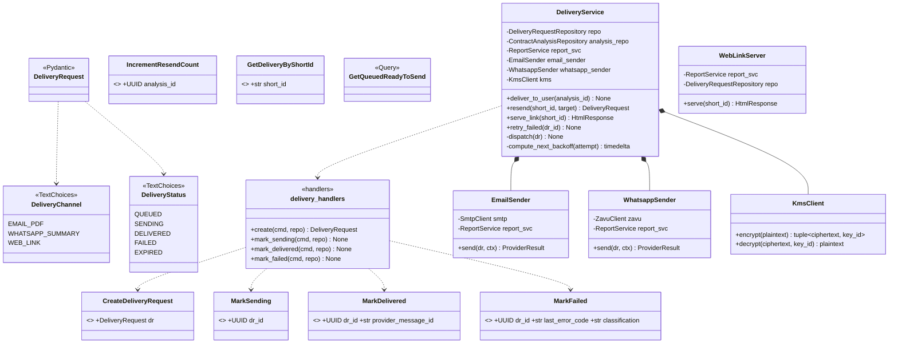
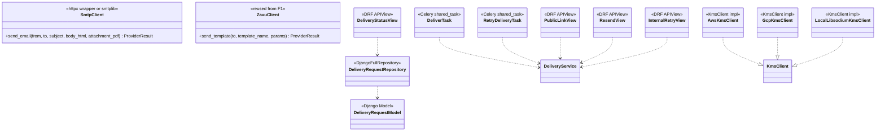
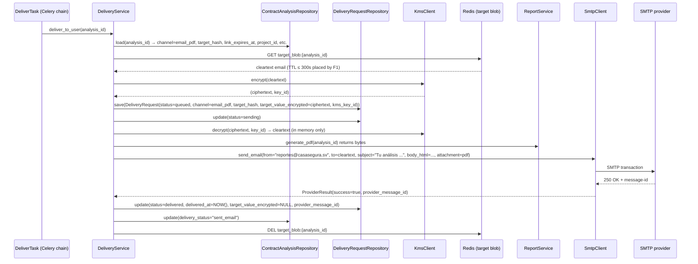
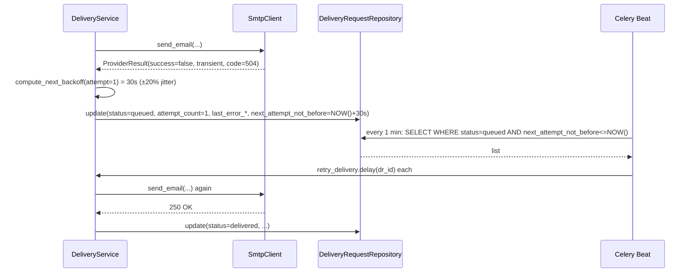
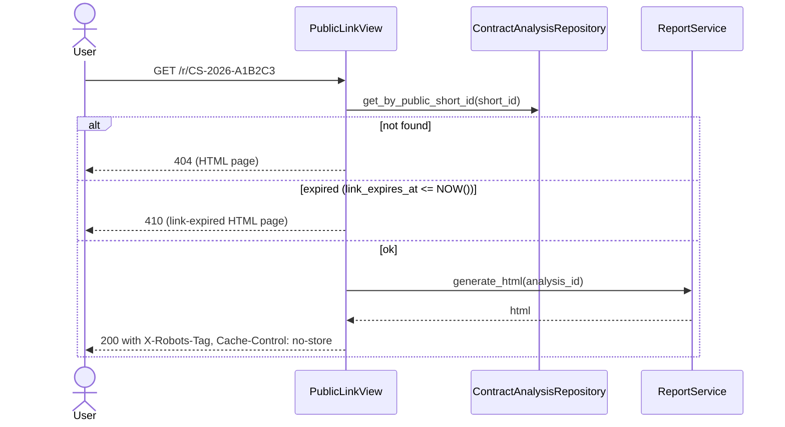
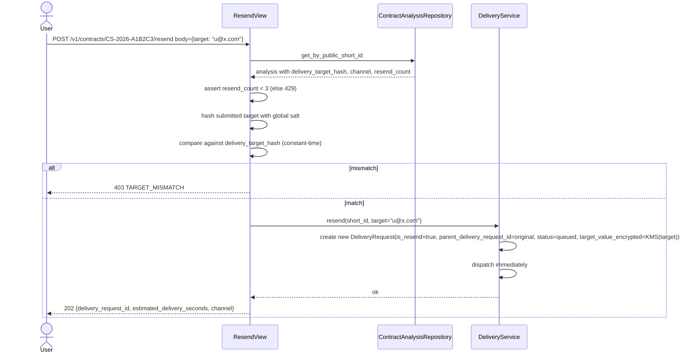
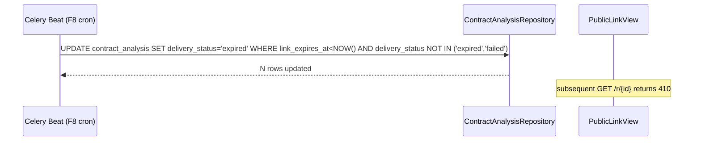
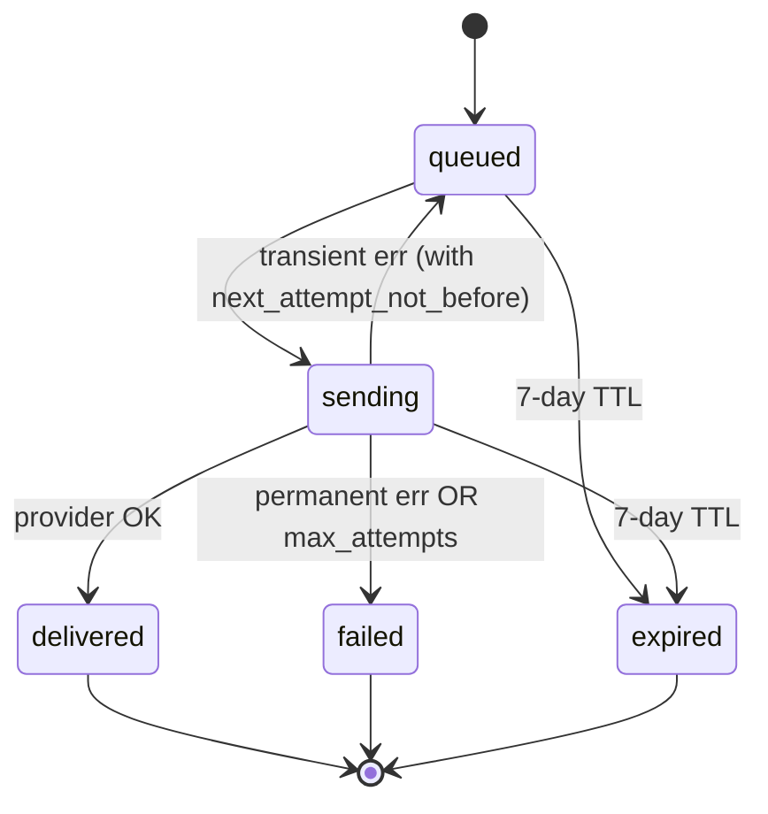
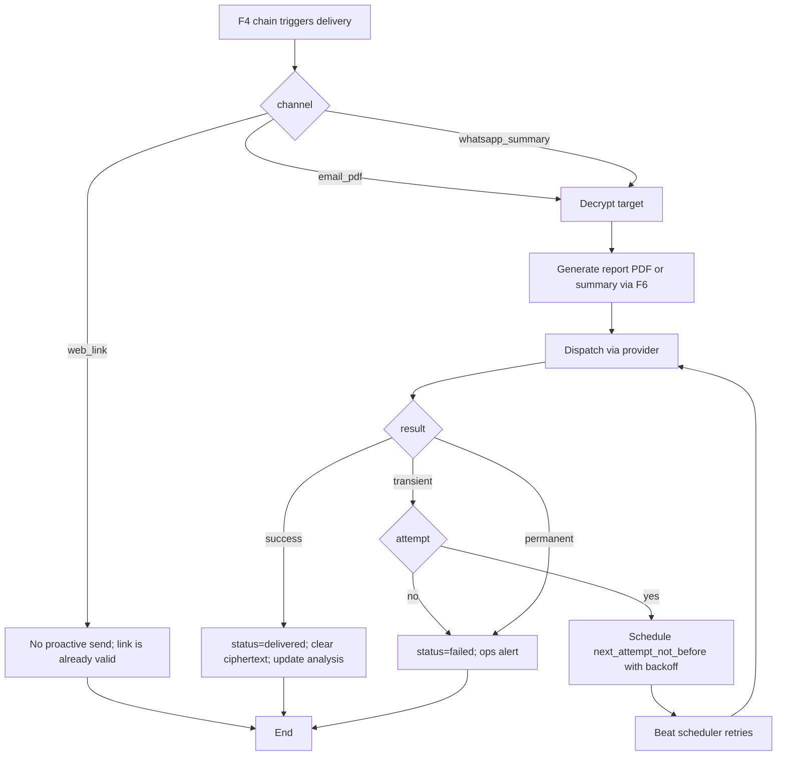
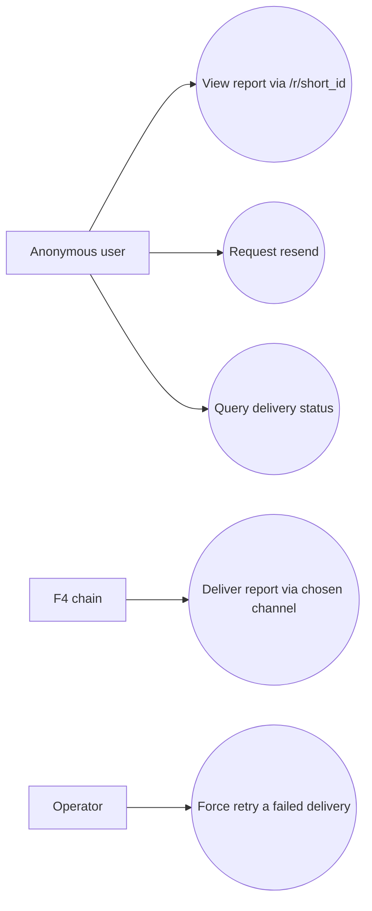

# Solution Diagrams — F7: Multi-Channel Delivery & Link Management

> Generated: 2026-05-15

---

## 1. Class Diagram

### 1.1 Domain + Application



### 1.2 Infrastructure



---

## 2. Sequence Diagrams

### 2.1 Email delivery (happy path)



### 2.2 Transient failure → backoff retry



### 2.3 WhatsApp delivery

```mermaid
sequenceDiagram
    participant Svc as DeliveryService
    participant Zavu as ZavuClient
    participant Meta as WhatsApp/Meta
    participant R as ReportService
    participant KMS as KmsClient

    Svc->>KMS: decrypt(ciphertext, key_id)
    KMS-->>Svc: phone +503XXX
    Svc->>R: generate_html (for params); also compute short URL
    Svc->>Zavu: send_template(to=phone, template="casa_segura_report_delivery", params=[score, band_label, 3 findings, link_url, expiry])
    Zavu->>Meta: API
    Meta-->>Zavu: 200 OK + provider_message_id
    Zavu-->>Svc: success
    Svc->>Svc: DR.status=delivered; AR.delivery_status="sent_whatsapp"
```

### 2.4 Public link view



### 2.5 Resend



### 2.6 Link expiration



---

## 3. State Diagram (per DeliveryRequest)



---

## 4. Activity Diagram



---

## 5. Component Diagram

```mermaid
graph TD
    F4Chain[F4 Celery chain]
    Task[DeliverTask]
    Beat[Celery Beat: retry_due_deliveries]
    Svc[DeliveryService]
    AR[ContractAnalysisRepository]
    DR[DeliveryRequestRepository]
    R[F6 ReportService]
    SMTP[SmtpClient]
    Zavu[ZavuClient]
    KMS[KmsClient]
    Provider1[SMTP provider]
    Provider2[Zavu API → Meta WhatsApp]
    Redis[(Redis: target blob 300s)]
    PG[(Postgres)]
    PubLink[PublicLinkView /r/{short_id}]
    Resend[ResendView]
    StatusV[DeliveryStatusView]
    Internal[InternalRetryView]

    F4Chain --> Task --> Svc
    Beat --> Svc
    Svc --> AR --> PG
    Svc --> DR --> PG
    Svc --> R
    Svc --> SMTP --> Provider1
    Svc --> Zavu --> Provider2
    Svc --> KMS
    Svc --> Redis
    PubLink --> Svc
    Resend --> Svc
    StatusV --> DR
    Internal --> Svc
```

---

## 6. Use Case Diagram



**End of document.**
