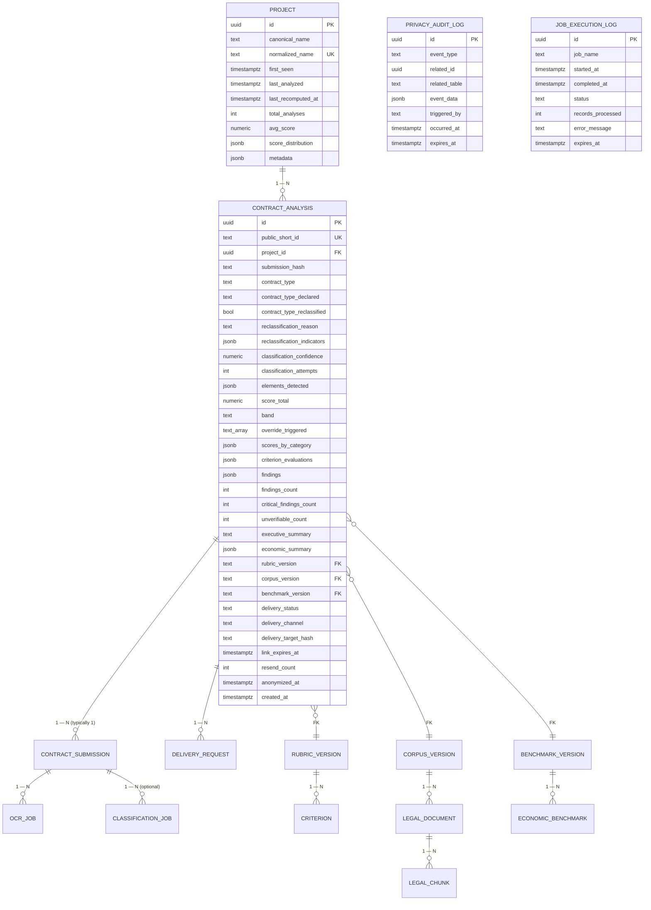

# Entity Relationship Diagram — F8: Persistence, Project Entity & Retention

> Generated: 2026-05-15
> Source: `PRD_F8_PERSISTENCIA_PROYECTO_RETENCION.md` §5 + `DOMAIN_MODEL.md`

---

## Overview

F8 owns the **central schema**. Of the 17 entities in `DOMAIN_MODEL.md`, F8 declares the business entities (`Project`, `ContractAnalysis`) and observability tables (`privacy_audit_log`, `job_execution_log`) directly. The catalog tables (`rubric_version`, `criterion`, `corpus_version`, `legal_document`, `legal_chunk`, `benchmark_version`, `economic_benchmark`, `rag_query_log`) are declared by their owning feature modules (F4, F3, F5). The transient tables (`contract_submission`, `ocr_job`, `delivery_request`, `classification_job`, `report_generation_log`) are declared by their owning modules (F1, F2, F7, F6).

This split is documented in `_shared/GLOBAL_ASSUMPTIONS.md` §11. F8 still controls the **invariants across the whole schema**: integrity constraints crossing modules (e.g., `contract_analysis.project_id` FK to `project.id`) and the retention/anonymization semantics that touch any module's data.

---

## Mermaid Diagram (full domain — F8 perspective)



---

## Entity Definitions (F8-owned)

### Project

| Field | Type | Constraints | Description |
|---|---|---|---|
| `id` | UUID | PK | — |
| `canonical_name` | TEXT | NOT NULL | Name as in the contract |
| `normalized_name` | TEXT | NOT NULL, UNIQUE | Slug used for matching |
| `first_seen` | TIMESTAMPTZ | default `NOW()` | — |
| `last_analyzed` | TIMESTAMPTZ | NOT NULL | — |
| `last_recomputed_at` | TIMESTAMPTZ | nullable | — |
| `total_analyses` | INT | default 0 | — |
| `avg_score` | NUMERIC(3,1) | nullable | — |
| `score_distribution` | JSONB | default `{green:0,yellow:0,red:0}` | — |
| `metadata` | JSONB | default `{}` | Extensible; `placeholder` flag |

Indices: `idx_project_normalized` on `normalized_name`, `idx_project_last_analyzed` on `last_analyzed`.

### ContractAnalysis

Central business row. All columns documented in `PRD_F8` §5.1 verbatim; described in `_shared/GLOBAL_ASSUMPTIONS.md` and across F1–F7 ERD docs. Indices critical:
- `idx_analysis_project` on `project_id`
- `idx_analysis_public_short_id` on `public_short_id`
- `idx_analysis_submission_hash` on `submission_hash`
- `idx_analysis_link_expires_at` partial WHERE NOT NULL
- `idx_analysis_anonymized_at` partial WHERE NULL
- `idx_analysis_created_at`

### PrivacyAuditLog

| Field | Type | Constraints | Description |
|---|---|---|---|
| `id` | UUID | PK | — |
| `event_type` | TEXT | CHECK enum 7 values | `analysis_anonymized | delivery_target_purged | submission_purged | manual_data_deletion | admin_access | corpus_version_published | rubric_version_published` |
| `related_id` | UUID | nullable | ID of the affected row |
| `related_table` | TEXT | nullable | Table name |
| `event_data` | JSONB | nullable | Extensible payload |
| `triggered_by` | TEXT | nullable | Operator or `system` |
| `occurred_at` | TIMESTAMPTZ | default `NOW()` | — |
| `expires_at` | TIMESTAMPTZ | default `NOW() + 1 year` | — |

### JobExecutionLog

| Field | Type | Constraints | Description |
|---|---|---|---|
| `id` | UUID | PK | — |
| `job_name` | TEXT | INDEX | — |
| `started_at` | TIMESTAMPTZ | INDEX | — |
| `completed_at` | TIMESTAMPTZ | nullable | — |
| `status` | TEXT | CHECK `running|success|failed` | — |
| `records_processed` | INT | nullable | — |
| `error_message` | TEXT | nullable | — |
| `expires_at` | TIMESTAMPTZ | default `NOW() + 30 days` | — |

---

## Pydantic Domain Entities (F8-owned)

```python
class Project(BaseModel):
    model_config = ConfigDict(from_attributes=True)
    id: UUID | None = None
    canonical_name: str
    normalized_name: str
    first_seen: datetime
    last_analyzed: datetime
    last_recomputed_at: datetime | None = None
    total_analyses: int = 0
    avg_score: float | None = None
    score_distribution: dict[str, int] = Field(default_factory=lambda: {"green":0,"yellow":0,"red":0})
    metadata: dict = Field(default_factory=dict)


class ContractAnalysis(BaseModel):
    # full set of columns; see _shared/GLOBAL_ASSUMPTIONS.md and F1-F7 ERD docs for fields
    ...


class PrivacyAuditLog(BaseModel):
    model_config = ConfigDict(from_attributes=True)
    id: UUID | None = None
    event_type: Literal["analysis_anonymized","delivery_target_purged","submission_purged","manual_data_deletion","admin_access","corpus_version_published","rubric_version_published"]
    related_id: UUID | None = None
    related_table: str | None = None
    event_data: dict | None = None
    triggered_by: str | None = None
    occurred_at: datetime
    expires_at: datetime


class JobExecutionLog(BaseModel):
    model_config = ConfigDict(from_attributes=True)
    id: UUID | None = None
    job_name: str
    started_at: datetime
    completed_at: datetime | None = None
    status: Literal["running","success","failed"]
    records_processed: int | None = None
    error_message: str | None = None
    expires_at: datetime
```

## Views

```sql
CREATE VIEW v_system_health AS
SELECT
  (SELECT COUNT(*) FROM contract_submission WHERE processing_status = 'received') AS submissions_pending,
  (SELECT COUNT(*) FROM contract_submission WHERE processing_status LIKE 'failed_%') AS submissions_failed_24h,
  (SELECT COUNT(*) FROM contract_analysis WHERE created_at > NOW() - INTERVAL '24 hours') AS analyses_24h,
  (SELECT COUNT(*) FROM contract_analysis WHERE anonymized_at IS NULL AND created_at < NOW() - INTERVAL '90 days') AS analyses_pending_anonymization,
  (SELECT COUNT(*) FROM delivery_request WHERE status = 'queued') AS deliveries_queued,
  (SELECT COUNT(*) FROM delivery_request WHERE status = 'failed' AND requested_at > NOW() - INTERVAL '24 hours') AS deliveries_failed_24h,
  (SELECT MAX(occurred_at) FROM privacy_audit_log WHERE event_type = 'analysis_anonymized') AS last_anonymization_run,
  (SELECT COUNT(*) FROM project) AS total_projects,
  (SELECT version FROM rubric_version WHERE is_active = TRUE) AS active_rubric_version,
  (SELECT version FROM corpus_version WHERE is_active = TRUE) AS active_corpus_version,
  (SELECT version FROM benchmark_version WHERE is_active = TRUE) AS active_benchmark_version;

CREATE VIEW v_retention_status AS
SELECT 'contract_submission' AS table_name, COUNT(*) FILTER (WHERE expires_at < NOW()) AS overdue, COUNT(*) AS total FROM contract_submission
UNION ALL
SELECT 'ocr_job', COUNT(*) FILTER (WHERE expires_at < NOW()), COUNT(*) FROM ocr_job
UNION ALL
SELECT 'delivery_request', COUNT(*) FILTER (WHERE expires_at < NOW()), COUNT(*) FROM delivery_request
UNION ALL
SELECT 'contract_analysis (pending anon)', COUNT(*) FILTER (WHERE created_at < NOW() - INTERVAL '90 days' AND anonymized_at IS NULL), COUNT(*) FROM contract_analysis;
```

---

## Modifications to Existing Models

F8 is greenfield. The initial migration creates everything.

---

## Migration Notes

- F8's first migration declares: `project`, `contract_analysis`, `privacy_audit_log`, `job_execution_log`, plus the seed placeholder project, and the two SQL views above.
- All other modules' migrations are dependency-graphed after F8's initial migration via `dependencies = [("platform", "0001_initial")]`.
- Postgres extensions enabled in F8's initial migration: `pgcrypto`, `uuid-ossp`, `vector`.

---

**End of document.**
