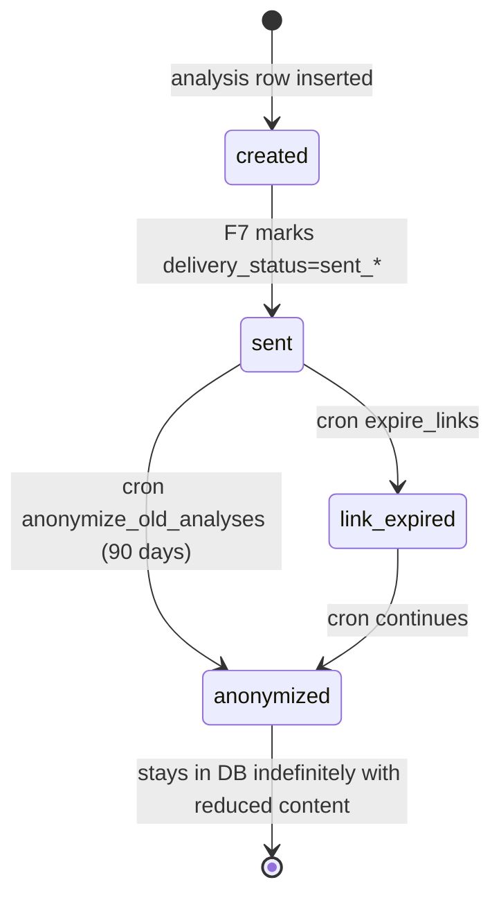

# Feature Overview — F8: Persistence, Project Entity & Retention

> Generated: 2026-05-15
> Stack: Django 5.2 LTS + Celery Beat + Postgres 15 + pgvector
> Depends on: None (horizontal foundation)
> Blocks: F1–F7 (all depend on the schema)

---

## Executive Summary

F8 is the **horizontal foundation** of Casa Segura. It owns the database schema, the `Project` matching logic, and every retention/cleanup job that materializes the privacy contract ("we don't keep your contract, we don't keep your personal data, after 90 days we anonymize everything"). It is the only feature that, if broken, breaks the entire product invariants — without F8's anonymization the system lies.

F8 has four responsibilities:

1. **Schema** — declare every persistent and transient table per `DOMAIN_MODEL.md`, manage migrations.
2. **Project matching** — when F2 extracts a normalized name, upsert and recompute aggregate metrics.
3. **Retention** — run periodic jobs that delete transient rows, erase delivery destinations, expire links, anonymize 90-day-old analyses, recompute project metrics.
4. **Audit** — record privacy-sensitive events (anonymizations, deletions, version publications) in `privacy_audit_log`.

F8 does not expose direct user-facing functionality, but the other seven features depend on it being correct.

---

## Key Concepts

| Term | Plain-language definition |
|---|---|
| **Anonymization** | At 90 days, an analysis loses snippets and exact figures but keeps band, score, project association, severity counts |
| **Transient cleanup** | Hard-delete of `contract_submission` and `ocr_job` rows past their 24-h TTL |
| **Project recompute** | Refresh `avg_score`, `score_distribution`, `total_analyses` for projects with new activity |
| **Placeholder project** | `unknown_<hash>` per failed name extraction; metadata.placeholder=true |
| **Privacy audit log** | 1-year retention; records anonymizations, deletions, admin access, version publications |
| **System health view** | A single SELECT that summarizes pending submissions, anonymizations due, last job runs |
| **Periodic task** | Celery Beat schedules every cron job |

---

## How It Works (Step by Step)

### Schema bootstrap

1. Operator deploys Django; runs `python manage.py migrate`.
2. Migrations create all tables (catalog + business + transient + observability).
3. Seed migrations load the placeholder project, the initial rubric `1.0.0`, the initial corpus version (F3 ingests separately), and the initial benchmark version (F5 loads separately).

### Project matching (F2 calls in)

1. F2 normalizes `canonical_name → normalized_name`.
2. F2 calls `find_or_create_project(canonical_name, normalized_name)` from F8.
3. F8 runs Postgres upsert `INSERT ... ON CONFLICT (normalized_name) DO UPDATE`.
4. Returns `project_id` to F2.
5. F2 updates `contract_analysis.project_id` from the placeholder to the real id.

### Periodic jobs (all owned by Celery Beat)

| Job | Frequency | What it does |
|---|---|---|
| `cleanup_transient` | every 15 min | DELETE `contract_submission` and `ocr_job` rows past 24 h |
| `cleanup_delivery_targets` | every 5 min | Erase `target_value_encrypted` for delivered or expired requests (safety net to F7's inline clear) |
| `expire_links` | every hour | Mark analyses past `link_expires_at` as `expired` |
| `anonymize_old_analyses` | daily 03:00 local | Anonymize analyses with `created_at < NOW() − 90 days` |
| `recompute_project_metrics` | every hour | Refresh `avg_score`, `score_distribution` for projects with new activity |
| `audit_log_cleanup` | weekly | Delete `privacy_audit_log` rows past 1 year |
| `cleanup_classification_jobs` | every hour | Delete `classification_job` past 24 h |
| `cleanup_report_generation_log` | daily | Delete `report_generation_log` past 30 days |
| `cleanup_rag_query_log` | daily | Delete `rag_query_log` past 90 days |
| `cleanup_job_execution_log` | weekly | Delete `job_execution_log` past 30 days |

### Anonymization (the privacy contract materialized)

1. Cron runs daily at 03:00 (`America/El_Salvador`).
2. Query `contract_analysis WHERE anonymized_at IS NULL AND created_at < NOW() - INTERVAL '90 days'`.
3. For each row in batches:
   - Erase `delivery_target_hash`
   - Erase `criterion_evaluations` content (keep counts in `scores_by_category`)
   - Erase `findings` content; keep `findings_count`, `critical_findings_count`, `unverifiable_count`
   - Reduce `economic_summary` to bucketed form
   - Preserve: `score_total`, `band`, `override_triggered`, `submission_hash`, `contract_type`, `project_id`, `created_at`, `executive_summary`, `rubric_version`, `corpus_version`, `benchmark_version`
   - Set `anonymized_at = NOW()`
4. Write a `privacy_audit_log(event_type='analysis_anonymized', related_id=...)`.

---

## Business Rules

- **BR-F8-00 (governing invariant):** Full contract text is never persisted. The only contract-content survivors are `evidence_clause_snippet` (≤ 500 chars) inside `findings` and economic figures inside `economic_summary`, both anonymized at 90 days.
- **BR-F8-01:** F8 owns the schema; other features read/write but do not alter structure.
- **BR-F8-02:** Persistent tables have indefinite life or explicit retention; transient tables hard-delete on TTL.
- **BR-F8-03:** 90-day anonymization is invariant; configurable downward only via product/privacy review.
- **BR-F8-04:** Anonymization is atomic per analysis (all-or-nothing).
- **BR-F8-05:** Cron jobs are idempotent.
- **BR-F8-06:** `Project` rows are never deleted.
- **BR-F8-07:** Placeholder projects not reused across submissions.
- **BR-F8-08:** `Project.avg_score` includes anonymized analyses.
- **BR-F8-09:** Anonymization buckets are fixed; changing them requires explicit migration.
- **BR-F8-10:** Postgres 15+ with `pgvector` extension.
- **BR-F8-11:** Backups daily, 30-day retention, encrypted at rest, pre-anonymization data not retained beyond 90 days.
- **BR-F8-12:** Production DB access restricted, MFA, rotating credentials.
- **BR-F8-13:** Each cron run emits metrics; alert if not executed in N+1 periods.
- **BR-F8-14:** Migrations run in controlled windows with rollback plans.
- **BR-F8-15:** `privacy_audit_log` retained 1 year.

---

## Lifecycle Diagram

---

## What Changes in the System

- New persistent tables for **business and observability** (declared collectively, but each module owns its own migrations after F8 declares the central ones): `project`, `contract_analysis`, `privacy_audit_log`, `job_execution_log` (and indirectly references all the F1/F2/F3/F4/F5/F6/F7 tables).
- Central seed data migration: placeholder project, default rubric version, default corpus version, default benchmark version.
- Celery Beat schedule definitions for all cleanup jobs.
- Internal endpoints for ops: health, manual job trigger, audit log query.

---

## What This Feature Does NOT Do

- Text extraction (F1)
- Classification (F2)
- Corpus / RAG (F3)
- Rubric (F4)
- Economic (F5)
- Report (F6)
- Delivery (F7)
- Admin UI for manual data editing
- BI tooling (operators use direct SQL)

---

## Audit and Compliance

- `privacy_audit_log` is the audit trail. Access restricted (DB-level role).
- Every anonymization, transient cleanup, manual deletion, admin access, and version publication writes a row.
- 1-year TTL on audit log.

---

## Assumptions Made

- Postgres 15 (RDS / Cloud SQL / Supabase / self-hosted — operationally configurable).
- KMS: AWS by default; configurable.
- Periodic tasks via `django-celery-beat` with `DatabaseScheduler`.
- Timezone for cron: `America/El_Salvador`.
- 90-day anonymization is fixed at MVP.
- `submission_hash` survives anonymization for future dedup (per `_shared/GLOBAL_ASSUMPTIONS.md` §9).
- ARCO-right early destruction endpoint is recommended (`POST /v1/contracts/{short_id}/destroy` with hash auth) but deferred to v1.1; the cleanup implementation supports it.

---

**End of document.**
