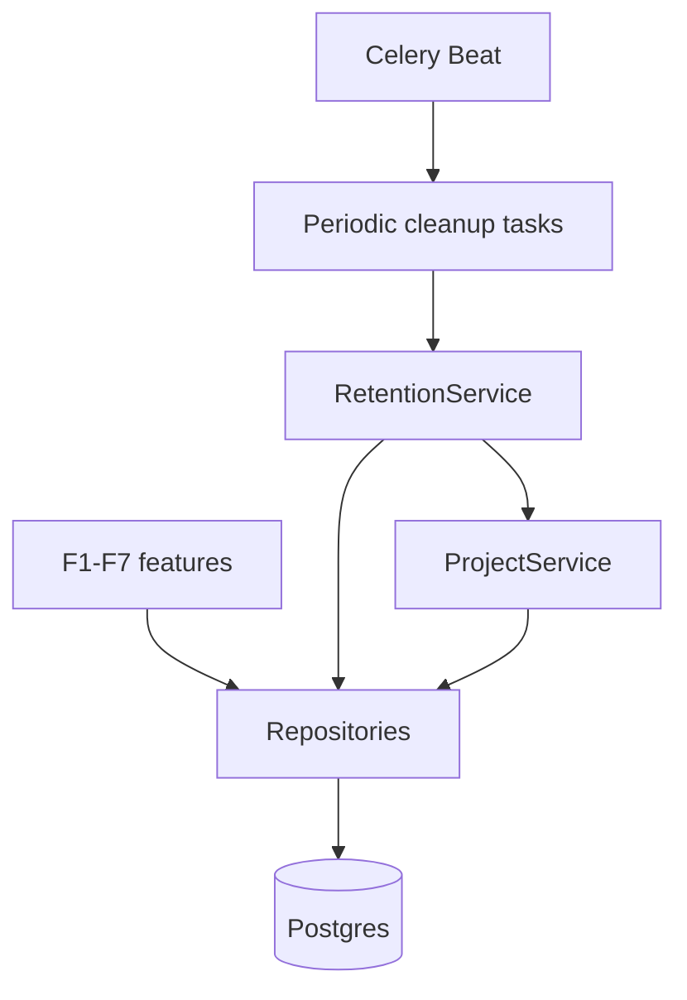
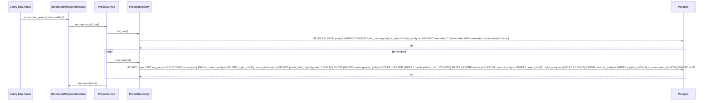
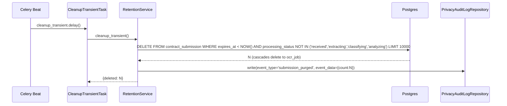
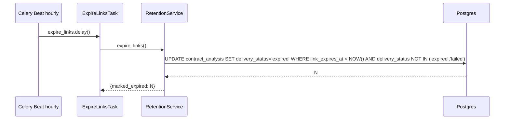
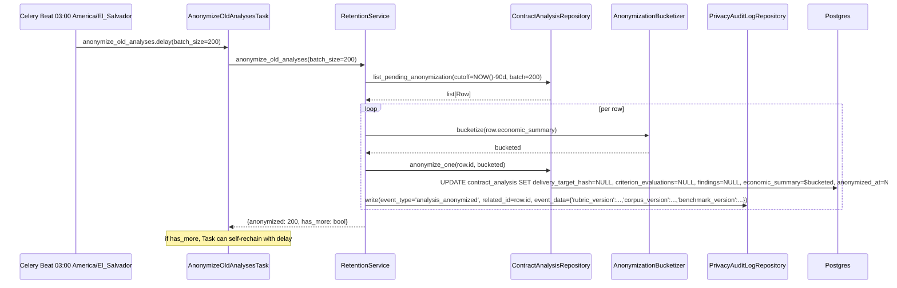
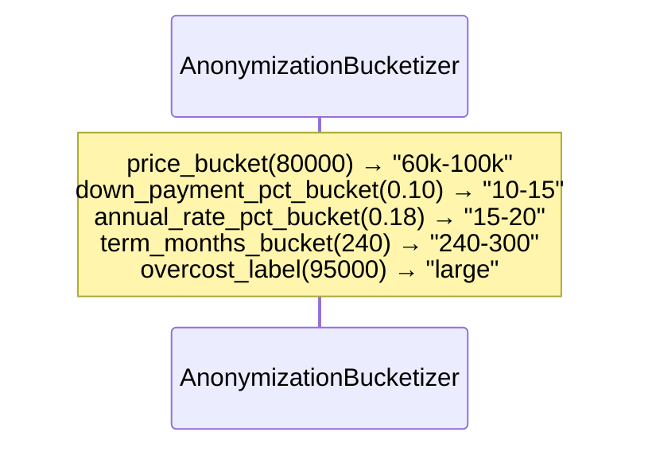
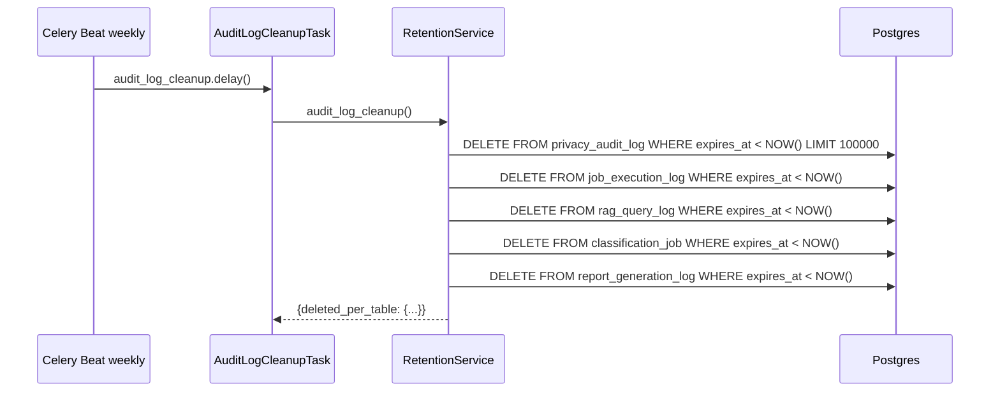
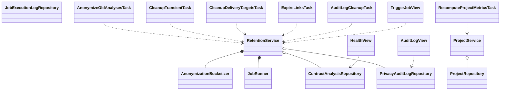

# Interaction Diagrams — F8: Persistence, Project Entity & Retention

> Generated: 2026-05-15

---

## Component Overview



---

## Flow: US-01 Schema initialization

```mermaid
sequenceDiagram
    actor Op as Operator
    participant Mgmt as Django management
    participant Alembic as Django migrate
    participant PG as Postgres

    Op->>Mgmt: python manage.py migrate
    Mgmt->>PG: CREATE EXTENSION pgcrypto, uuid-ossp, vector
    Mgmt->>PG: platform.0001_initial.py creates project, contract_analysis, privacy_audit_log, job_execution_log
    Mgmt->>PG: platform.0002_seed.py INSERT placeholder project, default rubric/corpus/benchmark versions
    Mgmt->>PG: corpus.0001_initial.py creates corpus_version, legal_document, legal_chunk, rag_query_log (with HNSW)
    Mgmt->>PG: rubric.0001_initial.py creates rubric_version, criterion
    Mgmt->>PG: rubric.0002_seed_v1_0_0.py inserts the 38 criteria from YAML
    Mgmt->>PG: economics.0001_initial.py creates benchmark_version, economic_benchmark
    Mgmt->>PG: economics.0002_seed_2026_Q2.py inserts benchmarks
    Mgmt->>PG: ingestion.0001_initial.py (no-op; tables owned by platform)
    Mgmt->>PG: classification.0001_initial.py creates classification_job
    Mgmt->>PG: reports.0001_initial.py creates report_generation_log
    Mgmt->>PG: delivery.0001_initial.py creates delivery_request
    Mgmt->>PG: delivery.0002_audit_view.py creates v_delivery_audit
    Mgmt-->>Op: schema ready
```

---

## Flow: US-02 Find or create Project

```mermaid
sequenceDiagram
    participant F2 as F2 ClassificationService
    participant Svc as ProjectService
    participant Repo as ProjectRepository
    participant PG as Postgres

    F2->>Svc: find_or_create("Residencial Las Palmeras","las palmeras")
    Svc->>Repo: upsert(canonical, normalized)
    Repo->>PG: INSERT ... ON CONFLICT (normalized_name) DO UPDATE SET last_analyzed=NOW(), canonical_name=EXCLUDED.canonical_name RETURNING id, (xmax = 0) AS was_inserted
    PG-->>Repo: project_id, was_inserted
    Repo-->>Svc: Project
    Svc-->>F2: Project
    Note over Svc: total_analyses NOT incremented inline; the hourly cron does it
```

---

## Flow: US-03 Update aggregate metrics



---

## Flow: US-04 cleanup_transient (every 15 min)



---

## Flow: US-05 cleanup_delivery_targets (every 5 min)

Per F7 Flow 8 — same as documented there.

---

## Flow: US-06 expire_links (hourly)



---

## Flow: US-07 anonymize_old_analyses (daily 03:00)



---

## Flow: US-08 Bucketization function



Bucket definitions (PRD F8 §US-08):
- `price_cash`: `<30k`, `30k-60k`, `60k-100k`, `100k-150k`, `150k-250k`, `>250k`
- `down_payment_pct`: `0-5`, `5-10`, `10-15`, `15-25`, `25-40`, `>40`
- `annual_rate_pct`: `<7`, `7-9`, `9-12`, `12-15`, `15-20`, `>20`
- `term_months`: `<120`, `120-180`, `180-240`, `240-300`, `>300`
- `overcost_label`: `none` (≤ 0), `small` (≤ $10k), `medium` (≤ $50k), `large` (> $50k)

---

## Flow: US-09 audit_log_cleanup (weekly)



---

## Flow: US-10 Versioned catalogs immutability

```mermaid
sequenceDiagram
    actor Op as Operator
    participant Mgmt as Mgmt command (rubric_seed, corpus_ingest, benchmarks_load)
    participant PG as Postgres

    Op->>Mgmt: insert a new version
    Mgmt->>PG: INSERT INTO rubric_version (...)
    PG-->>Mgmt: ok
    Note over Mgmt: Update only on `is_active`; UPDATE on any other column is rejected via trigger
```

The trigger:

```sql
CREATE OR REPLACE FUNCTION reject_catalog_mutation() RETURNS trigger AS $$
BEGIN
    IF (OLD.version IS NOT DISTINCT FROM NEW.version) AND TG_OP = 'UPDATE' THEN
        IF row_to_json(OLD)::jsonb - 'is_active' IS DISTINCT FROM row_to_json(NEW)::jsonb - 'is_active' THEN
            RAISE EXCEPTION 'Versioned catalog row is immutable except for is_active';
        END IF;
    END IF;
    RETURN NEW;
END;
$$ LANGUAGE plpgsql;

CREATE TRIGGER trg_rubric_version_immutable BEFORE UPDATE ON rubric_version FOR EACH ROW EXECUTE FUNCTION reject_catalog_mutation();
-- analogous triggers for corpus_version, benchmark_version
```

---

## Class Diagram



**End of document.**
