# Solution Diagrams — F8: Persistence, Project Entity & Retention

> Generated: 2026-05-15

---

## 1. Class Diagram

### 1.1 Domain + Application

```mermaid
classDiagram
    class Project { <<Pydantic>> }
    class ContractAnalysis { <<Pydantic>> }
    class PrivacyAuditLog { <<Pydantic>> }
    class JobExecutionLog { <<Pydantic>> }
    class FindOrCreateProject { <<Command>> }
    class RecomputeProjectMetrics { <<Command>> }
    class AnonymizeAnalysis { <<Command>> }
    class WritePrivacyAuditLog { <<Command>> }
    class WriteJobExecutionLog { <<Command>> }
    class GetSystemHealth { <<Query>> }
    class GetProjectByNormalizedName { <<Query>> }
    class GetAnalysesPendingAnonymization { <<Query>> }
    class ProjectService {
        -ProjectRepository repo
        +find_or_create(canonical, normalized) Project
        +recompute_metrics(project_id) Project
    }
    class RetentionService {
        -ContractSubmissionRepository submission_repo
        -OcrJobRepository ocr_repo
        -DeliveryRequestRepository delivery_repo
        -ContractAnalysisRepository analysis_repo
        -ProjectRepository project_repo
        -PrivacyAuditLogRepository audit_repo
        +cleanup_transient() dict
        +cleanup_delivery_targets() dict
        +expire_links() dict
        +anonymize_old_analyses(batch_size) dict
        +recompute_project_metrics() dict
        +audit_log_cleanup() dict
        -anonymize_one(analysis_id) None
        -bucketize_economic(summary) AnonymizedSummary
    }
    class AnonymizationBucketizer {
        +price_bucket(value) str
        +down_payment_bucket(pct) str
        +rate_bucket(pct) str
        +term_bucket(months) str
        +overcost_label(usd) str
    }
    class JobRunner {
        -JobExecutionLogRepository repo
        +run(job_name, fn) JobExecutionLog
    }
    RetentionService *-- AnonymizationBucketizer
    RetentionService *-- JobRunner
    ProjectService o-- ProjectRepository
```

### 1.2 Infrastructure

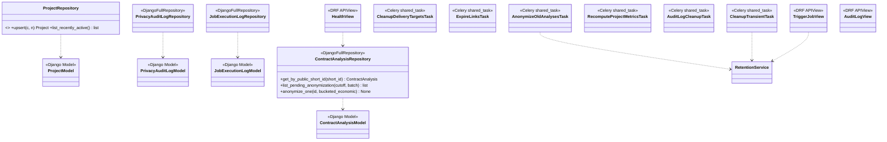

---

## 2. Sequence Diagrams

### 2.1 Project upsert from F2

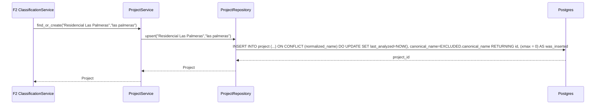

### 2.2 Anonymization (daily)

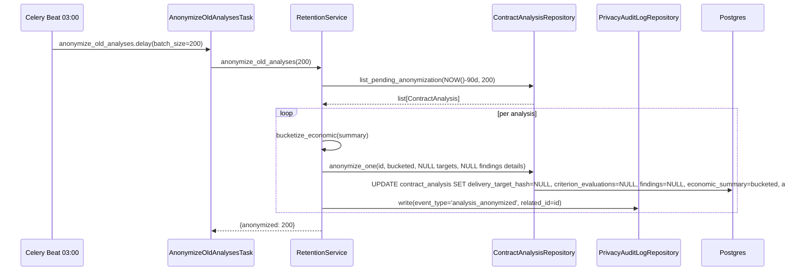

### 2.3 Transient cleanup (every 15 min)

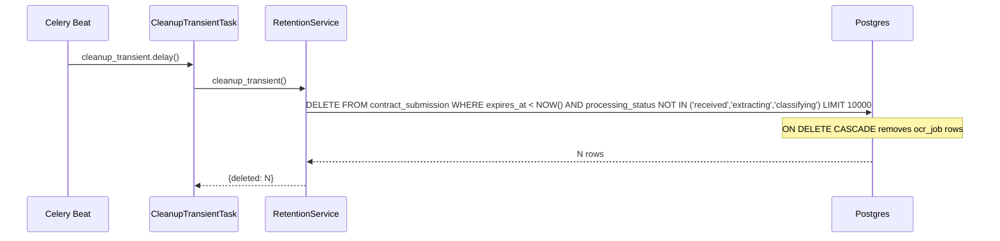

### 2.4 Recompute project metrics (hourly)

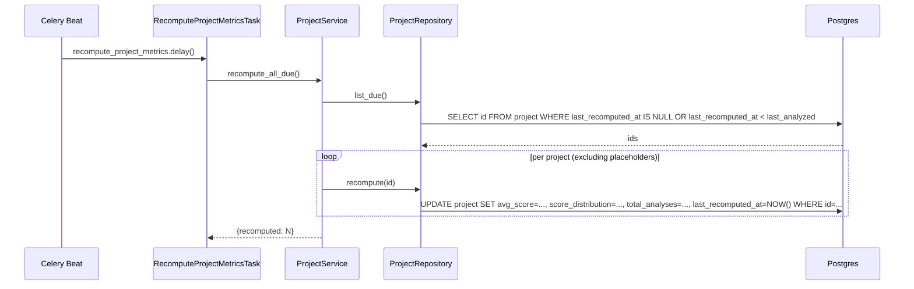

### 2.5 System health view

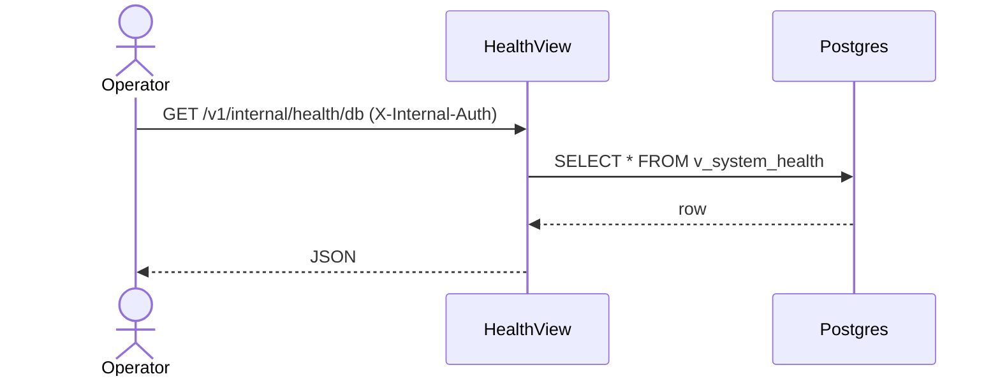

---

## 3. State Diagram (ContractAnalysis lifecycle from retention perspective)

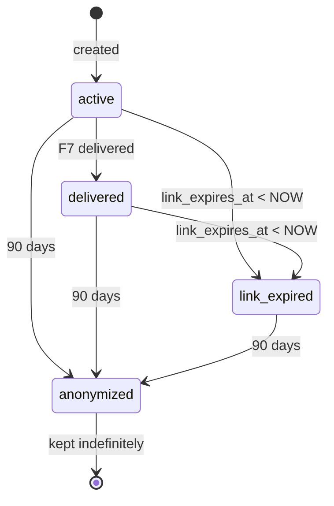

---

## 4. Activity Diagram — Anonymize one analysis

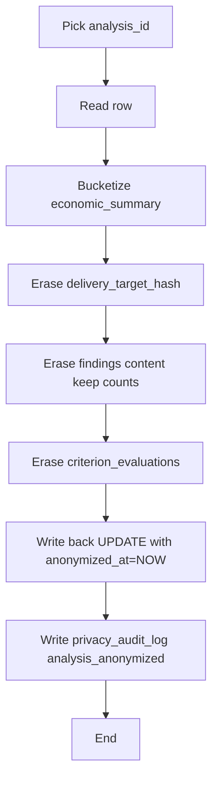

---

## 5. Component Diagram

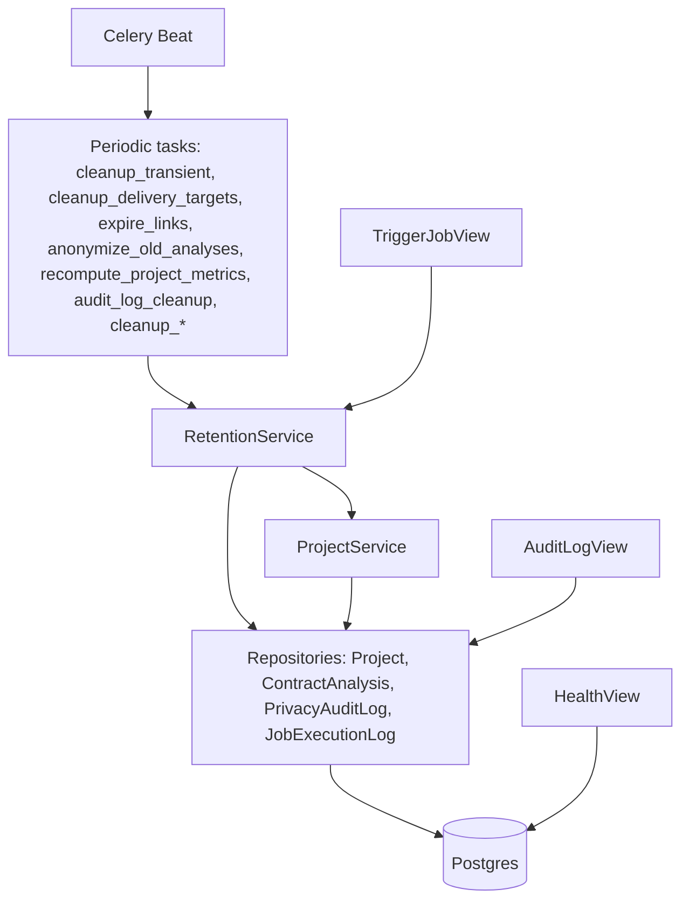

---

## 6. Use Case Diagram

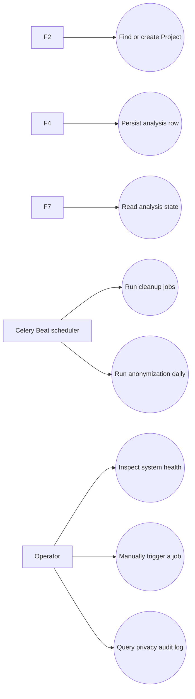

**End of document.**
